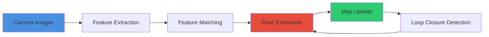
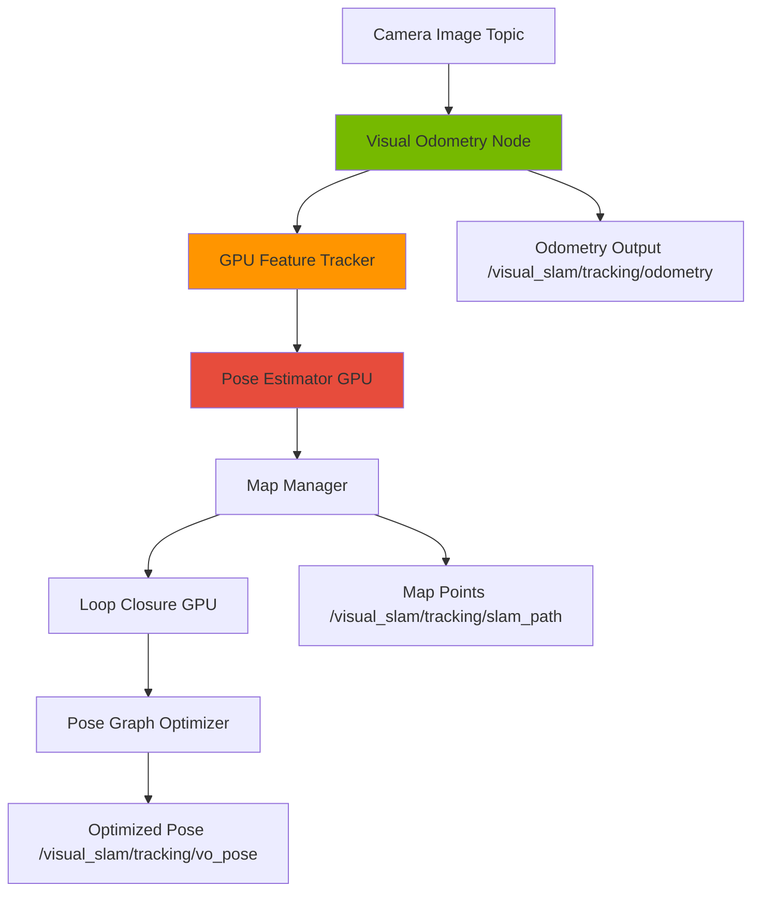

# Isaac ROS and Visual SLAM

**Reading Time:** ~35 minutes
**Difficulty Level:** Advanced

## Learning Objectives

By the end of this lesson, you will be able to:

1. Understand visual localization fundamentals and compare SLAM approaches for humanoid robots
2. Implement GPU-accelerated visual SLAM (vSLAM) using NVIDIA Isaac ROS
3. Perform camera calibration for monocular, stereo, and depth camera configurations
4. Optimize feature tracking and pose estimation pipelines for real-time performance
5. Deploy vSLAM on edge devices (NVIDIA Jetson) with ROS 2 integration

## Introduction

Humanoid robots navigate unpredictable environments where GPS is unavailable and wheel odometry is unreliable. Visual SLAM (Simultaneous Localization and Mapping) provides a solution by estimating the robot's pose and constructing a map using only camera data. However, traditional CPU-based SLAM algorithms struggle to meet real-time constraints on resource-limited mobile platforms.

NVIDIA Isaac ROS addresses this challenge by offloading computationally intensive operations—feature detection, descriptor matching, pose estimation—to the GPU. This lesson explores Isaac ROS's vSLAM implementation, covering calibration workflows, optimization techniques, and deployment strategies for production robotics systems.

---

## 1. Visual SLAM Fundamentals

### What is SLAM?

**SLAM (Simultaneous Localization and Mapping)** solves two interdependent problems:

1. **Localization**: Where is the robot? (estimate pose: position + orientation)
2. **Mapping**: What does the environment look like? (construct a map of landmarks)

**Visual SLAM** uses cameras as the primary sensor, extracting visual features (corners, edges) to track motion and build 3D maps.



**Why SLAM for Humanoids?**

- **GPS-denied environments**: Indoor spaces, urban canyons
- **No wheel odometry**: Bipedal walking introduces foot slippage and ground compliance
- **Lightweight sensors**: Cameras are cheaper and lighter than lidar (critical for weight-constrained robots)

### Visual vs Lidar SLAM

| Aspect | Visual SLAM | Lidar SLAM |
|--------|-------------|------------|
| **Sensors** | Cameras (monocular, stereo, RGB-D) | 2D/3D lidar |
| **Data Type** | Images (RGB), depth maps | Point clouds |
| **Range** | 0.5-30 m (camera-dependent) | 0.1-100+ m |
| **Lighting Sensitivity** | High (fails in dark/overexposed) | Low (active sensor) |
| **Texture Dependence** | Requires visual features | Works on featureless surfaces |
| **Computational Cost** | High (image processing) | Medium |
| **Map Density** | Sparse (feature points) or dense (every pixel) | Sparse (2D) or dense (3D) |
| **Use Case** | Indoor navigation, manipulation | Outdoor navigation, large spaces |

**Recommendation for Humanoids**: Use **visual SLAM for manipulation tasks** (dense 3D reconstruction) and **lidar SLAM for locomotion** (fast obstacle avoidance). Sensor fusion combines both.

:::tip Important Concept
Visual SLAM fails in **low-texture environments** (blank walls, uniform floors). Always validate performance in target deployment scenarios, not just lab conditions.
:::

### Feature Detection and Tracking

**Feature Extractors**:

1. **ORB (Oriented FAST and Rotated BRIEF)**:
   - Fast, rotation-invariant, binary descriptors
   - Used in ORB-SLAM, Isaac ROS vSLAM
   - ~1000-2000 features per frame at 30 FPS

2. **SIFT (Scale-Invariant Feature Transform)**:
   - Scale and rotation invariant, floating-point descriptors
   - Higher accuracy, slower (5-10 FPS CPU)
   - Patent-expired (as of 2020)

3. **SuperPoint (Deep Learning)**:
   - Learned features, robust to lighting changes
   - Requires GPU, ~30 FPS at 640x480

**Feature Matching**:

```python
import cv2
import numpy as np

# Extract ORB features
orb = cv2.ORB_create(nfeatures=1000)
kp1, des1 = orb.detectAndCompute(image1, None)
kp2, des2 = orb.detectAndCompute(image2, None)

# Match features (brute-force matcher for binary descriptors)
bf = cv2.BFMatcher(cv2.NORM_HAMMING, crossCheck=True)
matches = bf.match(des1, des2)

# Sort by distance (best matches first)
matches = sorted(matches, key=lambda x: x.distance)

# Draw top 50 matches
match_img = cv2.drawMatches(
    image1, kp1, image2, kp2, matches[:50],
    None, flags=cv2.DrawMatchesFlags_NOT_DRAW_SINGLE_POINTS
)
```

### Loop Closure Detection

**Problem**: Long-term drift (pose error accumulates over time)

**Solution**: Detect when the robot revisits a previously mapped location, then apply global optimization to correct accumulated errors.

**DBoW2 (Bag of Words)**:

- Convert image features to a "visual vocabulary"
- Fast image retrieval (~10 ms for 10,000 images)
- Used in ORB-SLAM2, Isaac ROS vSLAM

**Example Workflow**:

```python
# Pseudo-code (DBoW2 C++ library)
import pyDBoW3  # Python wrapper

# Load vocabulary (pre-trained on ImageNet)
vocab = pyDBoW3.Vocabulary("orb_vocab.yml.gz")

# Convert image to bag-of-words vector
image_features = extract_orb_features(current_image)
bow_vector = vocab.transform(image_features)

# Query database for similar images
database = pyDBoW3.Database(vocab)
candidates = database.query(bow_vector)  # Returns image IDs with similarity scores

if candidates[0].score > 0.8:  # Threshold
    print(f"Loop closure detected with image {candidates[0].id}")
```

---

## 2. Isaac ROS vSLAM

### vSLAM Node Architecture

Isaac ROS vSLAM is based on **cuVSLAM** (CUDA-accelerated VSLAM):



**Key Components**:

1. **Visual Odometry (VO)**: Frame-to-frame motion estimation
2. **Feature Tracker**: Detect and match ORB features on GPU
3. **Pose Estimator**: PnP (Perspective-n-Point) solver for camera pose
4. **Loop Closure**: DBoW2-based place recognition
5. **Pose Graph Optimizer**: g2o (graph optimization)

### Input/Output Specifications

**Inputs**:

- **Image Topics** (one of):
  - Stereo: `left/image_raw`, `right/image_raw`, `left/camera_info`, `right/camera_info`
  - Depth: `rgb/image_raw`, `depth/image_raw`, `rgb/camera_info`
  - Monocular: `image_raw`, `camera_info` (requires known scale or IMU fusion)

**Outputs**:

```yaml
# Odometry (high-frequency, local)
/visual_slam/tracking/odometry:
  type: nav_msgs/Odometry
  rate: 30 Hz

# Optimized pose (after loop closure)
/visual_slam/tracking/vo_pose:
  type: geometry_msgs/PoseStamped
  rate: 10 Hz

# SLAM path (trajectory history)
/visual_slam/tracking/slam_path:
  type: nav_msgs/Path

# Map points (sparse 3D landmarks)
/visual_slam/vis/landmarks_cloud:
  type: sensor_msgs/PointCloud2
```

### GPU Acceleration Benefits

**Performance Comparison** (Intel i7-10700K + RTX 3070 vs CPU-only):

| Operation | CPU (ORB-SLAM3) | GPU (Isaac ROS) | Speedup |
|-----------|-----------------|-----------------|---------|
| Feature detection (1000 features) | 15 ms | 2 ms | **7.5x** |
| Descriptor extraction | 10 ms | 1 ms | **10x** |
| Feature matching | 8 ms | 0.5 ms | **16x** |
| PnP pose estimation | 5 ms | 1 ms | **5x** |
| **Total Frame Time** | **38 ms (26 FPS)** | **4.5 ms (220 FPS)** | **8.4x** |

**Real-Time Capability**: Isaac ROS vSLAM achieves 60+ FPS on Jetson AGX Orin (embedded GPU), enabling low-latency control for dynamic tasks like humanoid balancing.

### Performance Characteristics

**Accuracy Metrics** (EuRoC MAV dataset, stereo mode):

- **Absolute Trajectory Error (ATE)**: 0.05-0.15 m (competitive with ORB-SLAM3)
- **Relative Pose Error (RPE)**: 0.01-0.03 m/s (drift rate)
- **Loop Closure Recall**: 85-95% (DBoW2 performance)

**Resource Usage**:

- **GPU Memory**: 500-800 MB (RTX 3070)
- **CPU Usage**: 10-15% single core (minimal—most work on GPU)
- **Power**: ~15 W (Jetson AGX Orin), ~25 W (RTX 3070)

---

## 3. Camera Calibration

### Intrinsic Parameters

Camera intrinsics model the lens and sensor geometry:

\[
K = \begin{bmatrix}
f_x & 0 & c_x \\
0 & f_y & c_y \\
0 & 0 & 1
\end{bmatrix}
\]

where:

- $f_x, f_y$: Focal lengths (pixels)
- $c_x, c_y$: Principal point (optical center)

**Distortion Coefficients** (radial + tangential):

\[
\text{dist} = [k_1, k_2, p_1, p_2, k_3]
\]

**Calibration with OpenCV**:

```python
import cv2
import numpy as np
import glob

# Prepare chessboard pattern (9x6 inner corners)
pattern_size = (9, 6)
square_size = 0.025  # 25 mm squares

# Object points (3D world coordinates)
objp = np.zeros((pattern_size[0] * pattern_size[1], 3), np.float32)
objp[:, :2] = np.mgrid[0:pattern_size[0], 0:pattern_size[1]].T.reshape(-1, 2)
objp *= square_size

# Collect calibration images
objpoints = []  # 3D points
imgpoints = []  # 2D points

images = glob.glob('calibration/*.png')

for fname in images:
    img = cv2.imread(fname)
    gray = cv2.cvtColor(img, cv2.COLOR_BGR2GRAY)

    # Find chessboard corners
    ret, corners = cv2.findChessboardCorners(gray, pattern_size, None)

    if ret:
        objpoints.append(objp)
        imgpoints.append(corners)

        # Refine corner positions
        corners_refined = cv2.cornerSubPix(
            gray, corners, (11, 11), (-1, -1),
            criteria=(cv2.TERM_CRITERIA_EPS + cv2.TERM_CRITERIA_MAX_ITER, 30, 0.001)
        )

# Calibrate camera
ret, camera_matrix, dist_coeffs, rvecs, tvecs = cv2.calibrateCamera(
    objpoints, imgpoints, gray.shape[::-1], None, None
)

print("Camera Matrix:\n", camera_matrix)
print("Distortion Coefficients:\n", dist_coeffs)

# Save calibration
np.savez('camera_calibration.npz', camera_matrix=camera_matrix, dist_coeffs=dist_coeffs)
```

**ROS 2 camera_info Message**:

```yaml
# camera_info.yaml (for isaac_ros_visual_slam)
image_width: 1280
image_height: 720
camera_name: realsense_d435i
camera_matrix:
  rows: 3
  cols: 3
  data: [615.3, 0.0, 320.0, 0.0, 615.8, 240.0, 0.0, 0.0, 1.0]
distortion_model: plumb_bob
distortion_coefficients:
  rows: 1
  cols: 5
  data: [-0.055, 0.0, 0.0, 0.0, 0.0]
rectification_matrix:
  rows: 3
  cols: 3
  data: [1.0, 0.0, 0.0, 0.0, 1.0, 0.0, 0.0, 0.0, 1.0]
projection_matrix:
  rows: 3
  cols: 4
  data: [615.3, 0.0, 320.0, 0.0, 0.0, 615.8, 240.0, 0.0, 0.0, 0.0, 1.0, 0.0]
```

### Distortion Models

**Brown-Conrady Model** (most common):

\[
\begin{aligned}
x_{\text{corrected}} &= x (1 + k_1 r^2 + k_2 r^4 + k_3 r^6) + 2 p_1 x y + p_2 (r^2 + 2 x^2) \\
y_{\text{corrected}} &= y (1 + k_1 r^2 + k_2 r^4 + k_3 r^6) + p_1 (r^2 + 2 y^2) + 2 p_2 x y
\end{aligned}
\]

**Fisheye Model** (for wide-angle cameras, >120° FOV):

```python
# Calibrate fisheye camera
ret, K, D, rvecs, tvecs = cv2.fisheye.calibrate(
    objpoints, imgpoints, gray.shape[::-1],
    None, None, flags=cv2.fisheye.CALIB_RECOMPUTE_EXTRINSIC
)

# Undistort fisheye image
undistorted = cv2.fisheye.undistortImage(img, K, D, Knew=K)
```

### Multi-Camera Setup

**Stereo Calibration**:

```python
# After individual calibrations, compute stereo baseline
ret, K1, D1, K2, D2, R, T, E, F = cv2.stereoCalibrate(
    objpoints, imgpoints_left, imgpoints_right,
    camera_matrix_left, dist_coeffs_left,
    camera_matrix_right, dist_coeffs_right,
    gray.shape[::-1],
    criteria=(cv2.TERM_CRITERIA_EPS + cv2.TERM_CRITERIA_MAX_ITER, 30, 1e-6),
    flags=cv2.CALIB_FIX_INTRINSIC
)

print("Rotation (R):\n", R)
print("Translation (T) [meters]:\n", T)  # Baseline between cameras

# Save stereo calibration
np.savez('stereo_calibration.npz', K1=K1, D1=D1, K2=K2, D2=D2, R=R, T=T)
```

**Extrinsic Calibration** (camera-to-robot transform):

```bash
# Use Kalibr (multi-camera/IMU calibration tool)
kalibr_calibrate_cameras \
  --bag calibration_data.bag \
  --topics /camera/left/image_raw /camera/right/image_raw \
  --models pinhole-radtan pinhole-radtan \
  --target april_6x6.yaml
```

### Calibration Tools

**Recommended Tools**:

1. **OpenCV**: Built-in calibration (`cv2.calibrateCamera`)
2. **Kalibr** (ETH Zurich): Multi-camera + IMU calibration
3. **CamOdoCal** (for camera-odometry calibration)
4. **Isaac ROS Calibration**: Native ROS 2 calibration node

**Best Practices**:

- Use 20-30 images with chessboard at various angles and distances
- Ensure chessboard fills 30-80% of image area
- Capture corners in all regions (center, edges, corners)
- Recalibrate every 6 months or after camera impacts

---

## 4. Feature Tracking and Pose Estimation

### Feature Detectors (ORB, SIFT)

**ORB Configuration**:

```python
# High-performance ORB for real-time tracking
orb = cv2.ORB_create(
    nfeatures=2000,     # Number of features to retain
    scaleFactor=1.2,    # Pyramid scale (multiscale detection)
    nlevels=8,          # Number of pyramid levels
    edgeThreshold=31,   # Border exclusion (pixels)
    firstLevel=0,       # Pyramid level to start
    WTA_K=2,            # Descriptor comparison points
    scoreType=cv2.ORB_HARRIS_SCORE,  # Harris corner score (vs FAST)
    patchSize=31        # Descriptor patch size
)
```

**SIFT Configuration** (for high accuracy):

```python
sift = cv2.SIFT_create(
    nfeatures=0,           # Keep all features
    nOctaveLayers=3,       # Layers per octave (scale space)
    contrastThreshold=0.04, # Feature strength threshold
    edgeThreshold=10,      # Edge response threshold
    sigma=1.6              # Gaussian blur sigma
)
```

### Descriptor Matching

**FLANN-based Matcher** (faster than brute-force):

```python
# FLANN parameters for ORB (binary descriptors)
FLANN_INDEX_LSH = 6
index_params = dict(
    algorithm=FLANN_INDEX_LSH,
    table_number=6,    # Hash tables (12 for ORB, 6 for BRIEF)
    key_size=12,       # Key length (bits)
    multi_probe_level=1
)
search_params = dict(checks=50)

flann = cv2.FlannBasedMatcher(index_params, search_params)

# Match descriptors
matches = flann.knnMatch(des1, des2, k=2)

# Lowe's ratio test (filter ambiguous matches)
good_matches = []
for m, n in matches:
    if m.distance < 0.7 * n.distance:
        good_matches.append(m)
```

### Pose Estimation (PnP)

**PnP (Perspective-n-Point)** estimates camera pose given 2D-3D correspondences:

```python
# Inputs:
# - object_points: 3D world coordinates (N x 3)
# - image_points: 2D pixel coordinates (N x 2)
# - camera_matrix: Intrinsic matrix (3 x 3)
# - dist_coeffs: Distortion coefficients (5 x 1)

success, rotation_vector, translation_vector = cv2.solvePnP(
    object_points,
    image_points,
    camera_matrix,
    dist_coeffs,
    flags=cv2.SOLVEPNP_ITERATIVE
)

# Convert rotation vector to matrix
rotation_matrix, _ = cv2.Rodrigues(rotation_vector)

# Compose transform
T = np.eye(4)
T[:3, :3] = rotation_matrix
T[:3, 3] = translation_vector.flatten()

print("Camera Pose:\n", T)
```

**RANSAC Outlier Rejection** (robust to mismatches):

```python
success, rotation_vector, translation_vector, inliers = cv2.solvePnPRansac(
    object_points,
    image_points,
    camera_matrix,
    dist_coeffs,
    reprojectionError=3.0,  # Max pixel error for inliers
    confidence=0.99,         # RANSAC confidence
    iterationsCount=1000     # Max iterations
)

print(f"Inlier ratio: {len(inliers) / len(object_points):.2%}")
```

### Uncertainty Quantification

**Covariance Estimation**:

```python
# After PnP, estimate pose uncertainty
def compute_pose_covariance(object_points, image_points, camera_matrix, rotation_vector, translation_vector):
    """Estimate covariance using Jacobian approximation."""
    # Reproject 3D points
    projected_points, _ = cv2.projectPoints(
        object_points, rotation_vector, translation_vector,
        camera_matrix, None
    )

    # Compute reprojection errors
    errors = image_points - projected_points.reshape(-1, 2)

    # Residual covariance (simplified)
    residual_cov = np.cov(errors.T)

    # Propagate to pose (requires Jacobian—simplified here)
    pose_cov = np.eye(6) * 0.01  # Placeholder (6 DOF: 3 rotation, 3 translation)

    return pose_cov

pose_cov = compute_pose_covariance(object_points, image_points, camera_matrix, rotation_vector, translation_vector)
print("Pose Covariance (6x6):\n", pose_cov)
```

---

## 5. Integration and Deployment

### ROS 2 Integration

**Launch Isaac ROS vSLAM**:

```python
# launch/isaac_vslam.launch.py
from launch import LaunchDescription
from launch_ros.actions import Node

def generate_launch_description():
    return LaunchDescription([
        # Visual SLAM node
        Node(
            package='isaac_ros_visual_slam',
            executable='visual_slam_node',
            name='visual_slam_node',
            parameters=[{
                'num_cameras': 2,  # Stereo
                'min_num_images': 2,
                'enable_rectified_pose': True,
                'enable_debug_mode': False,
                'enable_slam_visualization': True,
                'enable_landmarks_view': True,
                'enable_observations_view': False,
                'map_frame': 'map',
                'odom_frame': 'odom',
                'base_frame': 'base_link',
                'camera_optical_frames': ['left_camera_optical_frame', 'right_camera_optical_frame']
            }],
            remappings=[
                ('/stereo_camera/left/image', '/camera/left/image_raw'),
                ('/stereo_camera/left/camera_info', '/camera/left/camera_info'),
                ('/stereo_camera/right/image', '/camera/right/image_raw'),
                ('/stereo_camera/right/camera_info', '/camera/right/camera_info'),
            ]
        ),

        # Static transform (base_link → cameras)
        Node(
            package='tf2_ros',
            executable='static_transform_publisher',
            arguments=['0', '0', '0.5', '0', '0', '0', 'base_link', 'left_camera_optical_frame']
        ),
    ])
```

### Real-Time Performance Tuning

**Optimization Strategies**:

1. **Reduce Image Resolution**:

```python
# Downsample to 640x480 (from 1280x720)
downsampled = cv2.resize(image, (640, 480), interpolation=cv2.INTER_AREA)
```

2. **Decrease Feature Count**:

```python
# Reduce from 2000 to 1000 features
orb = cv2.ORB_create(nfeatures=1000)
```

3. **Disable Loop Closure** (for latency-critical tasks):

```yaml
# In node parameters
enable_loop_closure: false
```

4. **GPU Tuning** (Jetson):

```bash
# Max GPU clock frequency
sudo jetson_clocks

# Set power mode to MAX (30W on AGX Orin)
sudo nvpmodel -m 0
```

### Failure Recovery

**Common Failure Modes**:

| Failure | Cause | Recovery Strategy |
|---------|-------|-------------------|
| **Tracking Lost** | Low features, motion blur | Reset with known pose, reduce speed |
| **Loop Closure False Positive** | Visual aliasing (repetitive textures) | Increase DBoW2 threshold, add geometric verification |
| **Scale Drift** (monocular) | Lack of absolute scale | Fuse with IMU or depth sensor |
| **Map Corruption** | Long-term drift | Periodic map reset, use global localization (AMCL) |

**Automatic Recovery**:

```python
# Monitor tracking status
from isaac_ros_visual_slam_interfaces.msg import VisualSlamStatus

def status_callback(msg):
    if msg.vo_state == VisualSlamStatus.VO_STATE_LOST:
        print("Tracking lost! Initiating recovery...")
        # Options:
        # 1. Stop robot motion
        # 2. Reinitialize with last known pose
        # 3. Switch to backup localization (AMCL + lidar)
```

### Jetson Deployment

**Hardware Setup** (NVIDIA Jetson AGX Orin):

- **Cameras**: Intel RealSense D435i (stereo + IMU)
- **Storage**: 64 GB NVMe SSD (for map data)
- **Network**: Wi-Fi 6 (for remote monitoring)

**Docker Deployment** (Isaac ROS on Jetson):

```bash
# Pull Isaac ROS Docker image
docker pull nvcr.io/nvidia/isaac-ros:2023.1.0-aarch64

# Run container with GPU access
docker run --runtime=nvidia --gpus all \
  -v /dev:/dev --device-cgroup-rule='c 81:* rmw' \
  -v /tmp/argus_socket:/tmp/argus_socket \
  -it nvcr.io/nvidia/isaac-ros:2023.1.0-aarch64

# Inside container: launch vSLAM
ros2 launch isaac_ros_visual_slam isaac_ros_visual_slam_realsense.launch.py
```

**Performance on Jetson AGX Orin** (15W mode):

- **Frame Rate**: 30 FPS (1280x720 stereo)
- **Latency**: 50-80 ms (image capture → pose output)
- **Power**: 12-15 W total system

---

## Summary

This lesson covered GPU-accelerated visual SLAM with NVIDIA Isaac ROS:

- **Visual SLAM fundamentals**: Feature detection, matching, and loop closure provide robust localization in GPS-denied environments
- **Isaac ROS vSLAM**: GPU acceleration achieves 8x speedup over CPU-based SLAM, enabling real-time performance on edge devices
- **Camera calibration**: Intrinsic and extrinsic parameter estimation is critical for accurate pose estimation
- **Pose estimation**: PnP with RANSAC robustly estimates camera pose from 2D-3D correspondences
- **Deployment**: ROS 2 integration and Jetson optimization enable production-ready humanoid navigation

**Key Takeaway**: Isaac ROS vSLAM removes computational bottlenecks from visual localization, enabling humanoid robots to navigate complex environments with low latency and high accuracy. Always validate in target environments—SLAM performance degrades in low-texture or highly dynamic scenes.

---

## Next Steps

1. **Hands-On Exercise**: Calibrate a stereo camera and run Isaac ROS vSLAM on a recorded ROS 2 bag file
2. **Advanced Topic**: Explore [Nav2 Path Planning](./nav2-path-planning.md) to integrate vSLAM odometry with navigation
3. **Sensor Fusion**: Combine vSLAM with IMU using robot_localization EKF for improved accuracy
4. **Community Resources**:
   - [Isaac ROS GitHub](https://github.com/NVIDIA-ISAAC-ROS/isaac_ros_visual_slam)
   - [ORB-SLAM3 Paper](https://arxiv.org/abs/2007.11898)
   - [Kalibr Calibration Tool](https://github.com/ethz-asl/kalibr)

---

## Further Reading

- **"Visual SLAM: Why Bundle Adjust?"** (Computer Vision Tutorial) — Deep dive into pose graph optimization
- **"DBoW2 for Loop Closure"** (OpenCV Blog) — Bag-of-words image retrieval
- **NVIDIA Isaac ROS Documentation**: [docs.nvidia.com/isaac/ros](https://docs.nvidia.com/isaac/ros)

:::info Practice Quiz
Test your understanding with the [Module 3 Quiz](./quiz.md) before proceeding to navigation and path planning.
:::
