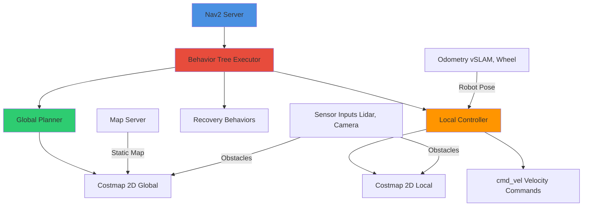

# Navigation and Path Planning

**Reading Time:** ~37 minutes
**Difficulty Level:** Advanced

## Learning Objectives

By the end of this lesson, you will be able to:

1. Understand the Nav2 architecture and its behavior tree-based approach to robot navigation
2. Configure global and local planners for humanoid-specific motion constraints
3. Implement multi-layer costmaps with obstacle inflation and clearance computation
4. Design costmap configurations tailored to bipedal locomotion (foot placement, stability margins)
5. Deploy autonomous navigation on real humanoid robots with real-time path following

## Introduction

Autonomous navigation transforms humanoid robots from teleoperated tools into independent agents capable of executing complex missions. The Navigation 2 (Nav2) stack—ROS 2's official navigation framework—provides a modular, production-ready system for path planning, obstacle avoidance, and goal execution.

However, humanoid robots present unique challenges absent in wheeled platforms:

- **Non-holonomic bipedal constraints**: Limited lateral movement, minimum step sizes
- **Stability margins**: Larger clearances needed to prevent balance loss during turns
- **Foot placement planning**: Discrete footstep selection rather than continuous trajectories
- **Recovery behaviors**: Specialized fall prevention and balance recovery

This lesson explores Nav2's architecture, configuration strategies, and humanoid-specific adaptations. You'll learn to integrate visual SLAM odometry, tune planners for dynamic environments, and deploy navigation on real robots.

---

## 1. Nav2 Architecture

### Nav2 Stack Components

Nav2 uses a **plugin-based architecture** where components (planners, controllers, behaviors) are swappable:



**Core Components**:

1. **Planner Server**: Computes global paths from start to goal
2. **Controller Server**: Tracks paths with local obstacle avoidance
3. **Recovery Server**: Executes recovery behaviors (rotate in place, back up)
4. **Costmap 2D**: Multi-layer obstacle representation (static, inflation, obstacle layers)
5. **Behavior Tree (BT)**: Coordinates component execution with failure handling

**Navigation Pipeline**:

```
Goal Request → Global Plan → Local Control → cmd_vel → Robot Motion
     ↓             ↓              ↓
   Recovery ← Path Failed? ← Collision Detected?
```

### Behavior Trees vs Traditional State Machines

**Traditional State Machine**:

```
IDLE → PLANNING → CONTROLLING → GOAL_REACHED
  ↑                    ↓
  └──── Recovery ←─────┘
```

**Behavior Tree** (Nav2 default):

```xml
<BehaviorTree>
  <Fallback name="NavigateWithRecovery">
    <Sequence name="NavigateToGoal">
      <ComputePathToPose goal="{goal}" path="{path}"/>
      <FollowPath path="{path}"/>
    </Sequence>
    <Recovery name="RecoveryActions">
      <Spin spin_dist="1.57"/>
      <BackUp backup_dist="0.5" backup_speed="0.1"/>
      <Wait wait_duration="5.0"/>
    </Recovery>
  </Fallback>
</BehaviorTree>
```

**Advantages**:

- **Composability**: Easily add new behaviors (e.g., "check battery → charge if low")
- **Reactive**: Real-time replanning on sensor updates
- **Debuggable**: Visual BT inspector (Groot tool)

### Lifecycle Management

Nav2 nodes use **managed lifecycle** (ROS 2 feature):

```
UNCONFIGURED → INACTIVE → ACTIVE → INACTIVE → FINALIZED
                   ↓          ↓
                 Configure  Activate
```

**Launch with Lifecycle Management**:

```bash
# Launch Nav2 stack
ros2 launch nav2_bringup bringup_launch.py

# Manually configure/activate (if needed)
ros2 lifecycle set /controller_server configure
ros2 lifecycle set /controller_server activate
```

### Integration with Perception

**Sensor Inputs to Costmap**:

| Sensor | Data Type | Costmap Layer | Purpose |
|--------|-----------|---------------|---------|
| **Lidar** | `sensor_msgs/LaserScan` | Obstacle Layer | Short-range obstacle detection (0.1-30 m) |
| **Depth Camera** | `sensor_msgs/PointCloud2` | Voxel Layer | 3D obstacles (stairs, overhead) |
| **Visual SLAM** | `nav_msgs/Odometry` | N/A (odometry source) | Robot pose estimation |
| **IMU** | `sensor_msgs/Imu` | N/A (fusion with odometry) | Orientation, angular velocity |

---

## 2. Costmaps and Mapping

### Static vs Dynamic Costmaps

**Static Costmap** (from SLAM-generated map):

- **Source**: `map_server` (loads PGM/YAML file)
- **Update Rate**: 0 Hz (unchanging)
- **Use Case**: Known environments (offices, warehouses)

**Dynamic Costmap** (real-time obstacle detection):

- **Source**: Lidar, depth cameras
- **Update Rate**: 5-10 Hz
- **Use Case**: Moving obstacles (humans, other robots)

**Configuration Example**:

```yaml
# costmap_common_params.yaml
global_costmap:
  update_frequency: 1.0  # Hz
  publish_frequency: 1.0
  robot_radius: 0.3  # meters (humanoid footprint)
  plugins:
    - static_layer
    - obstacle_layer
    - inflation_layer

local_costmap:
  update_frequency: 5.0  # Hz (higher for real-time control)
  publish_frequency: 2.0
  robot_radius: 0.3
  plugins:
    - obstacle_layer  # No static layer (dynamic only)
    - inflation_layer
```

### Obstacle Layers and Inflation

**Obstacle Layer** (marks detected obstacles):

```yaml
obstacle_layer:
  plugin: nav2_costmap_2d::ObstacleLayer
  observation_sources: scan
  scan:
    topic: /scan
    sensor_frame: lidar_link
    data_type: LaserScan
    marking: true    # Add obstacles to costmap
    clearing: true   # Remove obstacles when no longer detected
    min_obstacle_height: 0.0
    max_obstacle_height: 2.0
    obstacle_max_range: 25.0  # Ignore far obstacles
    raytrace_max_range: 30.0  # Clear space up to this range
```

**Inflation Layer** (adds safety margin around obstacles):

```yaml
inflation_layer:
  plugin: nav2_costmap_2d::InflationLayer
  inflation_radius: 0.7  # meters (2x robot radius)
  cost_scaling_factor: 3.0  # Exponential decay rate
```

**Cost Function**:

\[
\text{cost}(d) = 253 \cdot e^{-\text{cost\_scaling\_factor} \cdot (d - \text{robot\_radius})}
\]

where $d$ is distance to obstacle.

**Visualization**:

```
     0   100  200  253  254
  ┌─────────────────────────┐
  │ Free │ Low │ Med │ Inscribed │ Lethal
  └─────────────────────────┘
    > 0.7m  0.5m  0.4m  0.3m    0m
```

- **0-99**: Free space (safe)
- **100-252**: Increasing cost (prefer avoidance)
- **253**: Inscribed radius (robot center would cause collision)
- **254**: Lethal obstacle (collision guaranteed)

### Clearance Computation

**Footprint Specification** (for humanoid):

```yaml
# Instead of circular `robot_radius`, define polygon footprint
footprint: [
  [0.2, 0.15],   # Front-right
  [0.2, -0.15],  # Front-left
  [-0.2, -0.15], # Back-left
  [-0.2, 0.15]   # Back-right
]  # Rectangular footprint (40 cm x 30 cm)
```

**Clearance Costmap** (layer for preferred clearance):

```yaml
clearance_layer:
  plugin: nav2_costmap_2d::InflationLayer
  inflation_radius: 1.0  # Prefer 1m clearance
  cost_scaling_factor: 5.0  # Aggressive penalty
```

### Humanoid-Specific Considerations

**Stability Margins**:

- **Lateral clearance**: 2x standard (humanoids have narrower base of support)
- **Turn radius**: Larger inflation near corners (prevent tipping)
- **Footstep constraints**: Costmap resolution ≥ step size (10-15 cm typical)

**Example Configuration**:

```yaml
global_costmap:
  resolution: 0.1  # 10 cm cells (match footstep granularity)
  robot_radius: 0.4  # Effective radius including stability margin
  inflation_radius: 1.2  # 3x robot radius (vs 2x for wheeled robots)

local_costmap:
  resolution: 0.05  # 5 cm (finer for precise foot placement)
  width: 5.0  # meters
  height: 5.0
  robot_radius: 0.4
  inflation_radius: 0.8  # Smaller (local maneuvering)
```

---

## 3. Global Planning

### Dijkstra's Algorithm

**Dijkstra** (Nav2 default global planner):

- **Principle**: Breadth-first search with uniform edge costs
- **Optimality**: Finds shortest path in metric space
- **Performance**: O(N log N) for N cells

**Configuration**:

```yaml
planner_server:
  ros__parameters:
    planner_plugins: ["GridBased"]
    GridBased:
      plugin: nav2_navfn_planner/NavfnPlanner
      tolerance: 0.5  # Goal tolerance (meters)
      use_astar: false  # Dijkstra mode
      allow_unknown: true  # Plan through unexplored space
```

**A* Variant** (faster with heuristic):

```yaml
GridBased:
  plugin: nav2_navfn_planner/NavfnPlanner
  use_astar: true  # Enable A* heuristic
```

### RRT-Based Planners

**RRT* (Rapidly-exploring Random Tree)**:

- **Principle**: Probabilistic sampling in configuration space
- **Advantages**: Handles complex obstacles, kinodynamic constraints
- **Drawbacks**: Non-deterministic, slower than Dijkstra

**SmacPlanner** (hybrid A* + RRT):

```yaml
planner_plugins: ["SmacHybrid"]
SmacHybrid:
  plugin: nav2_smac_planner/SmacPlannerHybrid
  tolerance: 0.5
  downsample_costmap: false
  downsampling_factor: 1
  allow_unknown: true
  max_iterations: 1000000
  max_planning_time: 5.0  # seconds
  motion_model_for_search: "DUBIN"  # Car-like motion
  angle_quantization_bins: 72  # 5° resolution
  analytic_expansion_ratio: 3.5
  minimum_turning_radius: 0.4  # Humanoid turn radius
  reverse_penalty: 2.0
  change_penalty: 0.0
  non_straight_penalty: 1.2
  cost_penalty: 2.0
```

**When to Use RRT/Smac**:

- Narrow corridors
- Non-holonomic constraints (e.g., minimum turn radius)
- Kinodynamic planning (velocity/acceleration limits)

### Goal Prioritization

**Multiple Goal Handling**:

```python
# ROS 2 action client (Python)
from nav2_msgs.action import NavigateThroughPoses
import rclpy
from rclpy.action import ActionClient

class MultiGoalNavigator:
    def __init__(self):
        self.node = rclpy.create_node('multi_goal_navigator')
        self.client = ActionClient(
            self.node, NavigateThroughPoses, 'navigate_through_poses'
        )

    def navigate_waypoints(self, waypoints):
        """Navigate through list of (x, y, theta) waypoints."""
        goal_msg = NavigateThroughPoses.Goal()

        for x, y, theta in waypoints:
            pose = PoseStamped()
            pose.header.frame_id = 'map'
            pose.pose.position.x = x
            pose.pose.position.y = y
            # Convert theta to quaternion
            pose.pose.orientation = euler_to_quaternion(0, 0, theta)

            goal_msg.poses.append(pose)

        # Send goal
        self.client.wait_for_server()
        future = self.client.send_goal_async(goal_msg)
        rclpy.spin_until_future_complete(self.node, future)

# Usage
navigator = MultiGoalNavigator()
waypoints = [
    (1.0, 0.0, 0.0),      # Point 1
    (2.0, 1.0, 1.57),     # Point 2 (facing +Y)
    (3.0, 0.0, 3.14)      # Point 3 (facing -X)
]
navigator.navigate_waypoints(waypoints)
```

### Plan Validation

**Feasibility Checks**:

```yaml
# In SmacPlanner config
max_planning_time: 5.0  # Abort if no plan found
use_final_approach_orientation: true  # Enforce goal heading

# Custom validator plugin
planner_plugins: ["GridBased"]
GridBased:
  plugin: nav2_navfn_planner/NavfnPlanner
  validator:
    plugin: nav2_core::NoOpPathValidator  # Replace with custom
```

**Custom Validator** (check foot placement feasibility):

```cpp
// C++ plugin (simplified)
class FootstepValidator : public nav2_core::ProgressChecker {
public:
  bool isProgressMade(const nav_msgs::msg::Path& path) override {
    for (size_t i = 1; i < path.poses.size(); ++i) {
      double step_length = distance(path.poses[i-1], path.poses[i]);

      if (step_length < min_step_length_ || step_length > max_step_length_) {
        RCLCPP_WARN(logger_, "Invalid step length: %.2f m", step_length);
        return false;  // Reject plan
      }
    }
    return true;
  }

private:
  double min_step_length_ = 0.1;  // 10 cm
  double max_step_length_ = 0.6;  // 60 cm
};
```

---

## 4. Local Planning and Control

### DWB Local Planner

**DWB (Dynamic Window Approach-Based)** local planner:

- **Principle**: Sample velocity trajectories, score with cost function
- **Real-time**: 10-20 Hz control loop
- **Scoring**: Balances goal alignment, obstacle clearance, path following

**Configuration**:

```yaml
controller_server:
  ros__parameters:
    controller_plugins: ["FollowPath"]
    FollowPath:
      plugin: dwb_core::DWBLocalPlanner
      min_vel_x: -0.3  # Backward walking (m/s)
      max_vel_x: 0.8   # Forward walking
      min_vel_y: 0.0   # No lateral movement (non-holonomic)
      max_vel_y: 0.0
      min_speed_xy: 0.0
      max_speed_xy: 0.8
      min_speed_theta: 0.0
      max_vel_theta: 1.0  # Turning speed (rad/s)
      min_vel_theta: -1.0
      acc_lim_x: 2.5  # Acceleration limits (m/s²)
      acc_lim_y: 0.0
      acc_lim_theta: 3.2
      decel_lim_x: -2.5
      decel_lim_y: 0.0
      decel_lim_theta: -3.2
      vx_samples: 20  # Velocity samples (forward)
      vy_samples: 1   # No lateral samples
      vtheta_samples: 40  # Angular samples
      sim_time: 1.7  # Trajectory simulation horizon (seconds)
      linear_granularity: 0.05  # Path discretization
      angular_granularity: 0.025
      critics: [
        "RotateToGoal",
        "Oscillation",
        "BaseObstacle",
        "GoalAlign",
        "PathAlign",
        "PathDist",
        "GoalDist"
      ]
```

### Trajectory Generation

**DWB Trajectory Simulation**:

```python
# Pseudo-code (actual implementation in C++)
def generate_trajectories(current_vel, dt=0.05, sim_time=1.7):
    trajectories = []

    for vx in linspace(min_vel_x, max_vel_x, vx_samples):
        for vtheta in linspace(min_vel_theta, max_vel_theta, vtheta_samples):
            # Check dynamic constraints
            if not is_feasible_acceleration(current_vel, (vx, vtheta)):
                continue

            # Simulate trajectory
            trajectory = []
            x, y, theta = 0, 0, 0  # Start at robot frame origin
            v = (vx, 0, vtheta)

            for t in arange(0, sim_time, dt):
                # Update pose (differential drive kinematics)
                x += vx * cos(theta) * dt
                y += vx * sin(theta) * dt
                theta += vtheta * dt

                trajectory.append((x, y, theta))

            trajectories.append((v, trajectory))

    return trajectories
```

**Cost Function**:

\[
\text{cost} = w_1 \cdot \text{path\_dist} + w_2 \cdot \text{goal\_dist} + w_3 \cdot \text{obstacle\_cost} + w_4 \cdot \text{alignment}
\]

### Obstacle Avoidance

**BaseObstacle Critic**:

```yaml
# In DWB config
BaseObstacle:
  scale: 0.02  # Weight in total cost
  sum_scores: false  # Use max obstacle cost (vs sum)
```

**Emergency Stop**:

```yaml
# Velocity Smoother (prevents sudden stops)
velocity_smoother:
  plugin: nav2_velocity_smoother/VelocitySmoother
  smoothing_frequency: 20.0  # Hz
  scale_velocities: false
  feedback: "OPEN_LOOP"
  max_velocity: [0.8, 0.0, 1.0]  # [vx, vy, vtheta]
  min_velocity: [-0.3, 0.0, -1.0]
  max_accel: [2.5, 0.0, 3.2]
  max_decel: [-2.5, 0.0, -3.2]
  deadband_velocity: [0.0, 0.0, 0.0]
  velocity_timeout: 1.0  # Stop if no command received
```

### Speed Regulation

**Approach Velocity Scaling**:

```yaml
# In DWB config
PathDist:
  scale: 32.0  # High weight (follow path closely)

GoalDist:
  scale: 24.0  # Reduce speed near goal

# Explicit goal approach controller
goal_checker:
  plugin: nav2_controller::SimpleGoalChecker
  xy_goal_tolerance: 0.25  # meters
  yaw_goal_tolerance: 0.25  # radians (~14°)
  stateful: true  # Remember when goal reached
```

---

## 5. Deployment and Optimization

### Tuning Parameters

**Iteration Process**:

1. **Start Conservative**: High inflation, low speeds
2. **Test in Simulation**: Gazebo with realistic sensor noise
3. **Incremental Tuning**: Adjust one parameter at a time
4. **Real-World Validation**: Deploy on hardware

**Key Parameters**:

| Parameter | Effect | Tuning Direction |
|-----------|--------|------------------|
| `inflation_radius` | Safety margin | ↑ More clearance, ↓ Narrow passages |
| `max_vel_x` | Speed | ↑ Faster, ↓ Safer turns |
| `sim_time` | Look-ahead | ↑ Smoother paths, ↓ Reactive |
| `cost_scaling_factor` | Obstacle avoidance | ↑ Wider berth, ↓ Aggressive |

### Real-World Testing

**Validation Checklist**:

- [ ] Navigate 10 m corridor (0.5 m clearance each side)
- [ ] Execute 90° turn in 2 m² space
- [ ] Avoid moving obstacle (human walking speed: 1.4 m/s)
- [ ] Recover from blocked path (backup, replan)
- [ ] Reach goal with ±10 cm accuracy

**Logging and Diagnostics**:

```bash
# Record navigation session
ros2 bag record /scan /camera/depth/points /odom /cmd_vel /plan

# Visualize in RViz
ros2 run rviz2 rviz2 -d $(ros2 pkg prefix nav2_bringup)/share/nav2_bringup/rviz/nav2_default_view.rviz

# Monitor costmap updates
ros2 topic hz /local_costmap/costmap
ros2 topic echo /global_costmap/costmap --no-arr  # Summary only
```

### Performance Monitoring

**Nav2 Metrics**:

```python
# Subscribe to navigation status
from nav2_msgs.msg import BehaviorTreeLog

def bt_log_callback(msg):
    # Parse behavior tree execution
    for node in msg.event_log:
        if node.node_name == "ComputePathToPose":
            print(f"Planning time: {node.timestamp}ms")
        elif node.node_name == "FollowPath":
            print(f"Control rate: {1000 / node.timestamp} Hz")

rclpy.Subscriber('/behavior_tree_log', BehaviorTreeLog, bt_log_callback)
```

**Performance Targets**:

- **Global planning**: <500 ms for 100 m path
- **Local control**: >10 Hz (100 ms loop)
- **Costmap update**: >5 Hz (200 ms)
- **Total latency**: <300 ms (sensor → action)

### Multi-Robot Coordination

**Namespace Isolation**:

```yaml
# Launch robot 1
ros2 launch nav2_bringup bringup_launch.py namespace:=robot1

# Launch robot 2
ros2 launch nav2_bringup bringup_launch.py namespace:=robot2
```

**Shared Costmap** (centralized coordination):

```yaml
# Use shared map server
map_server:
  ros__parameters:
    yaml_filename: /maps/warehouse.yaml
    topic: /shared_map  # All robots subscribe
```

**Collision Avoidance**:

```yaml
# Treat other robots as dynamic obstacles
obstacle_layer:
  observation_sources: scan robot_detections
  robot_detections:
    topic: /robot_poses  # Publish all robot poses
    data_type: PoseArray
    marking: true
    clearing: true
```

---

## Summary

This lesson explored autonomous navigation for humanoid robots using Nav2:

- **Nav2 architecture**: Behavior tree-based coordination of planners, controllers, and recovery behaviors provides robust navigation
- **Costmaps**: Multi-layer obstacle representation with inflation and clearance layers ensures safe navigation
- **Global planning**: Dijkstra, A*, and RRT-based planners compute collision-free paths
- **Local control**: DWB planner generates real-time velocity commands with obstacle avoidance
- **Deployment**: Tuning, real-world testing, and performance monitoring ensure production readiness

**Key Takeaway**: Humanoid navigation requires larger safety margins (inflation radius), careful footstep validation, and stability-aware control. Always test in simulation before hardware deployment, and use behavior trees for graceful failure handling.

---

## Next Steps

1. **Hands-On Exercise**: Configure Nav2 for a simulated humanoid in Gazebo, navigate a 20 m course with obstacles
2. **Advanced Topic**: Explore footstep planning for precise foot placement ([Research: Humanoid Footstep Planning](https://ieeexplore.ieee.org))
3. **Integration**: Combine Nav2 with vision-language models for natural language navigation commands ([Module 4: VLA Systems](../module-4-vla/voice-to-action-systems.md))
4. **Community Resources**:
   - [Nav2 Documentation](https://navigation.ros.org/)
   - [Nav2 Tuning Guide](https://navigation.ros.org/tuning/)
   - [Nav2 GitHub](https://github.com/ros-planning/navigation2)

---

## Further Reading

- **"Navigation 2: The Next Generation"** (ROS Discourse, 2020) — Nav2 design philosophy
- **"Humanoid Footstep Planning Survey"** (IEEE Robotics & Automation Magazine, 2022)
- **Nav2 Smac Planner Paper**: [arxiv.org/abs/2106.05649](https://arxiv.org)

:::info Module 3 Assessment
Complete the [Module 3 Quiz](./quiz.md) to validate your understanding before advancing to Vision-Language-Action models.
:::
