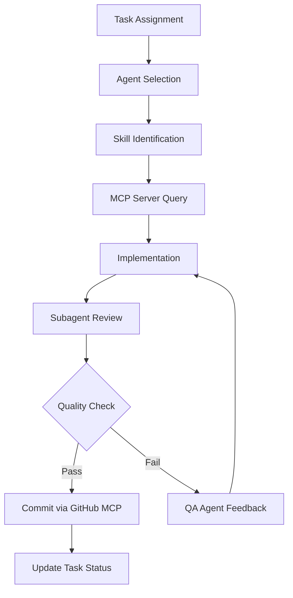

# Task.md — Physical AI & Humanoid Robotics Textbook

## Task Management & Tracking Document

**Document Version:** 2.0.0  
**Last Updated:** January 2025  
**Project:** Physical AI & Humanoid Robotics Interactive Textbook  
**References:** constitution.md, specifications.md, plan.md

---

## 🤖 LLM Agent Integration Protocol

### Core Principles for AI-Assisted Development

This project is designed to be built collaboratively with LLM agents. Every task should leverage available agents, subagents, skills, and MCP servers to maximize efficiency and quality while maintaining token economy.

### Agent Collaboration Framework

#### 1. **Task Analysis Phase**
Before starting any task, the LLM should:
- [ ] Analyze the task complexity and requirements
- [ ] Identify which agents/subagents are most suitable
- [ ] Determine which skills are needed
- [ ] Plan MCP server interactions
- [ ] Estimate token usage and optimize approach

#### 2. **Agent Assignment Strategy**

**Primary Agents:**
- **Architecture Agent**: System design, component structure, configuration
- **Frontend Agent**: UI/UX, React components, styling, animations
- **Content Agent**: Documentation writing, educational content, quizzes
- **Integration Agent**: API connections, third-party services, MCP coordination
- **QA Agent**: Testing, validation, bug detection, performance checks

**Subagent Specializations:**
- **CSS Specialist**: Styling, animations, responsive design
- **TypeScript Specialist**: Type definitions, interfaces, type safety
- **Accessibility Specialist**: ARIA, keyboard navigation, screen readers
- **Performance Specialist**: Optimization, lazy loading, bundle analysis
- **i18n Specialist**: Translations, RTL support, locale management

#### 3. **Skill Utilization Matrix**

For each task, identify and apply relevant skills:

| Task Type | Required Skills | MCP Servers |
|-----------|----------------|-------------|
| Component Creation | `docx`, `frontend-design` | GitHub, File System |
| Content Writing | `docx`, `product-self-knowledge` | File System |
| Configuration | `yml`, `json` | GitHub, File System |
| Testing | `testing`, `qa` | GitHub, Test Runner |
| Deployment | `ci-cd`, `deployment` | GitHub Actions, Vercel |

#### 4. **Token Economy Guidelines**

**Always optimize for token efficiency:**

✅ **DO:**
- Use skills to access pre-built patterns and best practices
- Leverage MCP servers for repetitive tasks
- Request subagents for specialized work
- Break large tasks into smaller, focused subtasks
- Cache frequently used code patterns
- Reference previous similar implementations

❌ **DON'T:**
- Generate entire files from scratch when templates exist
- Repeat explanations across similar tasks
- Include verbose comments in every code block
- Re-describe project context in each response
- Generate duplicate functionality

#### 5. **MCP Server Integration Protocol**

**Available MCP Servers:**
- **GitHub MCP**: Repository operations, PR management, issue tracking
- **File System MCP**: File operations, directory management
- **Web Search MCP**: Research, documentation lookup, package info
- **Code Analysis MCP**: Linting, formatting, complexity analysis
- **Testing MCP**: Test execution, coverage reports

**Usage Pattern:**
```
1. Identify task requirement
2. Query MCP server for existing resources
3. Retrieve relevant data/code
4. Apply transformations using skills
5. Validate with QA agent
6. Commit via GitHub MCP
```

#### 6. **Iterative Development Workflow**



### Task Execution Template

For every task, follow this structure:

```markdown
## Task X.X.X: [Task Name]

### 🎯 Agent Assignment
- **Primary Agent**: [Architecture/Frontend/Content/Integration/QA]
- **Subagents**: [List specialized subagents needed]
- **Skills Required**: [List skills from skill matrix]
- **MCP Servers**: [List MCP servers to utilize]

### 📋 Pre-Task Checklist
- [ ] Review constitution.md for constraints
- [ ] Check specifications.md for requirements
- [ ] Verify available skills
- [ ] Confirm MCP server access
- [ ] Estimate token budget

### 🔄 Implementation Steps
1. [Step 1 - with agent/skill assignment]
2. [Step 2 - with MCP server usage]
3. [Step 3 - with subagent coordination]

### ✅ Validation Criteria
- [ ] Code follows constitution guidelines
- [ ] Meets specifications requirements
- [ ] Passes QA agent review
- [ ] Token usage within budget
- [ ] MCP operations successful

### 📊 Completion Metrics
- Token Usage: [Estimated] / [Actual]
- Time Estimate: [Hours]
- Quality Score: [0-100]
- Agent Efficiency: [Rating]
```

---

## Quick Navigation

- [Task Summary Dashboard](#task-summary-dashboard)
- [Phase 1 Tasks: Foundation Setup](#phase-1-tasks-foundation-setup)
- [Phase 2 Tasks: Homepage Development](#phase-2-tasks-homepage-development)
- [Phase 3 Tasks: Content System](#phase-3-tasks-content-system)
- [Phase 4 Tasks: Interactive Features](#phase-4-tasks-interactive-features)
- [Phase 5 Tasks: Multi-Language & Polish](#phase-5-tasks-multi-language--polish)
- [Phase 6 Tasks: Testing & Deployment](#phase-6-tasks-testing--deployment)
- [Agent Performance Metrics](#agent-performance-metrics)
- [Bug Tracking](#bug-tracking)

---

## Task Summary Dashboard

### Overall Progress

```
Total Tasks:     145 (reduced from 156 - Docker tasks removed)
Completed:       0
In Progress:     0
Not Started:     145
Blocked:         0

Progress: ░░░░░░░░░░░░░░░░░░░░ 0%
```

### Phase Progress

| Phase | Tasks | Done | Progress | Primary Agents |
|-------|-------|------|----------|----------------|
| Phase 1: Foundation | 25 | 0 | ░░░░░░░░░░ 0% | Architecture, Frontend |
| Phase 2: Homepage | 42 | 0 | ░░░░░░░░░░ 0% | Frontend, CSS Specialist |
| Phase 3: Content | 35 | 0 | ░░░░░░░░░░ 0% | Content, i18n Specialist |
| Phase 4: Features | 28 | 0 | ░░░░░░░░░░ 0% | Integration, Frontend |
| Phase 5: i18n & Polish | 26 | 0 | ░░░░░░░░░░ 0% | i18n, Accessibility |
| Phase 6: Testing | 19 | 0 | ░░░░░░░░░░ 0% | QA, Performance |

### Priority Breakdown

| Priority | Total | Done | Remaining | Token Budget |
|----------|-------|------|-----------|--------------|
| 🔴 Critical | 42 | 0 | 42 | High |
| 🟠 High | 68 | 0 | 68 | Medium |
| 🟡 Medium | 25 | 0 | 25 | Low |
| 🟢 Low | 10 | 0 | 10 | Minimal |

---

## Phase 1 Tasks: Foundation Setup

**Duration:** Week 1-2  
**Status:** Not Started  
**Progress:** 0/25 tasks  
**Primary Agents:** Architecture Agent, Frontend Agent  
**Skills Required:** `docx`, `frontend-design`, `yml`, `json`  
**MCP Servers:** GitHub, File System

---

### 1.1 Project Initialization

**Priority:** 🔴 Critical  
**Estimated Time:** 1 day  
**Agent Assignment:** Architecture Agent  
**Token Budget:** Medium  
**Status:** ⬜ Not Started

#### 🎯 Agent Collaboration Plan
```
Primary: Architecture Agent
Subagents: None
Skills: project-scaffolding, git-operations
MCP: GitHub, File System
```

#### Tasks

- [ ] **1.1.1** Create GitHub repository `physical-ai-textbook`
  - **Agent Action**: Use GitHub MCP to create repository
  - **Skill**: `git-operations`
  - **Validation**: Repository URL accessible
  
- [ ] **1.1.2** Initialize Docusaurus project with TypeScript
  ```bash
  npx create-docusaurus@latest physical-ai-textbook classic --typescript
  ```
  - **Agent Action**: Execute via File System MCP
  - **Skill**: `project-scaffolding`
  - **Validation**: `npm run start` works

- [ ] **1.1.3** Configure `docusaurus.config.ts`
  - **Agent Action**: Frontend Agent applies configuration skill
  - **Skill**: `docx`, `config-templates`
  - **Tasks**:
    - [ ] Set site title and tagline
    - [ ] Configure URL and baseUrl
    - [ ] Set organizationName and projectName
    - [ ] Configure deployment settings
  - **Validation**: Build succeeds without errors

- [ ] **1.1.4** Set up folder structure per specifications.md
  - **Agent Action**: Architecture Agent creates directory tree
  - **Skill**: `project-structure`
  - **MCP**: File System
  - **Directories**:
    - [ ] `/src/components/` with subdirectories
    - [ ] `/src/css/` directories
    - [ ] `/src/hooks/` directory
    - [ ] `/src/utils/` directory
    - [ ] `/src/types/` directory
    - [ ] `/quizzes/` directory
    - [ ] `/i18n/` directories
  - **Validation**: All directories exist

- [ ] **1.1.5** Create `.gitignore` file
  - **Agent Action**: Use git-operations skill
  - **Content**:
    - [ ] node_modules
    - [ ] build directory
    - [ ] .docusaurus
    - [ ] .env files
  - **Validation**: Git status clean

- [ ] **1.1.6** Initial commit and push
  - **Agent Action**: GitHub MCP commit operation
  - **Validation**: Commit hash recorded: _____________

- [ ] **1.1.7** Set up branch protection on `main`
  - **Agent Action**: GitHub MCP settings
  - **Rules**:
    - [ ] Require PR reviews
    - [ ] Require status checks
  - **Validation**: Settings verified

#### Completion Checklist
- [ ] Repository accessible at GitHub URL
- [ ] `npm run start` works locally
- [ ] `npm run build` completes without errors
- [ ] All folders created per structure
- [ ] Architecture Agent sign-off

**Agent Performance Metrics:**
- Token Usage: _______ / 15,000 (estimated)
- Completion Time: _______ hours
- Quality Score: _______ / 100

---

### 1.2 Development Environment

**Priority:** 🟡 Medium  
**Estimated Time:** 0.5 days  
**Agent Assignment:** Architecture Agent + TypeScript Specialist  
**Token Budget:** Low  
**Status:** ⬜ Not Started

#### 🎯 Agent Collaboration Plan
```
Primary: Architecture Agent
Subagents: TypeScript Specialist
Skills: linting-config, formatting-config, typescript-config
MCP: File System
```

#### Tasks

- [ ] **1.2.1** Configure ESLint
  - **Agent**: Architecture Agent
  - **Skill**: `linting-config`
  - **Actions**:
    - [ ] Install ESLint packages
    - [ ] Create `.eslintrc.js` from skill template
    - [ ] Add lint script to package.json
  - **Validation**: `npm run lint` executes

- [ ] **1.2.2** Configure Prettier
  - **Agent**: Architecture Agent
  - **Skill**: `formatting-config`
  - **Actions**:
    - [ ] Install Prettier
    - [ ] Create `.prettierrc` from skill template
    - [ ] Add format script to package.json
  - **Validation**: `npm run format` works

- [ ] **1.2.3** Set up TypeScript strict mode
  - **Agent**: TypeScript Specialist
  - **Skill**: `typescript-config`
  - **Actions**:
    - [ ] Update `tsconfig.json` using skill template
    - [ ] Enable strict: true
    - [ ] Configure path aliases
  - **Validation**: TypeScript compiles without errors

- [ ] **1.2.4** Create VS Code workspace settings
  - **Agent**: Architecture Agent
  - **Skill**: `editor-config`
  - **Actions**:
    - [ ] Create `.vscode/settings.json`
    - [ ] Configure format on save
    - [ ] Configure recommended extensions
  - **Validation**: Settings file present

- [ ] **1.2.5** Set up Husky pre-commit hooks
  - **Agent**: Architecture Agent
  - **Skill**: `git-hooks`
  - **Actions**:
    - [ ] Install Husky
    - [ ] Configure pre-commit hook
    - [ ] Add lint-staged
  - **Validation**: Pre-commit hook triggers

#### Completion Checklist
- [ ] ESLint runs without config errors
- [ ] Prettier formats code correctly
- [ ] TypeScript catches type errors
- [ ] Pre-commit hooks trigger on commit
- [ ] TypeScript Specialist sign-off

**Agent Performance Metrics:**
- Token Usage: _______ / 8,000 (estimated)
- Completion Time: _______ hours
- Quality Score: _______ / 100

---

### 1.3 Design System - CSS Variables

**Priority:** 🔴 Critical  
**Estimated Time:** 1 day  
**Agent Assignment:** Frontend Agent + CSS Specialist  
**Token Budget:** Medium  
**Status:** ⬜ Not Started

#### 🎯 Agent Collaboration Plan
```
Primary: Frontend Agent
Subagents: CSS Specialist
Skills: frontend-design, css-variables, design-tokens
MCP: File System
```

#### Tasks

- [ ] **1.3.1** Create `src/css/variables.css`
  - **Agent**: Frontend Agent
  - **Skill**: `frontend-design`, `css-variables`
  - **Action**: Generate from design tokens skill

- [ ] **1.3.2** Define color tokens
  - **Agent**: CSS Specialist
  - **Skill**: `design-tokens`
  - **Reference**: Use skill's color palette templates
  - **Tokens**:
    ```css
    --primary: #00F0FF;
    --secondary: #B8C4CE;
    --accent: #FF6B35;
    --bg-primary: #0A0E14;
    --bg-card: #1A2230;
    --text-primary: #E8EDF3;
    ```
  - **Subtasks**:
    - [ ] Primary colors defined
    - [ ] Secondary colors defined
    - [ ] Background colors defined
    - [ ] Text colors defined
    - [ ] Semantic colors (success, warning, error) defined
  - **Validation**: All tokens accessible

- [ ] **1.3.3** Define typography tokens
  - **Agent**: CSS Specialist
  - **Skill**: `typography-scale`
  - **Tokens**:
    - [ ] Font family variables
    - [ ] Font size scale
    - [ ] Font weight scale
    - [ ] Line height scale
  - **Validation**: Typography renders correctly

- [ ] **1.3.4** Define spacing tokens
  - **Agent**: CSS Specialist
  - **Skill**: `spacing-system`
  - **Tokens**:
    - [ ] Spacing scale (4px, 8px, 16px, 24px, 32px, 48px, 64px)
    - [ ] Component-specific spacing
  - **Validation**: Spacing consistent

- [ ] **1.3.5** Define other tokens
  - **Agent**: CSS Specialist
  - **Skill**: `design-tokens`
  - **Tokens**:
    - [ ] Border radius scale
    - [ ] Shadow definitions
    - [ ] Z-index scale
    - [ ] Transition durations
  - **Validation**: All tokens work

- [ ] **1.3.6** Import variables in `custom.css`
  - **Agent**: Frontend Agent
  - **Action**: Add import statement
  - **Validation**: Variables accessible globally

#### Completion Checklist
- [ ] All color tokens defined and accessible
- [ ] Typography scale complete
- [ ] Spacing scale complete
- [ ] Variables importable in any CSS file
- [ ] CSS Specialist sign-off

**Agent Performance Metrics:**
- Token Usage: _______ / 12,000 (estimated)
- Completion Time: _______ hours
- Quality Score: _______ / 100

---

### 1.4 Design System - Typography

**Priority:** 🟠 High  
**Estimated Time:** 0.5 days  
**Agent Assignment:** Frontend Agent + CSS Specialist  
**Token Budget:** Low  
**Status:** ⬜ Not Started

#### 🎯 Agent Collaboration Plan
```
Primary: Frontend Agent
Subagents: CSS Specialist
Skills: frontend-design, web-fonts
MCP: File System, Web Search (for font CDN)
```

#### Tasks

- [ ] **1.4.1** Research and select font loading method
  - **Agent**: Frontend Agent
  - **MCP**: Web Search for font optimization best practices
  - **Decision**: Self-hosted vs CDN

- [ ] **1.4.2** Download Orbitron font (if self-hosted)
  - **Agent**: Frontend Agent
  - **Actions**:
    - [ ] Download font files via Web Search MCP
    - [ ] Add to `/static/fonts/Orbitron/`
    - [ ] Create @font-face declaration using skill template

- [ ] **1.4.3** Download Rajdhani font (if self-hosted)
  - **Agent**: Frontend Agent
  - **Actions**:
    - [ ] Download font files
    - [ ] Add to `/static/fonts/Rajdhani/`
    - [ ] Create @font-face declaration

- [ ] **1.4.4** Download Source Code Pro font (if self-hosted)
  - **Agent**: Frontend Agent
  - **Actions**:
    - [ ] Download font files
    - [ ] Add to `/static/fonts/SourceCodePro/`
    - [ ] Create @font-face declaration

- [ ] **1.4.5** Download JetBrains Mono font (if self-hosted)
  - **Agent**: Frontend Agent
  - **Actions**:
    - [ ] Download font files
    - [ ] Add to `/static/fonts/JetBrainsMono/`
    - [ ] Create @font-face declaration

- [ ] **1.4.6** Alternative: Use Google Fonts CDN
  - **Agent**: CSS Specialist
  - **Skill**: `web-fonts`
  - **Action**: 
    ```css
    @import url('https://fonts.googleapis.com/css2?family=Orbitron:wght@400;500;600;700;800;900&family=Rajdhani:wght@300;400;500;600;700&family=Source+Code+Pro:wght@300;400;500;600&family=JetBrains+Mono:wght@400;500;600&display=swap');
    ```
  - **Validation**: CDN import added

- [ ] **1.4.7** Test font loading
  - **Agent**: Performance Specialist (subagent)
  - **Tests**:
    - [ ] Fonts display correctly
    - [ ] No FOUT (Flash of Unstyled Text)
    - [ ] Performance acceptable (Lighthouse check)
  - **Validation**: All tests pass

#### Completion Checklist
- [ ] All 4 fonts loading correctly
- [ ] Font weights available as needed
- [ ] No significant performance impact
- [ ] CSS Specialist sign-off

**Agent Performance Metrics:**
- Token Usage: _______ / 6,000 (estimated)
- Completion Time: _______ hours
- Quality Score: _______ / 100

---

### 1.5 Design System - Base Styles

**Priority:** 🟠 High  
**Estimated Time:** 1 day  
**Agent Assignment:** Frontend Agent + CSS Specialist  
**Token Budget:** Medium  
**Status:** ⬜ Not Started

#### 🎯 Agent Collaboration Plan
```
Primary: Frontend Agent
Subagents: CSS Specialist, Accessibility Specialist
Skills: frontend-design, component-library, a11y-patterns
MCP: File System
```

#### Tasks

- [ ] **1.5.1** Override Docusaurus theme colors
  - **Agent**: Frontend Agent
  - **Skill**: `theme-customization`
  - **Actions**:
    - [ ] Update `--ifm-color-primary` variables
    - [ ] Set dark mode as default
    - [ ] Override background colors
  - **Validation**: Dark theme applied

- [ ] **1.5.2** Style base HTML elements
  - **Agent**: CSS Specialist
  - **Skill**: `base-styles`
  - **Elements**:
    - [ ] Body background and text color
    - [ ] Heading styles (h1-h6)
    - [ ] Paragraph styles
    - [ ] Link styles with hover effects
    - [ ] List styles
  - **Validation**: All elements styled

- [ ] **1.5.3** Create button base styles
  - **Agent**: Frontend Agent
  - **Skill**: `frontend-design`, `component-library`
  - **Reference**: Use skill's button component templates
  - **Styles**:
    - [ ] `.btn-primary` - Gradient fill style
    - [ ] `.btn-secondary` - Outline style
    - [ ] `.btn-ghost` - Minimal style
    - [ ] `.btn-danger` - Destructive style
    - [ ] Button sizes (sm, md, lg)
    - [ ] Disabled states
    - [ ] Hover animations
  - **Validation**: All button variants work

- [ ] **1.5.4** Create card base styles
  - **Agent**: Frontend Agent
  - **Skill**: `frontend-design`, `glassmorphism`
  - **Styles**:
    - [ ] `.card` - Default card
    - [ ] `.card-glass` - Glassmorphism card
    - [ ] `.card-elevated` - With shadow
    - [ ] `.card-interactive` - With hover effects
  - **Validation**: All card variants render

- [ ] **1.5.5** Create form element styles
  - **Agent**: CSS Specialist + Accessibility Specialist
  - **Skill**: `form-components`, `a11y-patterns`
  - **Elements**:
    - [ ] Input fields
    - [ ] Select dropdowns
    - [ ] Checkboxes
    - [ ] Radio buttons
    - [ ] Toggles/switches
    - [ ] Focus states (accessible)
  - **Validation**: Forms accessible and styled

- [ ] **1.5.6** Style scrollbars
  - **Agent**: CSS Specialist
  - **Skill**: `custom-scrollbar`
  - **Styles**:
    - [ ] Custom scrollbar for dark theme
    - [ ] Webkit scrollbar styles
    - [ ] Firefox scrollbar styles
  - **Validation**: Scrollbars match theme

#### Completion Checklist
- [ ] Dark theme applied globally
- [ ] All base elements styled
- [ ] Buttons work correctly
- [ ] Cards display properly
- [ ] Form elements styled and accessible
- [ ] Scrollbars match theme
- [ ] Accessibility Specialist sign-off

**Agent Performance Metrics:**
- Token Usage: _______ / 15,000 (estimated)
- Completion Time: _______ hours
- Quality Score: _______ / 100
- Accessibility Score: _______ / 100

---

### 1.6 Animation System

**Priority:** 🟡 Medium  
**Estimated Time:** 1 day  
**Agent Assignment:** Frontend Agent + CSS Specialist + Performance Specialist  
**Token Budget:** Medium  
**Status:** ⬜ Not Started

#### 🎯 Agent Collaboration Plan
```
Primary: Frontend Agent
Subagents: CSS Specialist, Performance Specialist, Accessibility Specialist
Skills: frontend-design, css-animations, performance-optimization
MCP: File System
```

#### Tasks

- [ ] **1.6.1** Create `src/css/animations.css`
  - **Agent**: Frontend Agent
  - **Skill**: `css-animations`
  - **Action**: Create file from skill template

- [ ] **1.6.2** Define timing functions
  - **Agent**: CSS Specialist
  - **Skill**: `animation-easing`
  - **Functions**:
    ```css
    --ease-default: cubic-bezier(0.4, 0, 0.2, 1);
    --ease-bounce: cubic-bezier(0.68, -0.55, 0.265, 1.55);
    --ease-elastic: cubic-bezier(0.68, -0.6, 0.32, 1.6);
    ```
  - **Validation**: All easing functions defined

- [ ] **1.6.3** Define duration scale
  - **Agent**: CSS Specialist
  - **Durations**:
    - [ ] `--duration-fast: 150ms`
    - [ ] `--duration-normal: 300ms`
    - [ ] `--duration-slow: 500ms`
    - [ ] `--duration-slower: 800ms`
  - **Validation**: Duration scale complete

- [ ] **1.6.4** Create keyframe animations
  - **Agent**: Frontend Agent
  - **Skill**: `frontend-design`, `keyframe-library`
  - **Reference**: Use skill's animation templates
  - **Keyframes**:
    - [ ] `fadeInUp` - Fade in with upward motion
    - [ ] `fadeInDown` - Fade in with downward motion
    - [ ] `fadeIn` - Simple fade in
    - [ ] `slideInLeft` - Slide from left
    - [ ] `slideInRight` - Slide from right
    - [ ] `scaleIn` - Scale from small to normal
    - [ ] `glowPulse` - Pulsing glow effect
    - [ ] `shimmerSweep` - Shimmer sweep effect
    - [ ] `gridPulse` - Background grid pulse
    - [ ] `float` - Floating particle motion
    - [ ] `rotate` - Continuous rotation
  - **Validation**: All keyframes defined

- [ ] **1.6.5** Create utility classes
  - **Agent**: CSS Specialist
  - **Classes**:
    - [ ] `.animate-fadeInUp`
    - [ ] `.animate-fadeIn`
    - [ ] `.animate-glow`
    - [ ] `.animate-on-scroll`
    - [ ] `.stagger-children`
  - **Validation**: Utility classes work

- [ ] **1.6.6** Implement reduced-motion
  - **Agent**: Accessibility Specialist
  - **Skill**: `a11y-patterns`
  - **Code**:
    ```css
    @media (prefers-reduced-motion: reduce) {
      *, *::before, *::after {
        animation-duration: 0.01ms !important;
        transition-duration: 0.01ms !important;
      }
    }
    ```
  - **Validation**: Reduced motion media query works

- [ ] **1.6.7** Test animations
  - **Agent**: Performance Specialist + QA Agent
  - **Tests**:
    - [ ] Test in Chrome (60fps check)
    - [ ] Test in Firefox (60fps check)
    - [ ] Test in Safari (60fps check)
    - [ ] Test reduced-motion preference
  - **Validation**: All animations smooth at 60fps

#### Completion Checklist
- [ ] All keyframes defined
- [ ] Utility classes work
- [ ] Reduced motion works
- [ ] Animations are smooth (60fps)
- [ ] Performance Specialist sign-off
- [ ] Accessibility Specialist sign-off

**Agent Performance Metrics:**
- Token Usage: _______ / 12,000 (estimated)
- Completion Time: _______ hours
- Quality Score: _______ / 100
- Performance Score: _______ / 100
- Accessibility Score: _______ / 100

---

### 1.7 Component Scaffolding

**Priority:** 🟠 High  
**Estimated Time:** 1 day  
**Agent Assignment:** Architecture Agent + Frontend Agent + TypeScript Specialist  
**Token Budget:** High  
**Status:** ⬜ Not Started

#### 🎯 Agent Collaboration Plan
```
Primary: Architecture Agent
Subagents: Frontend Agent, TypeScript Specialist
Skills: component-scaffolding, typescript-patterns, react-patterns
MCP: File System, GitHub
```

#### Tasks

- [ ] **1.7.1** Create HomepageFeatures component structure
  - **Agent**: Frontend Agent
  - **Skill**: `react-patterns`, `component-scaffolding`
  - **Files**:
    - [ ] `src/components/HomepageFeatures/index.tsx`
    - [ ] `src/components/HomepageFeatures/styles.module.css`
  - **Action**: Generate from skill template

- [ ] **1.7.2** Create ModuleCard component structure
  - **Agent**: Frontend Agent
  - **Skill**: `react-patterns`
  - **Files**:
    - [ ] `src/components/ModuleCard/index.tsx`
    - [ ] `src/components/ModuleCard/styles.module.css`

- [ ] **1.7.3** Create Timeline component structure
  - **Agent**: Frontend Agent
  - **Skill**: `react-patterns`
  - **Files**:
    - [ ] `src/components/Timeline/index.tsx`
    - [ ] `src/components/Timeline/styles.module.css`

- [ ] **1.7.4** Create HardwareTabs component structure
  - **Agent**: Frontend Agent
  - **Skill**: `react-patterns`
  - **Files**:
    - [ ] `src/components/HardwareTabs/index.tsx`
    - [ ] `src/components/HardwareTabs/styles.module.css`

- [ ] **1.7.5** Create Quiz component structure
  - **Agent**: Frontend Agent
  - **Skill**: `react-patterns`, `quiz-components`
  - **Files**:
    - [ ] `src/components/Quiz/index.tsx`
    - [ ] `src/components/Quiz/QuizQuestion.tsx`
    - [ ] `src/components/Quiz/QuizResults.tsx`
    - [ ] `src/components/Quiz/styles.module.css`

- [ ] **1.7.6** Create LanguageSelector component structure
  - **Agent**: Frontend Agent
  - **Skill**: `react-patterns`, `i18n-components`
  - **Files**:
    - [ ] `src/components/LanguageSelector/index.tsx`
    - [ ] `src/components/LanguageSelector/styles.module.css`

- [ ] **1.7.7** Create ReadingTime component structure
  - **Agent**: Frontend Agent
  - **Skill**: `react-patterns`
  - **Files**:
    - [ ] `src/components/ReadingTime/index.tsx`
    - [ ] `src/components/ReadingTime/styles.module.css`

- [ ] **1.7.8** Create CookieConsent component structure
  - **Agent**: Frontend Agent
  - **Skill**: `react-patterns`, `gdpr-components`
  - **Files**:
    - [ ] `src/components/CookieConsent/index.tsx`
    - [ ] `src/components/CookieConsent/styles.module.css`

- [ ] **1.7.9** Create GitHubAuth component structure
  - **Agent**: Frontend Agent
  - **Skill**: `react-patterns`, `auth-components`
  - **Files**:
    - [ ] `src/components/GitHubAuth/index.tsx`
    - [ ] `src/components/GitHubAuth/styles.module.css`

- [ ] **1.7.10** Create TypeScript interfaces
  - **Agent**: TypeScript Specialist
  - **Skill**: `typescript-patterns`, `type-definitions`
  - **Files**:
    - [ ] `src/types/quiz.ts` - Quiz data structures
    - [ ] `src/types/auth.ts` - Authentication types
    - [ ] `src/types/language.ts` - i18n types
    - [ ] `src/types/components.ts` - Component prop types
  - **Action**: Generate comprehensive type definitions

- [ ] **1.7.11** Create custom hooks placeholders
  - **Agent**: Frontend Agent
  - **Skill**: `react-hooks`, `hook-patterns`
  - **Files**:
    - [ ] `src/hooks/useAuth.ts` - Authentication hook
    - [ ] `src/hooks/useLanguage.ts` - Language switching
    - [ ] `src/hooks/useQuiz.ts` - Quiz state management
    - [ ] `src/hooks/useCookieConsent.ts` - Cookie preferences
    - [ ] `src/hooks/useReadingProgress.ts` - Reading tracking
  - **Action**: Create with proper TypeScript typing

- [ ] **1.7.12** Create utility function placeholders
  - **Agent**: Architecture Agent
  - **Skill**: `utility-patterns`
  - **Files**:
    - [ ] `src/utils/readingTime.ts` - Reading time calculation
    - [ ] `src/utils/localStorage.ts` - Storage utilities
    - [ ] `src/utils/api.ts` - API helpers
  - **Action**: Create with JSDoc comments

#### Completion Checklist
- [ ] All component folders created
- [ ] All TypeScript interfaces defined
- [ ] All hooks have placeholder exports
- [ ] All utilities have placeholder exports
- [ ] No import errors
- [ ] TypeScript compiles successfully
- [ ] Architecture Agent sign-off
- [ ] TypeScript Specialist sign-off

**Agent Performance Metrics:**
- Token Usage: _______ / 18,000 (estimated)
- Completion Time: _______ hours
- Quality Score: _______ / 100

---

### Phase 1 Completion Checklist

**Agent Review Board:**
- [ ] Architecture Agent: Foundation solid ✓
- [ ] Frontend Agent: Components scaffolded ✓
- [ ] TypeScript Specialist: Types comprehensive ✓
- [ ] CSS Specialist: Design system complete ✓
- [ ] Accessibility Specialist: Standards met ✓
- [ ] Performance Specialist: Baseline established ✓

**Technical Validation:**
- [ ] Repository created and accessible
- [ ] Development environment configured
- [ ] All CSS variables defined
- [ ] All fonts loading correctly
- [ ] Base styles applied
- [ ] Animations defined and performant
- [ ] Component structure scaffolded
- [ ] `npm run start` works
- [ ] `npm run build` succeeds
- [ ] TypeScript compilation successful
- [ ] No accessibility violations
- [ ] Ready for Phase 2

**Metrics Summary:**
- Total Token Usage: _______ / 100,000 (estimated)
- Phase Duration: _______ hours
- Quality Score: _______ / 100
- Code Coverage: _______ %

**Phase 1 Sign-off:**  
Completed by: _____________  
Date: _____________  
Notes: _____________

---

## Phase 2 Tasks: Homepage Development

**Duration:** Week 2-4  
**Status:** Not Started  
**Progress:** 0/42 tasks  
**Primary Agents:** Frontend Agent, CSS Specialist  
**Skills Required:** `frontend-design`, `react-patterns`, `css-animations`  
**MCP Servers:** File System, GitHub

---

### 2.1 Header Component

**Priority:** 🔴 Critical  
**Estimated Time:** 1.5 days  
**Agent Assignment:** Frontend Agent + CSS Specialist + Accessibility Specialist  
**Token Budget:** High  
**Status:** ⬜ Not Started

#### 🎯 Agent Collaboration Plan
```
Primary: Frontend Agent
Subagents: CSS Specialist, Accessibility Specialist
Skills: frontend-design, react-patterns, navigation-components, a11y-navigation
MCP: File System, GitHub
```

#### Tasks

- [ ] **2.1.1** Create custom Navbar component
  - **Agent**: Frontend Agent
  - **Skill**: `react-patterns`, `navigation-components`
  - **Actions**:
    - [ ] Create `src/theme/Navbar/index.tsx`
    - [ ] Swizzle Docusaurus Navbar if needed
  - **Validation**: Component renders

- [ ] **2.1.2** Implement logo
  - **Agent**: Frontend Agent
  - **Skill**: `frontend-design`
  - **Tasks**:
    - [ ] Add logo image/SVG (use Web Search MCP if needed)
    - [ ] Link to homepage
    - [ ] Style logo container
  - **Validation**: Logo displays and links correctly

- [ ] **2.1.3** Create navigation links
  - **Agent**: Frontend Agent + Accessibility Specialist
  - **Skill**: `navigation-components`, `a11y-navigation`
  - **Links**:
    - [ ] Home link
    - [ ] Modules dropdown
    - [ ] Resources link
    - [ ] About link
    - [ ] Style active states
    - [ ] Add ARIA labels
  - **Validation**: All links functional and accessible

- [ ] **2.1.4** Add search bar placeholder
  - **Agent**: Frontend Agent
  - **Skill**: `frontend-design`, `search-ui`
  - **Tasks**:
    - [ ] Create search input UI
    - [ ] Add search icon
    - [ ] Add keyboard shortcut hint (⌘K)
    - [ ] Style for dark theme
  - **Validation**: Search UI renders (functionality in Phase 4)

- [ ] **2.1.5** Add language selector placeholder
  - **Agent**: Frontend Agent
  - **Skill**: `i18n-components`
  - **Tasks**:
    - [ ] Create globe icon button
    - [ ] Placeholder dropdown (functional in Phase 5)
  - **Validation**: Button renders

- [ ] **2.1.6** Add GitHub login button
  - **Agent**: Frontend Agent
  - **Skill**: `auth-components`
  - **Tasks**:
    - [ ] Create button with GitHub icon
    - [ ] Style as secondary button
    - [ ] Placeholder click handler
  - **Validation**: Button renders and styled

- [ ] **2.1.7** Implement sticky behavior
  - **Agent**: CSS Specialist
  - **Skill**: `sticky-header`, `scroll-effects`
  - **Effects**:
    - [ ] Header sticks on scroll
    - [ ] Add backdrop blur on scroll
    - [ ] Reduce padding on scroll (compact mode)
    - [ ] Add shadow on scroll
  - **Validation**: All scroll effects work smoothly

- [ ] **2.1.8** Create mobile hamburger menu
  - **Agent**: Frontend Agent + Accessibility Specialist
  - **Skill**: `mobile-navigation`, `a11y-navigation`
  - **Tasks**:
    - [ ] Hamburger icon button (accessible)
    - [ ] Slide-in menu panel
    - [ ] All navigation items in mobile menu
    - [ ] Close button
    - [ ] Overlay backdrop
    - [ ] Focus management
  - **Validation**: Mobile menu accessible and functional

- [ ] **2.1.9** Test responsive behavior
  - **Agent**: QA Agent
  - **Tests**:
    - [ ] Desktop layout correct (1920px, 1440px, 1200px)
    - [ ] Tablet layout correct (768px)
    - [ ] Mobile hamburger works (375px)
    - [ ] Touch targets adequate (44x44px minimum)
  - **Validation**: All breakpoints tested

#### Completion Checklist
- [ ] Header displays correctly
- [ ] All navigation links work
- [ ] Sticky behavior works smoothly
- [ ] Mobile menu accessible and functional
- [ ] Blur effect on scroll works
- [ ] Keyboard navigation works
- [ ] Screen reader compatible
- [ ] Frontend Agent sign-off
- [ ] Accessibility Specialist sign-off

**Agent Performance Metrics:**
- Token Usage: _______ / 20,000 (estimated)
- Completion Time: _______ hours
- Quality Score: _______ / 100
- Accessibility Score: _______ / 100

---

### 2.2 Footer Component

**Priority:** 🟠 High  
**Estimated Time:** 1 day  
**Agent Assignment:** Frontend Agent + CSS Specialist  
**Token Budget:** Medium  
**Status:** ⬜ Not Started

#### 🎯 Agent Collaboration Plan
```
Primary: Frontend Agent
Subagents: CSS Specialist
Skills: frontend-design, react-patterns, footer-components
MCP: File System
```

#### Tasks

- [ ] **2.2.1** Create custom Footer component
  - **Agent**: Frontend Agent
  - **Skill**: `react-patterns`, `footer-components`
  - **Action**: