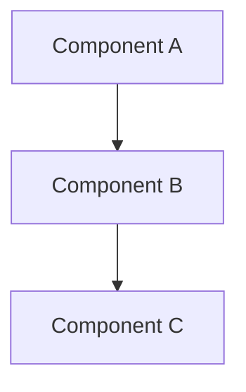

# Specifications.md — Physical AI & Humanoid Robotics Textbook

## Technical Specifications Document

**Document Version:** 1.0.0  
**Last Updated:** January 2025  
**Project:** Physical AI & Humanoid Robotics Interactive Textbook  
**Reference:** constitution.md

---

## Table of Contents

1. [Technology Stack](#1-technology-stack)
2. [Project Structure](#2-project-structure)
3. [Homepage Specifications](#3-homepage-specifications)
4. [Content Pages Specifications](#4-content-pages-specifications)
5. [Component Specifications](#5-component-specifications)
6. [Multi-Language System](#6-multi-language-system)
7. [Authentication System](#7-authentication-system)
8. [Quiz System](#8-quiz-system)
9. [Search System](#9-search-system)
10. [Cookie Management](#10-cookie-management)
11. [UI Component Library](#11-ui-component-library)
12. [Animation Specifications](#12-animation-specifications)
13. [API Specifications](#13-api-specifications)
14. [Performance Requirements](#14-performance-requirements)
15. [Testing Requirements](#15-testing-requirements)
16. [Deployment Pipeline](#16-deployment-pipeline)

---

## 1. Technology Stack

### Core Framework

| Layer | Technology | Version | Purpose |
|-------|------------|---------|---------|
| Framework | Docusaurus | 3.x | Static site generation |
| UI Library | React | 18.x | Component architecture |
| Language | TypeScript | 5.x | Type safety |
| Styling | CSS Modules + Tailwind | 3.x | Scoped styling |
| Build Tool | Webpack (via Docusaurus) | 5.x | Bundling |

### Dependencies

**Required Packages:**
```json
{
  "dependencies": {
    "@docusaurus/core": "^3.0.0",
    "@docusaurus/preset-classic": "^3.0.0",
    "@docusaurus/theme-search-algolia": "^3.0.0",
    "react": "^18.2.0",
    "react-dom": "^18.2.0",
    "clsx": "^2.0.0",
    "prism-react-renderer": "^2.0.0"
  },
  "devDependencies": {
    "@docusaurus/module-type-aliases": "^3.0.0",
    "@docusaurus/types": "^3.0.0",
    "typescript": "^5.0.0"
  }
}
```

### Development Environment

| Requirement | Specification |
|-------------|---------------|
| Node.js | v18.0.0 or higher |
| npm | v9.0.0 or higher |
| Git | v2.40.0 or higher |
| OS | Windows/macOS/Linux |
| IDE | VS Code (recommended) |

---

## 2. Project Structure

### Directory Layout

```
physical-ai-textbook/
├── .github/
│   └── workflows/
│       └── deploy.yml              # GitHub Actions deployment
│
├── docs/
│   ├── module-1-ros2/
│   │   ├── index.md
│   │   ├── nodes-topics-services.md
│   │   ├── python-rclpy.md
│   │   ├── urdf-humanoids.md
│   │   └── _category_.json
│   │
│   ├── module-2-digital-twin/
│   │   ├── index.md
│   │   ├── gazebo-physics.md
│   │   ├── unity-rendering.md
│   │   ├── sensor-simulation.md
│   │   └── _category_.json
│   │
│   ├── module-3-nvidia-isaac/
│   │   ├── index.md
│   │   ├── isaac-sim.md
│   │   ├── isaac-ros-vslam.md
│   │   ├── nav2-path-planning.md
│   │   └── _category_.json
│   │
│   └── module-4-vla/
│       ├── index.md
│       ├── voice-to-action.md
│       ├── llm-cognitive-planning.md
│       ├── capstone-project.md
│       └── _category_.json
│
├── i18n/
│   ├── ur/
│   │   └── docusaurus-plugin-content-docs/
│   │       └── current/
│   ├── ar/
│   │   └── docusaurus-plugin-content-docs/
│   │       └── current/
│   ├── zh/
│   │   └── docusaurus-plugin-content-docs/
│   │       └── current/
│   └── es/
│       └── docusaurus-plugin-content-docs/
│           └── current/
│
├── src/
│   ├── components/
│   │   ├── HomepageFeatures/
│   │   │   ├── index.tsx
│   │   │   └── styles.module.css
│   │   ├── ModuleCard/
│   │   │   ├── index.tsx
│   │   │   └── styles.module.css
│   │   ├── Timeline/
│   │   │   ├── index.tsx
│   │   │   └── styles.module.css
│   │   ├── HardwareTabs/
│   │   │   ├── index.tsx
│   │   │   └── styles.module.css
│   │   ├── Quiz/
│   │   │   ├── index.tsx
│   │   │   ├── QuizQuestion.tsx
│   │   │   ├── QuizResults.tsx
│   │   │   └── styles.module.css
│   │   ├── LanguageSelector/
│   │   │   ├── index.tsx
│   │   │   └── styles.module.css
│   │   ├── ReadingTime/
│   │   │   ├── index.tsx
│   │   │   └── styles.module.css
│   │   ├── CookieConsent/
│   │   │   ├── index.tsx
│   │   │   └── styles.module.css
│   │   └── GitHubAuth/
│   │       ├── index.tsx
│   │       └── styles.module.css
│   │
│   ├── css/
│   │   ├── custom.css              # Global custom styles
│   │   ├── variables.css           # CSS variables
│   │   └── animations.css          # Animation definitions
│   │
│   ├── pages/
│   │   ├── index.tsx               # Homepage
│   │   └── index.module.css
│   │
│   ├── theme/
│   │   ├── Navbar/
│   │   │   └── index.tsx           # Custom navbar
│   │   ├── Footer/
│   │   │   └── index.tsx           # Custom footer
│   │   └── DocItem/
│   │       └── index.tsx           # Custom doc page
│   │
│   ├── hooks/
│   │   ├── useAuth.ts
│   │   ├── useLanguage.ts
│   │   ├── useQuiz.ts
│   │   └── useCookieConsent.ts
│   │
│   ├── utils/
│   │   ├── readingTime.ts
│   │   ├── localStorage.ts
│   │   └── api.ts
│   │
│   └── types/
│       ├── quiz.ts
│       ├── auth.ts
│       └── language.ts
│
├── static/
│   ├── img/
│   │   ├── logo.svg
│   │   ├── hero-bg.svg
│   │   ├── module-icons/
│   │   └── hardware/
│   └── fonts/
│       ├── Orbitron/
│       ├── Rajdhani/
│       └── JetBrainsMono/
│
├── quizzes/
│   ├── module-1-quiz.json
│   ├── module-2-quiz.json
│   ├── module-3-quiz.json
│   └── module-4-quiz.json
│
├── docusaurus.config.ts
├── sidebars.ts
├── package.json
├── tsconfig.json
├── constitution.md
└── specifications.md
```

---

## 3. Homepage Specifications

### Section 1: Hero

**Layout:** Full viewport height, centered content

| Element | Specification |
|---------|---------------|
| Title | "Physical AI & Humanoid Robotics" |
| Title Font | Orbitron, 48-72px, weight 800 |
| Title Effect | Gradient text animation (cyan → orange) |
| Subtitle | "Bridging the gap between digital minds and physical bodies" |
| Subtitle Font | Rajdhani, 20-24px, weight 500 |
| Description | 2-3 sentences, max 150 characters |
| Background | Animated neural grid with particles |
| CTA Buttons | 2 buttons, 16px gap between |

**Button Specifications:**

| Button | Label | Action | Style |
|--------|-------|--------|-------|
| Primary | "Start Reading" | Navigate to `/docs/module-1-ros2` | Gradient fill, glow hover |
| Secondary | "Login with GitHub" | Trigger OAuth flow | Outline, fill on hover |

### Section 2: Course Modules

**Layout:** 4-column grid (desktop), 2-column (tablet), 1-column (mobile)

**Module Card Data:**

| Module | Icon | Title | Description |
|--------|------|-------|-------------|
| 1 | 🧠 | The Robotic Nervous System | Master ROS 2 middleware, nodes, topics, services, and URDF for humanoid control |
| 2 | 🌐 | The Digital Twin | Build physics simulations with Gazebo & Unity, simulate sensors and environments |
| 3 | 🤖 | The AI-Robot Brain | Leverage NVIDIA Isaac Sim, VSLAM, and Nav2 for advanced perception |
| 4 | 🗣️ | Vision-Language-Action | Integrate voice commands, LLM planning, and build the capstone project |

**Card Dimensions:**

| Property | Desktop | Tablet | Mobile |
|----------|---------|--------|--------|
| Width | 280px | 45% | 100% |
| Padding | 32px | 24px | 20px |
| Gap | 24px | 20px | 16px |
| Border Radius | 20px | 16px | 12px |

### Section 3: Why Physical AI Matters

**Layout:** 2-column (60/40 split), stacked on mobile

**Left Column Content:**
- Heading: "Why Physical AI Matters"
- Paragraph: Explanation of embodied intelligence (150-200 words)
- Key Points (3 items with icons):
  - 🧬 Embodied Intelligence
  - 🤝 Human-Robot Interaction
  - 🔄 Sim-to-Real Transfer

**Right Column:**
- Illustration: Humanoid robot with neural network overlay
- Format: SVG or optimized PNG
- Animation: Subtle pulse effect on neural connections

### Section 4: Weekly Breakdown

**Layout:** Vertical timeline with expandable items

**Timeline Data:**

| Weeks | Title | Topics |
|-------|-------|--------|
| 1-2 | Introduction to Physical AI | Foundations, embodied intelligence, sensor systems |
| 3-5 | ROS 2 Fundamentals | Architecture, nodes, topics, services, Python packages |
| 6-7 | Robot Simulation with Gazebo | Environment setup, URDF/SDF, physics simulation |
| 8-10 | NVIDIA Isaac Platform | Isaac SDK, Isaac Sim, reinforcement learning |
| 11-12 | Humanoid Robot Development | Kinematics, locomotion, manipulation, HRI |
| 13 | Conversational Robotics | GPT integration, speech recognition, multi-modal |

**Interaction:**
- Default: First item expanded
- Click: Toggle expand/collapse with animation
- Indicator: Chevron rotates on expand

### Section 5: Curricular Guidance

**Layout:** Tabbed interface with 3 tabs

**Tab Structure:**

| Tab | Content |
|-----|---------|
| Learning Outcomes | 6 outcome cards with icons |
| Assessments | 4 assessment types with descriptions |
| Prerequisites | Knowledge requirements checklist |

**Learning Outcomes:**
1. Understand Physical AI principles and embodied intelligence
2. Master ROS 2 for robotic control
3. Simulate robots with Gazebo and Unity
4. Develop with NVIDIA Isaac AI robot platform
5. Design humanoid robots for natural interactions
6. Integrate GPT models for conversational robotics

**Assessments:**
1. ROS 2 Package Development Project (25%)
2. Gazebo Simulation Implementation (25%)
3. Isaac-based Perception Pipeline (25%)
4. Capstone: Simulated Humanoid Robot (25%)

### Section 6: Hardware Requirements

**Layout:** Tabbed component with 4 tabs

**Tab 1: Workstation**

| Component | Specification | Notes |
|-----------|---------------|-------|
| GPU | NVIDIA RTX 4070 Ti (12GB) or higher | RTX 3090/4090 ideal |
| CPU | Intel i7 13th Gen+ / AMD Ryzen 9 | Physics calculations |
| RAM | 64GB DDR5 | 32GB minimum |
| OS | Ubuntu 22.04 LTS | ROS 2 native |
| Storage | 1TB NVMe SSD | Fast asset loading |

**Tab 2: Edge Kit**

| Component | Model | Price | Notes |
|-----------|-------|-------|-------|
| Brain | NVIDIA Jetson Orin Nano Super | $249 | 40 TOPS, 8GB |
| Eyes | Intel RealSense D435i | $349 | RGB + Depth + IMU |
| Ears | ReSpeaker USB Mic Array v2.0 | $69 | Far-field voice |
| Storage | 128GB microSD | $30 | High-endurance |
| **Total** | | **~$700** | |

**Tab 3: Robot Lab**

| Option | Robot | Price | Pros/Cons |
|--------|-------|-------|-----------|
| A: Proxy | Unitree Go2 Edu | $1,800-$3,000 | Durable, good ROS 2 support |
| B: Mini Humanoid | Unitree G1 | ~$16,000 | True biped, expensive |
| C: Budget | Hiwonder TonyPi Pro | ~$600 | Raspberry Pi, limited AI |

**Tab 4: Cloud Option**

| Service | Instance | Cost | Notes |
|---------|----------|------|-------|
| AWS | g5.2xlarge | ~$1.50/hr | A10G GPU, 24GB VRAM |
| Storage | EBS Volume | ~$25/quarter | Environment saves |
| **Estimated** | 120 hrs/quarter | **~$205** | + Edge kit required |

---

## 4. Content Pages Specifications

### Page Metadata

Each content page requires frontmatter:

```yaml
---
id: unique-page-id
title: Page Title
sidebar_label: Sidebar Label
sidebar_position: 1
description: SEO description (150-160 characters)
keywords: [keyword1, keyword2, keyword3]
---
```

### Reading Time Component

**Placement:** Below page title, above content

**Display Format:** "⏱ Estimated Reading Time: XX min"

**Calculation Formula:**
```
baseTime = ceil(wordCount / 200)
codeTime = codeBlocks * 1
diagramTime = diagrams * 0.5
totalTime = baseTime + codeTime + diagramTime
```

### Content Structure Template

```markdown
# Page Title

⏱ Estimated Reading Time: XX min

## Introduction
[300 words introducing the topic]

## Core Concepts

### Concept 1
[Detailed explanation with examples]

### Concept 2
[Detailed explanation with examples]

## Hands-On Tutorial

### Prerequisites
- Item 1
- Item 2

### Step 1: Setup
[Instructions with code]

### Step 2: Implementation
[Instructions with code]

### Step 3: Testing
[Instructions with code]

## Code Examples

### Example 1: Basic Implementation
```python
# Code with comments
```

### Example 2: Advanced Usage
```python
# Code with comments
```

## Architecture Diagram



## Best Practices
[List of recommendations]

## Common Pitfalls
[List of things to avoid]

## Summary
[200-word recap of key points]

## Next Steps
[What to learn next]

## Quiz
[Link to module quiz]
```

### Word Count Requirements

| Section | Word Count |
|---------|------------|
| Introduction | 300 |
| Core Concepts | 2,500-3,000 |
| Hands-On Tutorial | 2,000-2,500 |
| Code Examples | 500-700 |
| Best Practices | 300-400 |
| Summary | 200 |
| **Total** | **6,000-7,000** |

---

## 5. Component Specifications

### ModuleCard Component

**Props Interface:**
```typescript
interface ModuleCardProps {
  moduleNumber: number;
  icon: string;
  title: string;
  description: string;
  href: string;
  topics: string[];
}
```

**States:**
- Default: Subtle border, no shadow
- Hover: Lift 8px, glow border, shimmer sweep
- Focus: Visible focus ring for accessibility

### Timeline Component

**Props Interface:**
```typescript
interface TimelineItem {
  weeks: string;
  title: string;
  description: string;
  topics: string[];
}

interface TimelineProps {
  items: TimelineItem[];
  defaultExpanded?: number;
}
```

**Behavior:**
- Single item expanded at a time (accordion)
- Smooth height animation (300ms)
- Node pulse animation on active

### HardwareTabs Component

**Props Interface:**
```typescript
interface HardwareSpec {
  component: string;
  model: string;
  price?: string;
  notes: string;
}

interface HardwareTab {
  id: string;
  label: string;
  specs: HardwareSpec[];
}

interface HardwareTabsProps {
  tabs: HardwareTab[];
  defaultTab?: string;
}
```

### ReadingTime Component

**Props Interface:**
```typescript
interface ReadingTimeProps {
  content: string;
  codeBlocks?: number;
  diagrams?: number;
}
```

**Output:** Formatted string with clock icon

---

## 6. Multi-Language System

### Supported Locales

```typescript
const locales = {
  en: {
    label: 'English',
    direction: 'ltr',
    flag: '🇺🇸',
    htmlLang: 'en-US'
  },
  ur: {
    label: 'اردو',
    direction: 'rtl',
    flag: '🇵🇰',
    htmlLang: 'ur-PK'
  },
  ar: {
    label: 'العربية',
    direction: 'rtl',
    flag: '🇸🇦',
    htmlLang: 'ar-SA'
  },
  zh: {
    label: '中文',
    direction: 'ltr',
    flag: '🇨🇳',
    htmlLang: 'zh-CN'
  },
  es: {
    label: 'Español',
    direction: 'ltr',
    flag: '🇪🇸',
    htmlLang: 'es-ES'
  }
};
```

### URL Structure

```
/                           → English (default)
/ur/                        → Urdu
/ar/                        → Arabic
/zh/                        → Chinese
/es/                        → Spanish

/docs/module-1-ros2/        → English docs
/ur/docs/module-1-ros2/     → Urdu docs
/ar/docs/module-1-ros2/     → Arabic docs
```

### Language Selector Component

**Props Interface:**
```typescript
interface LanguageSelectorProps {
  currentLocale: string;
  onLocaleChange: (locale: string) => void;
}
```

**Behavior:**
- Dropdown on click
- Flag + label for each option
- Current language highlighted
- Persist selection to localStorage
- Smooth page transition on change

### RTL Support Requirements

**CSS Adjustments:**
- `direction: rtl` on html element
- Flip flexbox layouts
- Mirror padding/margins
- Flip icons and arrows
- Keep code blocks LTR

**Component Adjustments:**
- Sidebar moves to right
- Navigation order reversed
- Timeline line on right side
- Card layouts mirrored

---

## 7. Authentication System

### GitHub OAuth Flow

```
┌─────────────┐     ┌─────────────┐     ┌─────────────┐
│   Client    │────▶│   GitHub    │────▶│  Callback   │
│  (Browser)  │     │   OAuth     │     │   Handler   │
└─────────────┘     └─────────────┘     └─────────────┘
       │                                       │
       │                                       ▼
       │                               ┌─────────────┐
       │                               │   Store     │
       │◀──────────────────────────────│   Session   │
       │                               └─────────────┘
```

### Auth State Interface

```typescript
interface AuthState {
  isAuthenticated: boolean;
  user: {
    id: string;
    username: string;
    avatar: string;
    email?: string;
  } | null;
  token: string | null;
}

interface AuthActions {
  login: () => void;
  logout: () => void;
  checkAuth: () => Promise<boolean>;
}
```

### useAuth Hook

```typescript
interface UseAuthReturn {
  isAuthenticated: boolean;
  user: User | null;
  isLoading: boolean;
  login: () => void;
  logout: () => void;
}
```

### Session Storage

| Key | Value | Storage |
|-----|-------|---------|
| `auth_token` | JWT token | localStorage |
| `user_data` | User object (JSON) | localStorage |
| `auth_expiry` | Timestamp | localStorage |

### Protected Features

| Feature | Auth Required | Fallback |
|---------|---------------|----------|
| View content | No | - |
| Take quizzes | No | Results not saved |
| Save quiz results | Yes | Prompt to login |
| Track progress | Yes | Local only |
| Sync across devices | Yes | Not available |

---

## 8. Quiz System

### Quiz Data Structure

```typescript
interface QuizQuestion {
  id: string;
  type: 'multiple-choice' | 'true-false';
  question: string;
  options: string[];
  correctAnswer: number | number[];
  explanation: string;
  difficulty: 'easy' | 'medium' | 'hard';
  points: number;
}

interface Quiz {
  id: string;
  moduleId: string;
  title: string;
  description: string;
  questions: QuizQuestion[];
  passingScore: number;
  timeLimit?: number;
}

interface QuizAttempt {
  quizId: string;
  odateStarted: string;
  dateCompleted?: string;
  answers: Record<string, number>;
  score: number;
  passed: boolean;
  timeSpent: number;
}
```

### Quiz JSON Format

```json
{
  "id": "module-1-quiz",
  "moduleId": "module-1-ros2",
  "title": "ROS 2 Fundamentals Quiz",
  "description": "Test your knowledge of ROS 2 concepts",
  "passingScore": 70,
  "timeLimit": 900,
  "questions": [
    {
      "id": "q1",
      "type": "multiple-choice",
      "question": "What is a ROS 2 node?",
      "options": [
        "A physical robot component",
        "An executable that communicates via ROS",
        "A configuration file",
        "A sensor driver"
      ],
      "correctAnswer": 1,
      "explanation": "A node is an executable that uses ROS 2 to communicate with other nodes.",
      "difficulty": "easy",
      "points": 10
    }
  ]
}
```

### Quiz Component States

| State | Description | UI |
|-------|-------------|-----|
| `idle` | Quiz not started | Show intro + Start button |
| `active` | Quiz in progress | Show questions + timer |
| `submitted` | Answers submitted | Show results + explanations |
| `reviewing` | Reviewing answers | Show all Q&A with correct/incorrect |

### Quiz UI Specifications

**Progress Bar:**
- Width: 100% of quiz container
- Height: 4px
- Color: Gradient (progress color based on score)
- Animation: Smooth width transition

**Question Card:**
- One question per view
- Navigation: Previous/Next buttons
- Indicator: Question X of Y
- Flag option for review

**Results Screen:**
- Score: Large percentage display
- Pass/Fail indicator with color
- Breakdown: Correct/Incorrect/Skipped
- Per-question review with explanations
- Retake button

---

## 9. Search System

### Search Configuration

**Option A: Local Search (Recommended for Start)**

```javascript
// docusaurus.config.js
module.exports = {
  themes: ['@docusaurus/theme-search-algolia'],
  themeConfig: {
    algolia: {
      appId: 'YOUR_APP_ID',
      apiKey: 'YOUR_SEARCH_API_KEY',
      indexName: 'physical-ai-textbook',
      contextualSearch: true,
    },
  },
};
```

**Option B: Algolia DocSearch**

Apply at: https://docsearch.algolia.com/apply/

### Search UI Specifications

**Search Bar:**
- Location: Header (right side)
- Width: 200px collapsed, 400px expanded
- Placeholder: "Search docs... (⌘K)"
- Icon: Magnifying glass

**Search Modal:**
- Trigger: Click search bar or Cmd/Ctrl + K
- Overlay: Dark semi-transparent backdrop
- Width: 600px max
- Results: Show as user types (debounced 300ms)

**Search Results:**
- Group by: Module/Section
- Show: Title, snippet with highlight, breadcrumb
- Limit: 10 results per group
- Navigation: Arrow keys + Enter

### Search Index Fields

```typescript
interface SearchDocument {
  objectID: string;
  title: string;
  content: string;
  url: string;
  module: string;
  section: string;
  keywords: string[];
  hierarchy: {
    lvl0: string;
    lvl1: string;
    lvl2?: string;
  };
}
```

---

## 10. Cookie Management

### Cookie Categories

| Category | Required | Description |
|----------|----------|-------------|
| Essential | Yes | Site functionality, auth |
| Analytics | No | Usage tracking, performance |
| Preferences | No | Language, theme, settings |

### Cookie Consent Banner

**Placement:** Fixed bottom of viewport

**States:**
- `pending`: Banner visible, no choice made
- `accepted`: All cookies accepted
- `rejected`: Only essential cookies
- `custom`: User selected preferences

**Buttons:**
- "Accept All" → Accept all categories
- "Reject Non-Essential" → Essential only
- "Customize" → Open preferences modal

### Cookie Preferences Modal

**Structure:**
```
┌─────────────────────────────────────────────┐
│ Cookie Preferences                     [X]  │
├─────────────────────────────────────────────┤
│ ┌─────────────────────────────────────────┐ │
│ │ ✓ Essential Cookies          [Always On]│ │
│ │   Required for site functionality       │ │
│ └─────────────────────────────────────────┘ │
│ ┌─────────────────────────────────────────┐ │
│ │ ○ Analytics Cookies          [Toggle]   │ │
│ │   Help us improve the site              │ │
│ └─────────────────────────────────────────┘ │
│ ┌─────────────────────────────────────────┐ │
│ │ ○ Preference Cookies         [Toggle]   │ │
│ │   Remember your settings                │ │
│ └─────────────────────────────────────────┘ │
├─────────────────────────────────────────────┤
│              [Save Preferences]             │
└─────────────────────────────────────────────┘
```

### Cookie Storage

```typescript
interface CookiePreferences {
  essential: true; // Always true
  analytics: boolean;
  preferences: boolean;
  consentDate: string;
  consentVersion: string;
}
```

**Storage Key:** `cookie_consent`
**Storage Location:** localStorage

---

## 11. UI Component Library

### Button Variants

| Variant | Use Case | Style |
|---------|----------|-------|
| `primary` | Main CTAs | Gradient fill, glow hover |
| `secondary` | Secondary actions | Outline, fill on hover |
| `ghost` | Tertiary actions | No border, subtle hover |
| `danger` | Destructive actions | Red color scheme |
| `disabled` | Inactive state | Reduced opacity, no pointer |

### Button Sizes

| Size | Padding | Font Size | Min Width |
|------|---------|-----------|-----------|
| `sm` | 8px 16px | 14px | 80px |
| `md` | 12px 24px | 16px | 120px |
| `lg` | 16px 32px | 18px | 160px |

### Card Variants

| Variant | Use Case | Style |
|---------|----------|-------|
| `default` | General content | Subtle border, no shadow |
| `elevated` | Featured content | Shadow, slight lift |
| `interactive` | Clickable cards | Hover effects enabled |
| `glass` | Overlay content | Glassmorphism effect |

### Form Elements

**Input Fields:**
- Height: 48px
- Border: 1px solid secondary
- Border Radius: 8px
- Focus: Primary color border + glow
- Error: Red border + error message

**Select Dropdowns:**
- Same base style as inputs
- Custom dropdown arrow
- Animated dropdown menu

**Toggles:**
- Width: 48px
- Height: 24px
- Animation: Smooth slide (200ms)

### Icons

**Icon Library:** Lucide React (recommended)

**Common Icons:**
| Icon | Usage |
|------|-------|
| `Search` | Search bar |
| `Globe` | Language selector |
| `Github` | Auth button |
| `ChevronDown` | Dropdowns |
| `ChevronRight` | Navigation |
| `Clock` | Reading time |
| `CheckCircle` | Success states |
| `XCircle` | Error states |
| `Menu` | Mobile nav |
| `X` | Close buttons |

---

## 12. Animation Specifications

### Timing Functions

```css
:root {
  --ease-default: cubic-bezier(0.4, 0, 0.2, 1);
  --ease-in: cubic-bezier(0.4, 0, 1, 1);
  --ease-out: cubic-bezier(0, 0, 0.2, 1);
  --ease-bounce: cubic-bezier(0.68, -0.55, 0.265, 1.55);
  --ease-elastic: cubic-bezier(0.68, -0.6, 0.32, 1.6);
}
```

### Duration Scale

| Token | Duration | Use Case |
|-------|----------|----------|
| `--duration-fast` | 150ms | Micro-interactions |
| `--duration-normal` | 300ms | Standard transitions |
| `--duration-slow` | 500ms | Complex animations |
| `--duration-slower` | 800ms | Page transitions |

### Animation Definitions

**Fade In Up:**
```css
@keyframes fadeInUp {
  from {
    opacity: 0;
    transform: translateY(20px);
  }
  to {
    opacity: 1;
    transform: translateY(0);
  }
}
```

**Glow Pulse:**
```css
@keyframes glowPulse {
  0%, 100% {
    box-shadow: 0 0 20px var(--primary-glow);
  }
  50% {
    box-shadow: 0 0 40px var(--primary-glow),
                0 0 60px var(--accent-glow);
  }
}
```

**Shimmer Sweep:**
```css
@keyframes shimmerSweep {
  from {
    transform: translateX(-100%);
  }
  to {
    transform: translateX(100%);
  }
}
```

**Grid Pulse:**
```css
@keyframes gridPulse {
  0%, 100% {
    opacity: 0.3;
  }
  50% {
    opacity: 0.6;
  }
}
```

**Float:**
```css
@keyframes float {
  0% {
    transform: translateY(100vh) scale(0);
    opacity: 0;
  }
  10% {
    opacity: 0.6;
  }
  90% {
    opacity: 0.6;
  }
  100% {
    transform: translateY(-100vh) scale(1);
    opacity: 0;
  }
}
```

### Reduced Motion

```css
@media (prefers-reduced-motion: reduce) {
  *,
  *::before,
  *::after {
    animation-duration: 0.01ms !important;
    animation-iteration-count: 1 !important;
    transition-duration: 0.01ms !important;
  }
}
```

---

## 13. API Specifications

### Endpoints (If Backend Required)

**Authentication:**
```
GET  /api/auth/github          → Initiate OAuth
GET  /api/auth/github/callback → OAuth callback
POST /api/auth/logout          → End session
GET  /api/auth/me              → Get current user
```

**Quiz:**
```
GET  /api/quizzes/:moduleId    → Get quiz for module
POST /api/quizzes/:quizId/submit → Submit quiz attempt
GET  /api/quizzes/results      → Get user's quiz history
```

**Progress:**
```
GET  /api/progress             → Get user progress
POST /api/progress/update      → Update page completion
```

### Response Formats

**Success Response:**
```json
{
  "success": true,
  "data": { ... }
}
```

**Error Response:**
```json
{
  "success": false,
  "error": {
    "code": "ERROR_CODE",
    "message": "Human readable message"
  }
}
```

---

## 14. Performance Requirements

### Core Web Vitals Targets

| Metric | Target | Description |
|--------|--------|-------------|
| LCP | < 2.5s | Largest Contentful Paint |
| FID | < 100ms | First Input Delay |
| CLS | < 0.1 | Cumulative Layout Shift |
| FCP | < 1.8s | First Contentful Paint |
| TTI | < 3.8s | Time to Interactive |

### Bundle Size Limits

| Bundle | Max Size (gzipped) |
|--------|-------------------|
| Main JS | 150KB |
| Main CSS | 50KB |
| Per-page JS | 30KB |
| Total initial | 250KB |

### Image Optimization

| Format | Use Case | Max Size |
|--------|----------|----------|
| SVG | Icons, logos, illustrations | 20KB |
| WebP | Photos, complex images | 100KB |
| PNG | Screenshots with text | 150KB |

### Caching Strategy

| Resource | Cache Duration |
|----------|----------------|
| HTML | No cache (always fresh) |
| JS/CSS | 1 year (hashed filenames) |
| Images | 1 year |
| Fonts | 1 year |
| API responses | 5 minutes |

---

## 15. Testing Requirements

### Unit Testing

**Framework:** Jest + React Testing Library

**Coverage Targets:**
| Category | Minimum |
|----------|---------|
| Statements | 80% |
| Branches | 75% |
| Functions | 80% |
| Lines | 80% |

**Required Tests:**
- All utility functions
- All custom hooks
- All component rendering
- Quiz scoring logic
- Reading time calculation

### Integration Testing

**Framework:** Cypress

**Required Scenarios:**
- Homepage loads all sections
- Navigation works correctly
- Language switching functions
- Quiz flow (start → answer → submit → results)
- Auth flow (login → session → logout)
- Search functionality

### Accessibility Testing

**Tools:** axe-core, Lighthouse

**Requirements:**
- Zero critical violations
- Zero serious violations
- Warnings reviewed and justified

### Browser Testing

| Browser | Versions |
|---------|----------|
| Chrome | Latest 2 |
| Firefox | Latest 2 |
| Safari | Latest 2 |
| Edge | Latest 2 |
| Mobile Safari | iOS 15+ |
| Mobile Chrome | Android 10+ |

---

## 16. Deployment Pipeline

### GitHub Actions Workflow

```yaml
name: Deploy to GitHub Pages

on:
  push:
    branches: [main]
  pull_request:
    branches: [main]

jobs:
  build:
    runs-on: ubuntu-latest
    steps:
      - uses: actions/checkout@v4
      
      - name: Setup Node.js
        uses: actions/setup-node@v4
        with:
          node-version: '18'
          cache: 'npm'
      
      - name: Install dependencies
        run: npm ci
      
      - name: Build
        run: npm run build
      
      - name: Test
        run: npm test
      
      - name: Deploy
        if: github.ref == 'refs/heads/main'
        uses: peaceiris/actions-gh-pages@v3
        with:
          github_token: ${{ secrets.GITHUB_TOKEN }}
          publish_dir: ./build
```

### Environment Variables

| Variable | Description | Required |
|----------|-------------|----------|
| `GITHUB_TOKEN` | Auto-provided by Actions | Yes |
| `ALGOLIA_APP_ID` | Algolia application ID | If using Algolia |
| `ALGOLIA_API_KEY` | Algolia search API key | If using Algolia |

### Deployment Checklist

**Pre-deployment:**
- [ ] All tests passing
- [ ] Build completes without errors
- [ ] No TypeScript errors
- [ ] Lighthouse score > 90
- [ ] All links verified

**Post-deployment:**
- [ ] Site accessible at URL
- [ ] All pages load correctly
- [ ] Images and assets load
- [ ] Search functions
- [ ] Auth flow works
- [ ] i18n routes work

---

## Appendix A: File Templates

### Component Template

```typescript
// src/components/ComponentName/index.tsx
import React from 'react';
import styles from './styles.module.css';

interface ComponentNameProps {
  // Define props
}

export default function ComponentName({ 
  // Destructure props 
}: ComponentNameProps): JSX.Element {
  return (
    <div className={styles.container}>
      {/* Component content */}
    </div>
  );
}
```

### Hook Template

```typescript
// src/hooks/useHookName.ts
import { useState, useEffect } from 'react';

interface UseHookNameReturn {
  // Define return type
}

export function useHookName(): UseHookNameReturn {
  // Hook implementation
  return {
    // Return values
  };
}
```

### Page Template

```typescript
// src/pages/page-name.tsx
import React from 'react';
import Layout from '@theme/Layout';

export default function PageName(): JSX.Element {
  return (
    <Layout
      title="Page Title"
      description="Page description"
    >
      <main>
        {/* Page content */}
      </main>
    </Layout>
  );
}
```

---

## Appendix B: Glossary

| Term | Definition |
|------|------------|
| LTR | Left-to-Right text direction |
| RTL | Right-to-Left text direction |
| SSG | Static Site Generation |
| OAuth | Open Authorization protocol |
| GDPR | General Data Protection Regulation |
| WCAG | Web Content Accessibility Guidelines |
| LCP | Largest Contentful Paint |
| FID | First Input Delay |
| CLS | Cumulative Layout Shift |

---

## Appendix C: Agent Integration Note

> This project utilizes Claude Code CLI agents and skills for automation, content generation, and code scaffolding. 
> 
> Agents must strictly follow the rules and guidelines defined in `constitution.md` when interacting with project files, 
> creating components, pages, quizzes, or other assets. 
>
> While agents may reference this specifications document for technical guidance, 
> `constitution.md` is the authoritative source for all rules, constraints, and project conventions.


*This specifications document provides detailed technical requirements for implementing the Physical AI & Humanoid Robotics Interactive Textbook. Refer to constitution.md for high-level project principles and design direction.*
