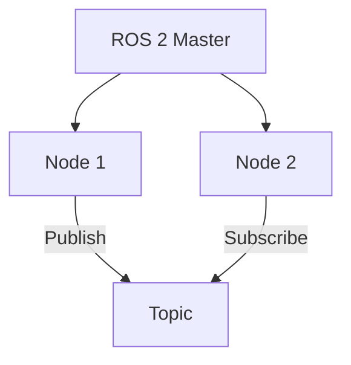

# Content Management Guide

This document explains how to edit, create, and translate content for the Physical AI & Humanoid Robotics Interactive Textbook.

## Content Structure

Content is organized by modules in the `docs/` directory:

```
docs/
├── module-1-ros2/
│   ├── index.md (Module overview)
│   ├── nodes-topics-services.md
│   ├── python-rclpy.md
│   ├── urdf-humanoids.md
│   └── quiz.md
├── module-2-digital-twin/
│   ├── index.md
│   ├── gazebo-simulation.md
│   ├── unity-visualization.md
│   ├── sensor-simulation.md
│   └── quiz.md
├── module-3-isaac/
├── module-4-vla/
└── index.md (Homepage content)
```

## Editing Content

### Basic Markdown

All content is written in Markdown with optional MDX extensions.

```markdown
# Heading 1
## Heading 2
### Heading 3

**Bold text**
*Italic text*
`inline code`

- Bullet list
- Another item

1. Numbered list
2. Another item

[Link text](https://example.com)
```

### Code Blocks

Use triple backticks with language identifier:

````markdown
```python
# Python example
import rclpy
from rclpy.node import Node

class MinimalPublisher(Node):
    def __init__(self):
        super().__init__('minimal_publisher')
```
````

Supported languages: `python`, `cpp`, `bash`, `yaml`, `json`, `javascript`, `typescript`

### Diagrams with Mermaid

Create architecture and flow diagrams using Mermaid:

````markdown

````

### Callouts & Admonitions

Highlight important information:

```markdown
:::info
This is an informational callout
:::

:::warning
This is a warning message
:::

:::danger
This is a critical warning
:::

:::tip
This is a helpful tip
:::
```

## Frontmatter

Every page must have frontmatter at the top:

```yaml
---
title: Page Title
sidebar_label: Short Label for Sidebar
sidebar_position: 1
description: Brief page description for SEO
---
```

### Frontmatter Fields

- **title**: Full page title (used in browser tab and navigation)
- **sidebar_label**: Short label for sidebar (if different from title)
- **sidebar_position**: Order in sidebar (1, 2, 3...)
- **description**: SEO description (100-160 characters)

## Content Guidelines

### Word Count

- **Minimum**: 6,000 words per page
- **Target**: 6,000-7,000 words
- **Structure**: Break into 4-5 main sections

### Code Examples

- **Quantity**: 3-5 examples per page minimum
- **Relevance**: Each example should illustrate a key concept
- **Comments**: Explain what the code does
- **Testing**: All code examples must be tested for correctness
- **Simulation-First**: All examples use simulation, not real robots

Example:
```python
# Example: Creating a ROS 2 publisher node
import rclpy
from rclpy.node import Node
from std_msgs.msg import String

class MinimalPublisher(Node):
    """
    A simple publisher node that publishes to a topic.

    This example demonstrates the basic structure of a ROS 2 node.
    """
    def __init__(self):
        super().__init__('minimal_publisher')
        # Create a publisher for String messages on 'topic' topic
        self.publisher_ = self.create_publisher(String, 'topic', 10)
        # Timer to publish at 100Hz (every 10ms)
        self.timer = self.create_timer(0.01, self.timer_callback)

    def timer_callback(self):
        msg = String()
        msg.data = 'Hello World!'
        self.publisher_.publish(msg)
        self.get_logger().info(f'Publishing: {msg.data}')
```

### Diagrams

- **Quantity**: 2-3 diagrams per page minimum
- **Types**: Architecture diagrams, flow charts, sequence diagrams
- **Clarity**: Diagrams should enhance understanding, not confuse
- **Mermaid Format**: Use Mermaid for consistency

### Learning Objectives

Start each page with learning objectives:

```markdown
## Learning Objectives

By the end of this page, you will understand:
- Concept 1
- Concept 2
- Concept 3
```

### Summary

End each page with a summary:

```markdown
## Summary

- Key takeaway 1
- Key takeaway 2
- Key takeaway 3
```

## Creating New Content

### 1. Create File

```bash
# For a new topic in Module 1
touch docs/module-1-ros2/new-topic.md
```

### 2. Add Frontmatter

```yaml
---
title: Topic: Understanding ROS 2 Communication
sidebar_label: ROS 2 Communication
sidebar_position: 4
description: Learn how ROS 2 nodes communicate via topics, services, and actions
---
```

### 3. Write Content

Follow the structure:

1. Learning Objectives (3-5 items)
2. Introduction (500 words)
3. Main Content (3-4 sections, ~1,500 words each)
4. Code Examples (3-5 examples)
5. Diagrams (2-3 diagrams)
6. Summary (bullet points)
7. Further Reading (links to related pages)

### 4. Update Sidebar

Edit `sidebars.ts` to include the new page:

```typescript
{
  type: 'doc',
  id: 'module-1-ros2/new-topic',
  label: 'New Topic',
},
```

### 5. Test Locally

```bash
npm start
# Navigate to new page and verify formatting
```

## Editing Existing Content

### Quick Edits

1. Navigate to page on live site
2. Click "Edit this page" link at bottom
3. Make changes directly on GitHub
4. Submit PR for review

### Local Edits

1. Clone repository and create branch
2. Edit `.md` file in your editor
3. Test locally: `npm start`
4. Commit and push changes
5. Create PR on GitHub

## Translating Content

### Multi-Language Structure

The project supports 5 languages: English (en), Urdu (ur), Arabic (ar), Chinese (zh), Spanish (es).

Translated content goes in `i18n/` directory:

```
i18n/
├── ur/
│   └── docusaurus-plugin-content-docs/
│       └── current/
│           ├── module-1-ros2/
│           │   └── index.md (Urdu translation)
├── ar/
├── zh/
└── es/
```

### Translation Workflow

1. **Create language directory** if not exists:
   ```bash
   mkdir -p i18n/ur/docusaurus-plugin-content-docs/current
   ```

2. **Copy English content**:
   ```bash
   cp docs/module-1-ros2/index.md i18n/ur/docusaurus-plugin-content-docs/current/
   ```

3. **Translate the file** (keep frontmatter, translate body)

4. **Keep frontmatter structure** (only translate title/description):
   ```yaml
   ---
   title: ماڈیول 1: دی روبوٹک نروس سسٹم  # Translated title
   sidebar_label: روبوٹک سسٹم              # Translated label
   sidebar_position: 1
   description: روبوٹکس کی بنیاد سیکھیں  # Translated description
   ---
   ```

5. **Do NOT translate**:
   - Code examples
   - Mermaid diagrams
   - Technical terms (use transliteration if needed)
   - Variable names

6. **Test RTL layout** for Arabic and Urdu

### UI String Translations

UI strings are in `i18n/*/common.json`:

```json
{
  "navigation": {
    "home": "Home",
    "modules": "Modules",
    "resources": "Resources"
  },
  "buttons": {
    "startReading": "Start Reading",
    "submit": "Submit"
  }
}
```

Update these files for new UI text.

## Image Guidelines

### Naming & Storage

- Store images in `static/images/module-X/`
- Use descriptive names: `ros2-architecture.png`
- Optimize before uploading (< 200KB per image)

### Including Images

```markdown

```

### Optimization Tools

```bash
# Compress PNG
pngquant --speed 1 image.png

# Compress JPG
jpegoptim --max=80 image.jpg

# Use WebP format
cwebp image.png -o image.webp
```

## Content Checklist

Before submitting content:

- [ ] Title and frontmatter present
- [ ] 6,000-7,000 words
- [ ] Learning objectives at start
- [ ] 3-5 code examples with comments
- [ ] 2-3 Mermaid diagrams
- [ ] Summary at end
- [ ] All links tested (internal and external)
- [ ] All code examples tested for correctness
- [ ] Spelling and grammar checked
- [ ] Images optimized and properly referenced
- [ ] No console errors when building
- [ ] Mobile responsive (375px width)
- [ ] Accessibility compliant

## Review Process

1. **Create PR** with your changes
2. **Request review** from maintainers
3. **Address feedback** on structure/grammar/accuracy
4. **Technical review** ensures correctness of concepts
5. **Final approval** before merge

## Publishing

Content is automatically published to live site when:

1. PR is approved and merged to `main`
2. GitHub Actions runs deployment workflow
3. Site updates within 5 minutes

## Common Issues

| Issue | Solution |
|-------|----------|
| Page not appearing in sidebar | Check `sidebars.ts` includes the page |
| Images not loading | Check path starts with `../../../static/` |
| Code block not highlighted | Ensure language identifier is correct (python, cpp, etc) |
| Links broken | Use relative paths or full URLs |
| Translation not showing | Check i18n folder structure matches English docs |

## Further Resources

- [Markdown Guide](https://www.markdownguide.org)
- [Mermaid Documentation](https://mermaid.js.org)
- [Docusaurus Content Docs](https://docusaurus.io/docs/markdown-features)
- [Writing Guide](docs/WRITING_GUIDE.md) (if exists)

---

For questions, open an issue or ask in discussions.
