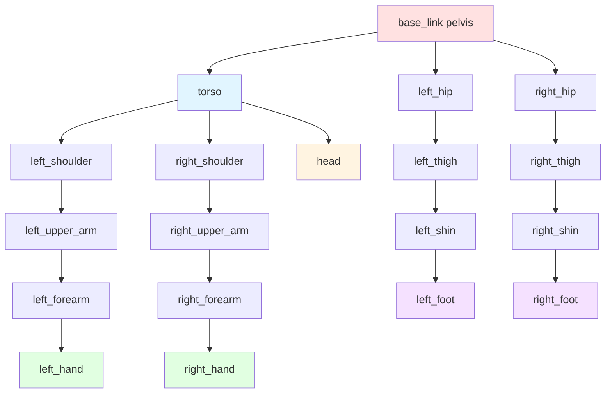

# URDF and Humanoid Description

**Reading Time:** ~30 minutes
**Difficulty Level:** Intermediate to Advanced

## Learning Objectives

By the end of this lesson, you will be able to:

1. **Understand** URDF (Unified Robot Description Format) syntax and structure, including XML schema and semantic conventions
2. **Describe** robot kinematics using links and joints, specifying coordinate frames, parent-child relationships, and transformations
3. **Create** URDF models of humanoid arms and legs with realistic joint types, limits, and dynamics properties
4. **Visualize** URDF models in RViz, inspecting coordinate frames, joint ranges, and geometric representations
5. **Apply** best practices for humanoid robot description, including realistic inertial properties, sensor placement, and documentation

---

## Introduction

Every robotic system—from simple wheeled platforms to complex humanoid robots—requires a formal description of its physical structure. This description answers fundamental questions: What are the robot's parts? How are they connected? What are the masses, dimensions, and constraints? How do sensors and actuators relate to the robot's coordinate frames?

The **Unified Robot Description Format (URDF)** is the standard language for describing robot kinematics, dynamics, and visualization in ROS. URDF is an XML-based format that specifies:

- **Links:** Rigid bodies with mass, inertia, visual geometry, and collision geometry
- **Joints:** Connections between links with motion constraints (revolute, prismatic, fixed, etc.)
- **Sensors and Actuators:** Attachments to links with coordinate frame specifications
- **Materials and Textures:** Visual properties for rendering

URDF serves multiple critical functions:

1. **Simulation:** Physics engines (Gazebo, Isaac Sim) use URDF to model dynamics
2. **Visualization:** RViz displays robot structure and coordinate frames
3. **Motion Planning:** Planners use kinematic constraints and collision geometry
4. **Control:** Controllers need joint limits, inertial properties, and actuator specifications

This lesson focuses on URDF modeling for **humanoid robots**—bipedal systems with articulated arms, legs, torso, and head. Humanoids present unique challenges: high degree-of-freedom (DOF) kinematic chains, complex inertial properties, and tight coupling between mechanical design and control. We'll build URDF models incrementally, starting with fundamental concepts and progressing to complete humanoid subsystems.

:::tip Simulation-First Development
All examples in this lesson are designed for simulation environments. Accurate URDF models enable you to develop and test control algorithms, perception systems, and behaviors entirely in simulation before deploying to physical hardware. Invest time creating high-fidelity URDFs—it accelerates development and reduces hardware risk.
:::

---

## 1. URDF Fundamentals

### 1.1 What is URDF?

**URDF (Unified Robot Description Format)** is an XML specification for describing robot morphology. It defines a **kinematic tree**—a hierarchical structure where each link (rigid body) connects to exactly one parent link via a joint, forming a tree (no cycles).

**URDF structure:**

```xml
<?xml version="1.0"?>
<robot name="my_robot">
  <!-- Links (rigid bodies) -->
  <link name="base_link">...</link>
  <link name="link1">...</link>

  <!-- Joints (connections between links) -->
  <joint name="joint1" type="revolute">
    <parent link="base_link"/>
    <child link="link1"/>
    ...
  </joint>

  <!-- Additional elements: materials, transmissions, sensors -->
</robot>
```

**Key characteristics:**

- **Tree Structure:** No kinematic loops (for loops, use additional constraints in simulation)
- **Declarative:** Describes structure, not behavior (behavior comes from controllers)
- **Physics-Aware:** Includes mass, inertia, friction, damping for simulation
- **ROS-Integrated:** Direct integration with TF (coordinate transforms), joint state publisher, robot state publisher

**URDF vs. Other Formats:**

| Format | Purpose | Key Features |
|--------|---------|--------------|
| **URDF** | ROS robot description | Simple, widely supported, limited to tree structures |
| **SDF (Simulation Description Format)** | Gazebo simulation | Supports loops, multiple robots, more expressive physics |
| **MJCF (MuJoCo XML)** | MuJoCo simulation | Optimized for contact-rich simulation, different paradigm |
| **USD (Universal Scene Description)** | NVIDIA Omniverse/Isaac Sim | General-purpose 3D scene description, emerging standard |

For ROS 2 applications, URDF remains the primary format, with conversion tools available for SDF and other formats.

### 1.2 XML Structure

URDF is XML, so standard XML syntax rules apply: elements, attributes, nesting, closing tags.

**Minimal URDF example:**

```xml
<?xml version="1.0"?>
<robot name="minimal_robot">
  <link name="base_link"/>
</robot>
```

This defines a robot with a single link (no joints, no geometry—not very useful, but syntactically valid).

**Adding a joint and second link:**

```xml
<?xml version="1.0"?>
<robot name="two_link_robot">
  <link name="base_link"/>

  <link name="link1"/>

  <joint name="joint1" type="revolute">
    <parent link="base_link"/>
    <child link="link1"/>
    <origin xyz="0 0 0" rpy="0 0 0"/>
    <axis xyz="0 0 1"/>
    <limit lower="-1.57" upper="1.57" effort="10" velocity="1.0"/>
  </joint>
</robot>
```

**XML element hierarchy:**

- `<robot>`: Root element
  - `<link>`: Rigid body
    - `<inertial>`: Mass and inertia tensor
    - `<visual>`: Geometry for visualization
    - `<collision>`: Geometry for collision detection
  - `<joint>`: Connection between links
    - `<parent>`: Parent link reference
    - `<child>`: Child link reference
    - `<origin>`: Transform from parent to child
    - `<axis>`: Rotation/translation axis (for revolute/prismatic)
    - `<limit>`: Joint limits and dynamics
    - `<dynamics>`: Friction and damping

### 1.3 Links and Joints

**Links** represent rigid bodies—parts of the robot that don't deform (e.g., a robot arm segment, a wheel, a sensor housing).

**Joints** define how links move relative to each other. Joint types include:

| Joint Type | Motion | DOF | Use Case |
|------------|--------|-----|----------|
| **Fixed** | None | 0 | Attach sensors, mount rigid subassemblies |
| **Revolute** | Rotation around axis | 1 | Hinges, rotary joints (elbow, knee) |
| **Continuous** | Unlimited rotation | 1 | Wheels, spinning sensors |
| **Prismatic** | Translation along axis | 1 | Linear actuators, telescoping arms |
| **Planar** | Translation in plane, rotation around normal | 3 | Mobile bases (rarely used; prefer floating) |
| **Floating** | Unconstrained 6-DOF motion | 6 | Free-floating bases, underwater robots |

**Joint parent-child relationship:**

Every joint specifies:
- **Parent link:** The "fixed" end of the joint
- **Child link:** The "moving" end of the joint
- **Origin:** Transform from parent link's coordinate frame to the joint frame
- **Axis:** Direction of motion (for revolute/prismatic joints)

**Example: Revolute joint (elbow)**

```xml
<joint name="elbow_joint" type="revolute">
  <parent link="upper_arm"/>
  <child link="forearm"/>
  <origin xyz="0 0 0.3" rpy="0 0 0"/>  <!-- 0.3m along Z from upper_arm origin -->
  <axis xyz="0 1 0"/>  <!-- Rotates around Y-axis -->
  <limit lower="-2.0" upper="2.0" effort="50" velocity="2.0"/>
</joint>
```

**Interpretation:**

- The `forearm` link is the child of `upper_arm`
- The joint origin is 0.3 meters along the Z-axis of `upper_arm`
- Rotation occurs around the Y-axis
- Joint range: -2.0 to +2.0 radians (-114° to +114°)
- Maximum torque: 50 N⋅m
- Maximum velocity: 2.0 rad/s

### 1.4 Coordinate Frames

Understanding coordinate frames is essential for URDF modeling.

**Link coordinate frame:**

Each link has an **origin** (coordinate frame) at a location you choose. By convention:

- **X-axis:** Forward (for mobile robots) or along the link's length
- **Y-axis:** Left (right-hand rule)
- **Z-axis:** Up (for vertical links) or rotation axis (for revolute joints)

**Joint coordinate frame:**

A joint's origin is defined **relative to the parent link's frame**. The `<origin>` tag specifies the transform.

**Transform specification: `xyz` and `rpy`**

- **`xyz`:** Translation vector (meters) `[x, y, z]`
- **`rpy`:** Rotation in **roll-pitch-yaw** (radians) `[roll, pitch, yaw]`
  - **Roll:** Rotation around X-axis
  - **Pitch:** Rotation around Y-axis
  - **Yaw:** Rotation around Z-axis
  - Applied in order: Yaw → Pitch → Roll (intrinsic rotations)

**Example:**

```xml
<origin xyz="0.1 0.0 0.05" rpy="0 1.57 0"/>
```

This means:
- Translate 0.1m in X, 0.05m in Z
- Rotate 90° (1.57 rad) around Y-axis (pitch)

:::warning Common Mistake: rpy Order
URDF uses **roll-pitch-yaw (RPY)** Euler angles with **intrinsic rotations** (rotations applied in the body frame). This differs from some conventions (e.g., aerospace yaw-pitch-roll). Always verify rotation order when converting from other representations.
:::

**Visualizing frames:**

RViz can display coordinate frames (TF frames) for all links and joints. This is invaluable for debugging URDF models.

**Key Takeaway:** URDF defines a kinematic tree via links (rigid bodies) and joints (connections with motion constraints). Each joint specifies a transform from parent to child, and the joint type determines allowed motion. Coordinate frames are central to understanding these transforms.

---

## 2. Describing Links

A link represents a rigid body. Its full description includes:

1. **Inertial properties:** Mass, center of mass, inertia tensor
2. **Visual geometry:** Meshes, primitives for rendering
3. **Collision geometry:** Simplified shapes for collision detection

### 2.1 Inertial Properties

Accurate inertial properties are critical for realistic simulation. Physics engines use mass and inertia to compute dynamics.

**Inertial element structure:**

```xml
<link name="my_link">
  <inertial>
    <origin xyz="0 0 0.05" rpy="0 0 0"/>  <!-- Center of mass relative to link frame -->
    <mass value="2.5"/>  <!-- Mass in kg -->
    <inertia ixx="0.01" ixy="0.0" ixz="0.0"
             iyy="0.01" iyz="0.0"
             izz="0.005"/>  <!-- Inertia tensor (kg⋅m²) -->
  </inertial>
</link>
```

**Inertia tensor explanation:**

The **inertia tensor** (a 3×3 symmetric matrix) describes resistance to rotational acceleration:

```
I = [ ixx  ixy  ixz ]
    [ ixy  iyy  iyz ]
    [ ixz  iyz  izz ]
```

**Diagonal terms (`ixx`, `iyy`, `izz`):** Moments of inertia around X, Y, Z axes
**Off-diagonal terms (`ixy`, `ixz`, `iyz`):** Products of inertia (coupling between axes)

For objects with symmetry, off-diagonal terms are often zero.

**Computing inertia for common shapes:**

| Shape | Inertia Formula | Notes |
|-------|-----------------|-------|
| **Solid Cylinder** (radius r, height h, mass m, Z-axis) | `ixx = iyy = m(3r² + h²)/12`<br/>`izz = mr²/2` | Common for limbs |
| **Solid Sphere** (radius r, mass m) | `ixx = iyy = izz = 2mr²/5` | Isotropic |
| **Rectangular Box** (width w, depth d, height h, mass m) | `ixx = m(d² + h²)/12`<br/>`iyy = m(w² + h²)/12`<br/>`izz = m(w² + d²)/12` | Common for torsos |

**Example: Forearm modeled as cylinder**

```xml
<inertial>
  <origin xyz="0 0 0.15" rpy="0 0 0"/>  <!-- CoM at midpoint -->
  <mass value="1.2"/>  <!-- 1.2 kg -->
  <!-- Cylinder: r=0.04m, h=0.3m -->
  <inertia ixx="0.0092" ixy="0.0" ixz="0.0"
           iyy="0.0092" iyz="0.0"
           izz="0.00096"/>
</inertial>
```

**Calculated:**
- `ixx = iyy = 1.2 * (3 * 0.04² + 0.3²) / 12 ≈ 0.0092`
- `izz = 1.2 * 0.04² / 2 ≈ 0.00096`

**Consequences of incorrect inertia:**

- **Too low:** Robot appears "floaty," unstable in simulation
- **Too high:** Robot appears sluggish, unresponsive
- **Asymmetric errors:** Unexpected wobbling, torque coupling

:::tip Best Practice: Use CAD-Derived Inertia
For physical robots, export inertial properties directly from CAD software (SolidWorks, Fusion 360, Blender). Manual approximations are acceptable for prototyping but should be refined with CAD data.
:::

### 2.2 Visual Geometry

**Visual geometry** defines how the link appears in visualization tools (RViz, Gazebo GUI).

**Geometry types:**

1. **Primitives:** Box, cylinder, sphere (defined parametrically)
2. **Meshes:** STL, DAE (COLLADA), OBJ files

**Primitive example: Box**

```xml
<visual>
  <origin xyz="0 0 0.15" rpy="0 0 0"/>
  <geometry>
    <box size="0.08 0.08 0.3"/>  <!-- Width, depth, height in meters -->
  </geometry>
  <material name="blue">
    <color rgba="0.0 0.0 1.0 1.0"/>  <!-- R G B A (0-1 range) -->
  </material>
</visual>
```

**Primitive example: Cylinder**

```xml
<visual>
  <origin xyz="0 0 0.15" rpy="0 0 0"/>
  <geometry>
    <cylinder radius="0.04" length="0.3"/>
  </geometry>
  <material name="gray">
    <color rgba="0.5 0.5 0.5 1.0"/>
  </material>
</visual>
```

**Mesh example:**

```xml
<visual>
  <origin xyz="0 0 0" rpy="0 0 0"/>
  <geometry>
    <mesh filename="package://my_robot_description/meshes/forearm.dae" scale="1 1 1"/>
  </geometry>
  <material name="robot_material">
    <color rgba="0.8 0.8 0.8 1.0"/>
  </material>
</visual>
```

**Mesh file formats:**

- **STL:** Simple, widely supported, no color/texture information
- **DAE (COLLADA):** Supports textures, materials, complex scenes
- **OBJ:** Common, supports materials via MTL files

**Mesh file paths:**

Use `package://` URI to reference files within ROS packages:

```
package://my_robot_description/meshes/arm.dae
```

This resolves to:

```
<workspace>/install/my_robot_description/share/my_robot_description/meshes/arm.dae
```

**Material definitions:**

Materials can be defined globally and reused:

```xml
<robot name="my_robot">
  <material name="blue">
    <color rgba="0.0 0.0 1.0 1.0"/>
  </material>

  <link name="link1">
    <visual>
      <geometry>...</geometry>
      <material name="blue"/>  <!-- Reuse material -->
    </visual>
  </link>
</robot>
```

### 2.3 Collision Geometry

**Collision geometry** defines shapes for collision detection. Physics engines use this to compute contacts, forces, and prevent interpenetration.

**Why separate collision and visual geometry?**

- **Performance:** Collision detection is expensive; use simplified shapes (boxes, cylinders) instead of high-poly meshes
- **Robustness:** Convex hulls and primitives are more stable than complex meshes
- **Accuracy:** Visual meshes may have decorative details irrelevant for collision

**Example: Visual mesh with simplified collision**

```xml
<link name="forearm">
  <!-- Visual: High-detail mesh for rendering -->
  <visual>
    <geometry>
      <mesh filename="package://my_robot_description/meshes/forearm_visual.dae"/>
    </geometry>
  </visual>

  <!-- Collision: Simplified cylinder for physics -->
  <collision>
    <origin xyz="0 0 0.15" rpy="0 0 0"/>
    <geometry>
      <cylinder radius="0.05" length="0.3"/>  <!-- Slightly larger than visual for margin -->
    </geometry>
  </collision>
</link>
```

**Collision margin:**

Some physics engines (e.g., Bullet) perform better with a small "safety margin" around collision shapes. Make collision geometry slightly larger than visual geometry (1-2 mm) to prevent jittering.

**Best practices for collision geometry:**

1. **Use primitives when possible:** Faster, more stable
2. **Approximate complex shapes:** Decompose into multiple primitives or use convex hulls
3. **Avoid concave meshes:** May require convex decomposition (expensive)
4. **Test in simulation:** Ensure no unexpected collisions or interpenetration

**Key Takeaway:** Links require three types of information: inertial (for dynamics), visual (for rendering), and collision (for physics). Invest effort in accurate inertial properties—they directly affect simulation fidelity. Use simplified collision geometry for performance.

---

## 3. Describing Joints

Joints define kinematic and dynamic relationships between links.

### 3.1 Joint Types

We've introduced joint types earlier; let's explore them in detail for humanoid modeling.

#### **Revolute Joint (Hinge)**

**Use case:** Knees, elbows, finger joints

**Properties:**
- 1 DOF (rotation around axis)
- Bounded range (specified by limits)
- Common in humanoid limbs

**Example: Knee joint**

```xml
<joint name="knee_joint" type="revolute">
  <parent link="thigh"/>
  <child link="shin"/>
  <origin xyz="0 0 -0.4" rpy="0 0 0"/>  <!-- 0.4m down from thigh origin -->
  <axis xyz="0 1 0"/>  <!-- Rotation around Y-axis (lateral) -->
  <limit lower="0.0" upper="2.5" effort="200" velocity="6.0"/>
  <dynamics damping="0.5" friction="0.1"/>
</joint>
```

**Interpretation:**

- Knee rotates around lateral axis (Y)
- Range: 0° to 143° (human knee flexion range)
- Max torque: 200 N⋅m
- Max velocity: 6 rad/s (~344°/s)
- Damping: 0.5 N⋅m⋅s/rad (resists fast motion)
- Friction: 0.1 N⋅m (constant resistive torque)

#### **Continuous Joint**

**Use case:** Rotating sensors, wheels, spinning actuators

**Properties:**
- 1 DOF (rotation around axis)
- Unbounded (no upper/lower limits)

**Example: Head yaw (pan)**

```xml
<joint name="head_yaw" type="continuous">
  <parent link="neck"/>
  <child link="head"/>
  <origin xyz="0 0 0.1" rpy="0 0 0"/>
  <axis xyz="0 0 1"/>  <!-- Rotation around Z-axis (vertical) -->
  <dynamics damping="0.2" friction="0.05"/>
</joint>
```

**Note:** While heads can rotate continuously in simulation, physical humanoids have cable/sensor limits. Use `revolute` with large limits for realism.

#### **Prismatic Joint (Slider)**

**Use case:** Telescoping limbs, linear actuators, variable-height torsos

**Properties:**
- 1 DOF (translation along axis)
- Bounded range

**Example: Telescoping antenna**

```xml
<joint name="antenna_extension" type="prismatic">
  <parent link="torso"/>
  <child link="antenna"/>
  <origin xyz="0 0 0.5" rpy="0 0 0"/>
  <axis xyz="0 0 1"/>  <!-- Translation along Z-axis -->
  <limit lower="0.0" upper="0.3" effort="50" velocity="0.5"/>
</joint>
```

**Interpretation:**

- Antenna extends 0 to 0.3 meters upward
- Max force: 50 N
- Max velocity: 0.5 m/s

#### **Fixed Joint**

**Use case:** Attach sensors, mount rigid assemblies, define coordinate frames

**Properties:**
- 0 DOF (no motion)
- Effectively "welds" child to parent

**Example: Camera mount**

```xml
<joint name="camera_mount" type="fixed">
  <parent link="head"/>
  <child link="camera"/>
  <origin xyz="0.05 0 0.08" rpy="0 0 0"/>  <!-- 5cm forward, 8cm up from head origin -->
</joint>
```

### 3.2 Joint Limits and Dynamics

**Limit element:**

```xml
<limit lower="-1.57" upper="1.57" effort="100" velocity="2.0"/>
```

**Attributes:**

- **`lower`:** Minimum joint value (radians for revolute, meters for prismatic)
- **`upper`:** Maximum joint value
- **`effort`:** Maximum absolute generalized force (N⋅m for revolute, N for prismatic)
- **`velocity`:** Maximum absolute velocity (rad/s or m/s)

**Dynamics element:**

```xml
<dynamics damping="0.7" friction="0.2"/>
```

**Attributes:**

- **`damping`:** Viscous damping coefficient (opposes velocity)
  - Units: N⋅m⋅s/rad (revolute) or N⋅s/m (prismatic)
  - Models air resistance, internal friction
- **`friction`:** Coulomb friction (constant resistive force)
  - Units: N⋅m (revolute) or N (prismatic)
  - Models static/kinetic friction

**Setting realistic limits:**

For humanoid joints, reference human biomechanics or robot specifications:

| Joint | Typical Range (deg) | Typical Range (rad) |
|-------|---------------------|---------------------|
| **Shoulder Pitch** | -90 to +180 | -1.57 to +3.14 |
| **Shoulder Roll** | -45 to +180 | -0.79 to +3.14 |
| **Elbow Flex** | 0 to +150 | 0 to +2.62 |
| **Hip Pitch** | -90 to +90 | -1.57 to +1.57 |
| **Hip Roll** | -45 to +45 | -0.79 to +0.79 |
| **Knee Flex** | 0 to +150 | 0 to +2.62 |
| **Ankle Pitch** | -45 to +45 | -0.79 to +0.79 |

:::important Safety Consideration
In simulation, joint limits prevent impossible configurations. For physical robots, limits must account for:
- Mechanical hard stops
- Sensor measurement ranges
- Software safety margins (e.g., limit to 95% of mechanical range)
- Collision avoidance (self-collision, environment)
:::

### 3.3 Actuator Properties

While URDF doesn't directly specify actuators (that's done via `<transmission>` elements for Gazebo), joint limits and dynamics provide essential constraints.

**Effort (Torque/Force) Limits:**

Determines maximum force the actuator can apply. Critical for:

- **Gravity compensation:** Can the joint hold its weight?
- **Acceleration:** Can it achieve desired motion quickly?
- **Load capacity:** Can it carry payloads?

**Example calculation: Required knee torque to hold leg**

```
Mass of shin + foot: 4 kg
Distance from knee to CoM: 0.25 m
Required torque (static, horizontal): 4 kg * 9.81 m/s² * 0.25 m ≈ 9.8 N⋅m
```

**Velocity limits:**

Determines maximum joint speed. Affects:

- **Responsiveness:** Can the robot move fast enough?
- **Trajectory tracking:** Can it follow desired paths accurately?

**Example:** A humanoid gait might require knee velocity of 3-5 rad/s during swing phase.

### 3.4 Parent-Child Relationships

The parent-child relationship defines the kinematic tree structure.

**Rules:**

1. **Each link has at most one parent joint:** No link can be the child of multiple joints (enforces tree structure)
2. **Root link has no parent:** Typically `base_link` or `world`
3. **Joints define directed edges:** Motion of parent affects child, but not vice versa (forward kinematics)

**Example kinematic tree (simplified humanoid):**

```
base_link (pelvis)
├── torso
│   ├── left_shoulder
│   │   └── left_upper_arm
│   │       └── left_forearm
│   │           └── left_hand
│   ├── right_shoulder
│   │   └── right_upper_arm
│   │       └── right_forearm
│   │           └── right_hand
│   └── head
├── left_hip
│   └── left_thigh
│       └── left_shin
│           └── left_foot
└── right_hip
    └── right_thigh
        └── right_shin
            └── right_foot
```

**Mermaid diagram:**



**Figure 1:** Simplified humanoid kinematic tree. The pelvis (`base_link`) is the root, with branches for torso/arms/head and legs.

**Key Takeaway:** Joints define kinematic constraints and dynamics. Choose appropriate joint types, set realistic limits based on human/robot specifications, and define the parent-child tree carefully—it determines how motion propagates through the robot.

---

## 4. Building Humanoid Structure

Now we'll apply URDF concepts to build realistic humanoid subsystems.

### 4.1 Humanoid Kinematics Overview

A typical humanoid robot has:

- **Torso:** 0-3 DOF (pitch, roll, yaw for flexibility)
- **Head:** 2-3 DOF (pan, tilt, optional roll)
- **Arms:** 7+ DOF per arm (shoulder: 3, elbow: 1, wrist: 3, hand: variable)
- **Legs:** 6 DOF per leg (hip: 3, knee: 1, ankle: 2)
- **Hands:** 0-20+ DOF (simple grippers to dexterous hands)

**Total DOF for a humanoid:** 30-50+ (excluding hands)

**Degrees of freedom distribution:**

| Subsystem | DOF | Joints |
|-----------|-----|--------|
| **Torso** | 3 | Waist pitch, roll, yaw |
| **Head** | 2 | Neck yaw, pitch |
| **Arm (each)** | 7 | Shoulder pitch/roll/yaw, elbow flex, wrist pitch/roll/yaw |
| **Leg (each)** | 6 | Hip pitch/roll/yaw, knee flex, ankle pitch/roll |

**Design principles:**

1. **Anthropomorphism:** Mimic human joint types and ranges for intuitive motion
2. **Redundancy:** Extra DOF (e.g., 7-DOF arms) enable obstacle avoidance and singularity avoidance
3. **Modularity:** Design subsystems (arm, leg) independently, then integrate

### 4.2 Arm Structure (Shoulder, Elbow, Wrist)

Let's build a 7-DOF humanoid arm.

**Joint breakdown:**

1. **Shoulder Pitch:** Forward/backward arm swing
2. **Shoulder Roll:** Lateral arm raise
3. **Shoulder Yaw:** Internal/external rotation
4. **Elbow Flex:** Forearm bending
5. **Wrist Pitch:** Hand up/down
6. **Wrist Roll:** Hand rotation
7. **Wrist Yaw:** Hand left/right (optional, often combined with roll)

**URDF implementation:**

```xml
<?xml version="1.0"?>
<robot name="humanoid_arm">

  <!-- Base link (shoulder mount point) -->
  <link name="shoulder_base"/>

  <!-- Shoulder Link 1 (Pitch) -->
  <link name="shoulder_pitch_link">
    <inertial>
      <mass value="0.5"/>
      <origin xyz="0 0 0" rpy="0 0 0"/>
      <inertia ixx="0.001" ixy="0" ixz="0" iyy="0.001" iyz="0" izz="0.001"/>
    </inertial>
    <visual>
      <geometry>
        <cylinder radius="0.05" length="0.1"/>
      </geometry>
      <material name="gray">
        <color rgba="0.5 0.5 0.5 1"/>
      </material>
    </visual>
    <collision>
      <geometry>
        <cylinder radius="0.05" length="0.1"/>
      </geometry>
    </collision>
  </link>

  <joint name="shoulder_pitch" type="revolute">
    <parent link="shoulder_base"/>
    <child link="shoulder_pitch_link"/>
    <origin xyz="0 0 0" rpy="0 0 0"/>
    <axis xyz="0 1 0"/>  <!-- Pitch around Y -->
    <limit lower="-1.57" upper="3.14" effort="100" velocity="2.0"/>
    <dynamics damping="0.7" friction="0.1"/>
  </joint>

  <!-- Shoulder Link 2 (Roll) -->
  <link name="shoulder_roll_link">
    <inertial>
      <mass value="0.4"/>
      <origin xyz="0 0 0" rpy="0 0 0"/>
      <inertia ixx="0.0008" ixy="0" ixz="0" iyy="0.0008" iyz="0" izz="0.0008"/>
    </inertial>
    <visual>
      <geometry>
        <cylinder radius="0.045" length="0.08"/>
      </geometry>
      <material name="gray"/>
    </visual>
    <collision>
      <geometry>
        <cylinder radius="0.045" length="0.08"/>
      </geometry>
    </collision>
  </link>

  <joint name="shoulder_roll" type="revolute">
    <parent link="shoulder_pitch_link"/>
    <child link="shoulder_roll_link"/>
    <origin xyz="0 0 0.05" rpy="0 0 0"/>
    <axis xyz="1 0 0"/>  <!-- Roll around X -->
    <limit lower="-0.79" upper="3.14" effort="100" velocity="2.0"/>
    <dynamics damping="0.7" friction="0.1"/>
  </joint>

  <!-- Shoulder Link 3 (Yaw) -->
  <link name="shoulder_yaw_link">
    <inertial>
      <mass value="0.3"/>
      <origin xyz="0 0 0.05" rpy="0 0 0"/>
      <inertia ixx="0.0005" ixy="0" ixz="0" iyy="0.0005" iyz="0" izz="0.0003"/>
    </inertial>
    <visual>
      <geometry>
        <cylinder radius="0.04" length="0.1"/>
      </geometry>
      <material name="blue">
        <color rgba="0.2 0.2 0.8 1"/>
      </material>
    </visual>
    <collision>
      <geometry>
        <cylinder radius="0.04" length="0.1"/>
      </geometry>
    </collision>
  </link>

  <joint name="shoulder_yaw" type="revolute">
    <parent link="shoulder_roll_link"/>
    <child link="shoulder_yaw_link"/>
    <origin xyz="0 0 0.04" rpy="0 0 0"/>
    <axis xyz="0 0 1"/>  <!-- Yaw around Z -->
    <limit lower="-1.57" upper="1.57" effort="50" velocity="2.0"/>
    <dynamics damping="0.5" friction="0.1"/>
  </joint>

  <!-- Upper Arm Link -->
  <link name="upper_arm">
    <inertial>
      <mass value="1.5"/>
      <origin xyz="0 0 -0.15" rpy="0 0 0"/>
      <inertia ixx="0.02" ixy="0" ixz="0" iyy="0.02" iyz="0" izz="0.002"/>
    </inertial>
    <visual>
      <origin xyz="0 0 -0.15" rpy="0 0 0"/>
      <geometry>
        <cylinder radius="0.05" length="0.3"/>
      </geometry>
      <material name="gray"/>
    </visual>
    <collision>
      <origin xyz="0 0 -0.15" rpy="0 0 0"/>
      <geometry>
        <cylinder radius="0.05" length="0.3"/>
      </geometry>
    </collision>
  </link>

  <joint name="upper_arm_joint" type="fixed">
    <parent link="shoulder_yaw_link"/>
    <child link="upper_arm"/>
    <origin xyz="0 0 0.05" rpy="0 0 0"/>
  </joint>

  <!-- Elbow Joint and Forearm -->
  <link name="forearm">
    <inertial>
      <mass value="1.2"/>
      <origin xyz="0 0 -0.125" rpy="0 0 0"/>
      <inertia ixx="0.0125" ixy="0" ixz="0" iyy="0.0125" iyz="0" izz="0.0012"/>
    </inertial>
    <visual>
      <origin xyz="0 0 -0.125" rpy="0 0 0"/>
      <geometry>
        <cylinder radius="0.04" length="0.25"/>
      </geometry>
      <material name="blue"/>
    </visual>
    <collision>
      <origin xyz="0 0 -0.125" rpy="0 0 0"/>
      <geometry>
        <cylinder radius="0.04" length="0.25"/>
      </geometry>
    </collision>
  </link>

  <joint name="elbow_flex" type="revolute">
    <parent link="upper_arm"/>
    <child link="forearm"/>
    <origin xyz="0 0 -0.3" rpy="0 0 0"/>
    <axis xyz="0 1 0"/>  <!-- Flex around Y -->
    <limit lower="0.0" upper="2.62" effort="80" velocity="3.0"/>
    <dynamics damping="0.6" friction="0.1"/>
  </joint>

  <!-- Wrist Pitch -->
  <link name="wrist_pitch_link">
    <inertial>
      <mass value="0.2"/>
      <origin xyz="0 0 0" rpy="0 0 0"/>
      <inertia ixx="0.0002" ixy="0" ixz="0" iyy="0.0002" iyz="0" izz="0.0002"/>
    </inertial>
    <visual>
      <geometry>
        <cylinder radius="0.03" length="0.06"/>
      </geometry>
      <material name="gray"/>
    </visual>
    <collision>
      <geometry>
        <cylinder radius="0.03" length="0.06"/>
      </geometry>
    </collision>
  </link>

  <joint name="wrist_pitch" type="revolute">
    <parent link="forearm"/>
    <child link="wrist_pitch_link"/>
    <origin xyz="0 0 -0.25" rpy="0 0 0"/>
    <axis xyz="0 1 0"/>
    <limit lower="-1.57" upper="1.57" effort="20" velocity="3.0"/>
    <dynamics damping="0.3" friction="0.05"/>
  </joint>

  <!-- Wrist Roll -->
  <link name="wrist_roll_link">
    <inertial>
      <mass value="0.15"/>
      <origin xyz="0 0 0" rpy="0 0 0"/>
      <inertia ixx="0.00015" ixy="0" ixz="0" iyy="0.00015" iyz="0" izz="0.00015"/>
    </inertial>
    <visual>
      <geometry>
        <cylinder radius="0.025" length="0.05"/>
      </geometry>
      <material name="blue"/>
    </visual>
    <collision>
      <geometry>
        <cylinder radius="0.025" length="0.05"/>
      </geometry>
    </collision>
  </link>

  <joint name="wrist_roll" type="revolute">
    <parent link="wrist_pitch_link"/>
    <child link="wrist_roll_link"/>
    <origin xyz="0 0 -0.03" rpy="0 0 0"/>
    <axis xyz="0 0 1"/>
    <limit lower="-1.57" upper="1.57" effort="10" velocity="4.0"/>
    <dynamics damping="0.2" friction="0.05"/>
  </joint>

  <!-- Hand (simplified as box) -->
  <link name="hand">
    <inertial>
      <mass value="0.3"/>
      <origin xyz="0 0 -0.05" rpy="0 0 0"/>
      <inertia ixx="0.0005" ixy="0" ixz="0" iyy="0.0003" iyz="0" izz="0.0003"/>
    </inertial>
    <visual>
      <origin xyz="0 0 -0.05" rpy="0 0 0"/>
      <geometry>
        <box size="0.08 0.12 0.1"/>
      </geometry>
      <material name="gray"/>
    </visual>
    <collision>
      <origin xyz="0 0 -0.05" rpy="0 0 0"/>
      <geometry>
        <box size="0.08 0.12 0.1"/>
      </geometry>
    </collision>
  </link>

  <joint name="hand_joint" type="fixed">
    <parent link="wrist_roll_link"/>
    <child link="hand"/>
    <origin xyz="0 0 -0.025" rpy="0 0 0"/>
  </joint>

</robot>
```

**Key design choices:**

- **Spherical shoulder:** Three sequential revolute joints (pitch, roll, yaw) approximate a ball-and-socket joint
- **Link offsets:** Each joint origin is offset to create realistic arm geometry
- **Decreasing mass:** Links farther from shoulder are lighter (reduces inertia)
- **Fixed hand joint:** Hand doesn't articulate (simplification; could add finger joints)

**Visualizing in RViz:**

```bash
# Install urdf_tutorial if not already installed
sudo apt install ros-humble-urdf-tutorial

# Launch URDF in RViz
ros2 launch urdf_tutorial display.launch.py model:=path/to/humanoid_arm.urdf
```

You should see the arm with movable joints (use the Joint State Publisher GUI to test ranges).

### 4.3 Leg Structure (Hip, Knee, Ankle)

Now let's build a 6-DOF humanoid leg.

**Joint breakdown:**

1. **Hip Yaw:** Leg rotation (internal/external)
2. **Hip Roll:** Leg abduction/adduction
3. **Hip Pitch:** Leg swing forward/backward
4. **Knee Flex:** Lower leg bending
5. **Ankle Pitch:** Foot dorsiflexion/plantarflexion
6. **Ankle Roll:** Foot inversion/eversion

**URDF implementation:**

```xml
<?xml version="1.0"?>
<robot name="humanoid_leg">

  <!-- Base link (hip mount point on pelvis) -->
  <link name="pelvis"/>

  <!-- Hip Yaw Link -->
  <link name="hip_yaw_link">
    <inertial>
      <mass value="0.6"/>
      <origin xyz="0 0 0" rpy="0 0 0"/>
      <inertia ixx="0.001" ixy="0" ixz="0" iyy="0.001" iyz="0" izz="0.001"/>
    </inertial>
    <visual>
      <geometry>
        <cylinder radius="0.06" length="0.1"/>
      </geometry>
      <material name="gray">
        <color rgba="0.5 0.5 0.5 1"/>
      </material>
    </visual>
    <collision>
      <geometry>
        <cylinder radius="0.06" length="0.1"/>
      </geometry>
    </collision>
  </link>

  <joint name="hip_yaw" type="revolute">
    <parent link="pelvis"/>
    <child link="hip_yaw_link"/>
    <origin xyz="0 0.1 0" rpy="0 0 0"/>  <!-- 0.1m lateral from pelvis center -->
    <axis xyz="0 0 1"/>  <!-- Yaw around Z -->
    <limit lower="-0.79" upper="0.79" effort="150" velocity="2.0"/>
    <dynamics damping="1.0" friction="0.2"/>
  </joint>

  <!-- Hip Roll Link -->
  <link name="hip_roll_link">
    <inertial>
      <mass value="0.5"/>
      <origin xyz="0 0 0" rpy="0 0 0"/>
      <inertia ixx="0.0008" ixy="0" ixz="0" iyy="0.0008" iyz="0" izz="0.0008"/>
    </inertial>
    <visual>
      <geometry>
        <cylinder radius="0.055" length="0.08"/>
      </geometry>
      <material name="gray"/>
    </visual>
    <collision>
      <geometry>
        <cylinder radius="0.055" length="0.08"/>
      </geometry>
    </collision>
  </link>

  <joint name="hip_roll" type="revolute">
    <parent link="hip_yaw_link"/>
    <child link="hip_roll_link"/>
    <origin xyz="0 0 -0.05" rpy="0 0 0"/>
    <axis xyz="1 0 0"/>  <!-- Roll around X -->
    <limit lower="-0.79" upper="0.79" effort="150" velocity="2.0"/>
    <dynamics damping="1.0" friction="0.2"/>
  </joint>

  <!-- Hip Pitch Link (part of thigh) -->
  <link name="thigh">
    <inertial>
      <mass value="3.0"/>
      <origin xyz="0 0 -0.2" rpy="0 0 0"/>
      <inertia ixx="0.05" ixy="0" ixz="0" iyy="0.05" iyz="0" izz="0.005"/>
    </inertial>
    <visual>
      <origin xyz="0 0 -0.2" rpy="0 0 0"/>
      <geometry>
        <cylinder radius="0.07" length="0.4"/>
      </geometry>
      <material name="blue">
        <color rgba="0.2 0.2 0.8 1"/>
      </material>
    </visual>
    <collision>
      <origin xyz="0 0 -0.2" rpy="0 0 0"/>
      <geometry>
        <cylinder radius="0.07" length="0.4"/>
      </geometry>
    </collision>
  </link>

  <joint name="hip_pitch" type="revolute">
    <parent link="hip_roll_link"/>
    <child link="thigh"/>
    <origin xyz="0 0 -0.04" rpy="0 0 0"/>
    <axis xyz="0 1 0"/>  <!-- Pitch around Y -->
    <limit lower="-1.57" upper="1.57" effort="200" velocity="3.0"/>
    <dynamics damping="1.5" friction="0.3"/>
  </joint>

  <!-- Knee Joint and Shin -->
  <link name="shin">
    <inertial>
      <mass value="2.0"/>
      <origin xyz="0 0 -0.2" rpy="0 0 0"/>
      <inertia ixx="0.03" ixy="0" ixz="0" iyy="0.03" iyz="0" izz="0.003"/>
    </inertial>
    <visual>
      <origin xyz="0 0 -0.2" rpy="0 0 0"/>
      <geometry>
        <cylinder radius="0.05" length="0.4"/>
      </geometry>
      <material name="gray"/>
    </visual>
    <collision>
      <origin xyz="0 0 -0.2" rpy="0 0 0"/>
      <geometry>
        <cylinder radius="0.05" length="0.4"/>
      </geometry>
    </collision>
  </link>

  <joint name="knee_flex" type="revolute">
    <parent link="thigh"/>
    <child link="shin"/>
    <origin xyz="0 0 -0.4" rpy="0 0 0"/>
    <axis xyz="0 1 0"/>
    <limit lower="0.0" upper="2.62" effort="200" velocity="6.0"/>
    <dynamics damping="1.0" friction="0.2"/>
  </joint>

  <!-- Ankle Pitch -->
  <link name="ankle_pitch_link">
    <inertial>
      <mass value="0.3"/>
      <origin xyz="0 0 0" rpy="0 0 0"/>
      <inertia ixx="0.0003" ixy="0" ixz="0" iyy="0.0003" iyz="0" izz="0.0003"/>
    </inertial>
    <visual>
      <geometry>
        <cylinder radius="0.04" length="0.08"/>
      </geometry>
      <material name="gray"/>
    </visual>
    <collision>
      <geometry>
        <cylinder radius="0.04" length="0.08"/>
      </geometry>
    </collision>
  </link>

  <joint name="ankle_pitch" type="revolute">
    <parent link="shin"/>
    <child link="ankle_pitch_link"/>
    <origin xyz="0 0 -0.4" rpy="0 0 0"/>
    <axis xyz="0 1 0"/>
    <limit lower="-0.79" upper="0.79" effort="100" velocity="3.0"/>
    <dynamics damping="0.5" friction="0.1"/>
  </joint>

  <!-- Ankle Roll and Foot -->
  <link name="foot">
    <inertial>
      <mass value="1.0"/>
      <origin xyz="0.05 0 -0.03" rpy="0 0 0"/>
      <inertia ixx="0.005" ixy="0" ixz="0" iyy="0.01" iyz="0" izz="0.008"/>
    </inertial>
    <visual>
      <origin xyz="0.05 0 -0.03" rpy="0 0 0"/>
      <geometry>
        <box size="0.2 0.1 0.06"/>  <!-- Length, width, height -->
      </geometry>
      <material name="blue"/>
    </visual>
    <collision>
      <origin xyz="0.05 0 -0.03" rpy="0 0 0"/>
      <geometry>
        <box size="0.2 0.1 0.06"/>
      </geometry>
    </collision>
  </link>

  <joint name="ankle_roll" type="revolute">
    <parent link="ankle_pitch_link"/>
    <child link="foot"/>
    <origin xyz="0 0 -0.04" rpy="0 0 0"/>
    <axis xyz="1 0 0"/>
    <limit lower="-0.52" upper="0.52" effort="80" velocity="3.0"/>
    <dynamics damping="0.5" friction="0.1"/>
  </joint>

</robot>
```

**Key design choices:**

- **Spherical hip:** Three revolute joints (yaw, roll, pitch) provide full 3-DOF hip motion
- **Realistic masses:** Thigh and shin are heavier than hip/ankle links
- **Foot geometry:** Box shape provides ground contact surface
- **Knee constraint:** `lower="0.0"` prevents hyperextension (knee bends only forward)

### 4.4 Full Humanoid Sketch (Integrated Structure)

Combining arms, legs, torso, and head:

```xml
<?xml version="1.0"?>
<robot name="simple_humanoid">

  <!-- Pelvis (root link) -->
  <link name="pelvis">
    <inertial>
      <mass value="10.0"/>
      <origin xyz="0 0 0" rpy="0 0 0"/>
      <inertia ixx="0.1" ixy="0" ixz="0" iyy="0.15" iyz="0" izz="0.1"/>
    </inertial>
    <visual>
      <geometry>
        <box size="0.3 0.4 0.2"/>
      </geometry>
      <material name="gray">
        <color rgba="0.6 0.6 0.6 1"/>
      </material>
    </visual>
    <collision>
      <geometry>
        <box size="0.3 0.4 0.2"/>
      </geometry>
    </collision>
  </link>

  <!-- Torso -->
  <link name="torso">
    <inertial>
      <mass value="15.0"/>
      <origin xyz="0 0 0.25" rpy="0 0 0"/>
      <inertia ixx="0.3" ixy="0" ixz="0" iyy="0.35" iyz="0" izz="0.2"/>
    </inertial>
    <visual>
      <origin xyz="0 0 0.25" rpy="0 0 0"/>
      <geometry>
        <box size="0.35 0.5 0.5"/>
      </geometry>
      <material name="blue">
        <color rgba="0.3 0.3 0.9 1"/>
      </material>
    </visual>
    <collision>
      <origin xyz="0 0 0.25" rpy="0 0 0"/>
      <geometry>
        <box size="0.35 0.5 0.5"/>
      </geometry>
    </collision>
  </link>

  <joint name="waist" type="fixed">
    <parent link="pelvis"/>
    <child link="torso"/>
    <origin xyz="0 0 0.1" rpy="0 0 0"/>
  </joint>

  <!-- Left Arm (reference previous arm URDF, mount to torso) -->
  <!-- Right Arm (mirror left arm) -->
  <!-- Left Leg (reference previous leg URDF, mount to pelvis) -->
  <!-- Right Leg (mirror left leg) -->
  <!-- Head (simple fixed joint for now) -->

  <link name="head">
    <inertial>
      <mass value="2.0"/>
      <origin xyz="0 0 0.1" rpy="0 0 0"/>
      <inertia ixx="0.02" ixy="0" ixz="0" iyy="0.02" iyz="0" izz="0.02"/>
    </inertial>
    <visual>
      <origin xyz="0 0 0.1" rpy="0 0 0"/>
      <geometry>
        <sphere radius="0.15"/>
      </geometry>
      <material name="gray"/>
    </visual>
    <collision>
      <origin xyz="0 0 0.1" rpy="0 0 0"/>
      <geometry>
        <sphere radius="0.15"/>
      </geometry>
    </collision>
  </link>

  <joint name="neck" type="fixed">
    <parent link="torso"/>
    <child link="head"/>
    <origin xyz="0 0 0.5" rpy="0 0 0"/>
  </joint>

</robot>
```

*Note: Complete integration requires including all arm and leg joints from previous sections.*

**Key Takeaway:** Building humanoid URDFs requires careful attention to joint placement, realistic masses, and kinematic tree structure. Start with subsystems (arm, leg), validate them individually in RViz, then integrate into a full-body model.

---

## 5. Visualization and Validation

### 5.1 Loading URDF in RViz

RViz is the standard ROS visualization tool. It can display URDF models, coordinate frames (TF), sensor data, and more.

**Launching URDF in RViz:**

```bash
# Install robot_state_publisher and joint_state_publisher
sudo apt install ros-humble-robot-state-publisher ros-humble-joint-state-publisher-gui

# Launch with URDF
ros2 launch urdf_tutorial display.launch.py model:=/path/to/your_robot.urdf
```

**What happens:**

1. **`robot_state_publisher`** reads URDF and publishes TF transforms for all links
2. **`joint_state_publisher_gui`** provides sliders to control joint positions
3. **RViz** visualizes the robot model and TF frames

**RViz display options:**

- **RobotModel:** Shows visual geometry, colored by material
- **TF:** Shows coordinate frames as RGB axes (X=red, Y=green, Z=blue)
- **Axes:** Adjustable size for better visibility

### 5.2 Checking Frames and Transforms

**Inspecting TF tree:**

```bash
# List all frames
ros2 run tf2_tools view_frames

# Generates frames.pdf showing TF tree
```

**Querying specific transforms:**

```bash
# Transform from base_link to hand
ros2 run tf2_ros tf2_echo base_link hand
```

**Expected output:**

```
At time 0.0
- Translation: [0.500, 0.200, 1.200]
- Rotation: in Quaternion [0.000, 0.000, 0.707, 0.707]
            in RPY (radian) [0.000, 0.000, 1.571]
            in RPY (degree) [0.000, 0.000, 90.000]
```

**Common frame issues:**

- **Disconnected frames:** Joint parent/child mismatch
- **Unexpected offsets:** Incorrect `<origin>` in joints
- **Flipped axes:** Wrong axis specification or rotation

### 5.3 Using URDF Parser Tools

**`check_urdf`:** Validates URDF syntax

```bash
# Install urdfdom
sudo apt install liburdfdom-tools

# Check URDF
check_urdf your_robot.urdf
```

**Output (if valid):**

```
robot name is: simple_humanoid
---------- Successfully Parsed XML ---------------
root Link: pelvis has 2 child(ren)
    child(1):  torso
        child(1):  head
    child(2):  left_leg
        child(1):  left_thigh
            ...
```

**Output (if invalid):**

```
Error: <error message>
```

**`urdf_to_graphiz`:** Visualizes kinematic tree

```bash
urdf_to_graphiz your_robot.urdf
# Generates robot.gv and robot.pdf
```

### 5.4 Debugging Common Issues

**Issue: "Link [X] has no inertia"**

**Problem:** Missing or zero inertia tensor

**Solution:** Add realistic inertial properties to all links (even if small)

```xml
<inertial>
  <mass value="0.01"/>  <!-- Minimum 0.01 kg to avoid numerical issues -->
  <inertia ixx="0.00001" iyy="0.00001" izz="0.00001" ixy="0" ixz="0" iyz="0"/>
</inertial>
```

**Issue: "Joint [X] effort limit is zero"**

**Problem:** Missing or zero effort in `<limit>`

**Solution:** Set realistic effort values

```xml
<limit lower="..." upper="..." effort="10.0" velocity="1.0"/>
```

**Issue: Robot "explodes" in Gazebo**

**Problem:** Unrealistic inertia, conflicting collision geometry, or missing damping

**Solution:**

1. Verify inertia values (use CAD or formulas)
2. Simplify collision geometry
3. Add damping to joints
4. Reduce initial joint velocities

**Issue: Self-collision**

**Problem:** Links interpenetrate at rest configuration

**Solution:**

1. Adjust joint origins to separate links
2. Use `<collision>` geometry smaller than `<visual>`
3. Configure Gazebo collision filters (disable certain link pairs)

**Key Takeaway:** Validation is essential. Use `check_urdf`, RViz, and TF tools to verify your URDF before simulating. Catching errors early (syntax, missing properties, incorrect transforms) saves debugging time later.

---

## 6. Best Practices for Humanoid URDF

### 6.1 Realistic Masses and Inertias

**Why it matters:**

Simulation fidelity depends on accurate dynamics. Incorrect mass/inertia causes:

- Unrealistic motion (too fast, too slow)
- Instability (tipping, oscillations)
- Poor controller performance (gains tuned for wrong dynamics)

**Best practices:**

1. **Use CAD-derived values:** Export from SolidWorks, Fusion 360, Blender
2. **Approximate with formulas:** For simple shapes, use standard inertia formulas
3. **Validate against real robot:** Measure or estimate total mass, check reasonableness
4. **Avoid extreme values:** Very small or large masses cause numerical issues

**Example:** A 70 kg humanoid might distribute mass as:

| Component | Mass (kg) | Percentage |
|-----------|-----------|------------|
| Torso | 25 | 36% |
| Pelvis | 10 | 14% |
| Head | 4 | 6% |
| Arms (total) | 8 | 11% |
| Legs (total) | 23 | 33% |

### 6.2 Sensor Placement

Sensors (cameras, IMUs, LiDARs) are attached to links via fixed joints. Their coordinate frames must be accurately specified for perception algorithms.

**Example: Camera on head**

```xml
<link name="camera_link">
  <inertial>
    <mass value="0.05"/>
    <inertia ixx="0.00001" iyy="0.00001" izz="0.00001" ixy="0" ixz="0" iyz="0"/>
  </inertial>
  <visual>
    <geometry>
      <box size="0.03 0.08 0.03"/>
    </geometry>
    <material name="black">
      <color rgba="0 0 0 1"/>
    </material>
  </visual>
</link>

<joint name="camera_joint" type="fixed">
  <parent link="head"/>
  <child link="camera_link"/>
  <origin xyz="0.1 0 0.05" rpy="0 0 0"/>  <!-- 10cm forward, 5cm up -->
</joint>
```

**Sensor frame conventions:**

- **Camera optical frame:** X=right, Y=down, Z=forward (OpenCV convention)
- **IMU frame:** X=forward, Y=left, Z=up (ROS convention)
- **LiDAR frame:** X=forward, Z=up, rotates around Z

### 6.3 Actuator Representation

While URDF doesn't directly model actuators, `<transmission>` elements (Gazebo-specific) link joints to actuators.

**Example transmission (for Gazebo):**

```xml
<transmission name="shoulder_pitch_trans">
  <type>transmission_interface/SimpleTransmission</type>
  <joint name="shoulder_pitch">
    <hardwareInterface>hardware_interface/EffortJointInterface</hardwareInterface>
  </joint>
  <actuator name="shoulder_pitch_motor">
    <mechanicalReduction>100</mechanicalReduction>  <!-- Gear ratio -->
  </actuator>
</transmission>
```

**Note:** Transmissions are not part of standard URDF; they're Gazebo extensions.

### 6.4 Documentation and Maintainability

**Document your URDF:**

- **Comments:** Explain non-obvious choices (e.g., "Inertia approximated as cylinder")
- **Units:** Always note units in comments (kg, m, rad)
- **References:** Cite data sources (CAD file, biomechanics paper, manufacturer spec)

**Modular design:**

Break large URDFs into smaller files using Xacro (XML macros):

```xml
<!-- main_robot.urdf.xacro -->
<robot name="humanoid" xmlns:xacro="http://www.ros.org/wiki/xacro">
  <xacro:include filename="arm.urdf.xacro"/>
  <xacro:include filename="leg.urdf.xacro"/>

  <xacro:arm prefix="left" parent="torso" xyz="0 0.3 0.5"/>
  <xacro:arm prefix="right" parent="torso" xyz="0 -0.3 0.5"/>
  <xacro:leg prefix="left" parent="pelvis" xyz="0 0.1 0"/>
  <xacro:leg prefix="right" parent="pelvis" xyz="0 -0.1 0"/>
</robot>
```

**Version control:**

- Track URDF in Git
- Tag versions matching robot hardware revisions
- Document changes in commit messages

**Key Takeaway:** URDF is code—apply software engineering best practices. Document assumptions, modularize complex models, validate thoroughly, and maintain consistency across versions.

---

## Summary

This lesson provided a comprehensive introduction to URDF for humanoid robot modeling:

- **URDF** is an XML-based format for describing robot kinematics, dynamics, and visualization. It defines a kinematic tree of links (rigid bodies) connected by joints (motion constraints).

- **Links** specify inertial properties (mass, inertia tensor), visual geometry (meshes or primitives for rendering), and collision geometry (simplified shapes for physics).

- **Joints** define parent-child relationships, motion types (revolute, prismatic, fixed, etc.), transforms, limits, and dynamics (damping, friction).

- **Humanoid modeling** requires careful design of multi-DOF kinematic chains: spherical shoulders/hips (3 DOF), revolute elbows/knees (1 DOF), and articulated wrists/ankles (2-3 DOF).

- **Visualization and validation** using RViz, TF tools, and URDF parsers ensures correctness before simulation. Check for syntax errors, missing properties, and incorrect transforms.

- **Best practices** include using realistic masses and inertias (preferably CAD-derived), accurately placing sensors, documenting assumptions, and modularizing complex models with Xacro.

**Key Principles:**

1. **Accuracy:** Realistic dynamics require accurate inertial properties
2. **Simplicity:** Use primitives for collision geometry; reserve meshes for visual fidelity
3. **Modularity:** Design reusable subsystems (arms, legs) and compose them
4. **Validation:** Test incrementally—validate links, then joints, then full assemblies
5. **Documentation:** URDF is specification—document it like code

By mastering URDF, you can create high-fidelity digital twins of humanoid robots, enabling simulation-first development of perception, planning, and control systems.

---

## Further Reading

- **URDF Specification:** [http://wiki.ros.org/urdf/XML](http://wiki.ros.org/urdf/XML) — Complete XML reference
- **Xacro Tutorial:** [http://wiki.ros.org/xacro](http://wiki.ros.org/xacro) — Macros for modular URDF
- **SDF (Simulation Description Format):** [http://sdformat.org/](http://sdformat.org/) — More expressive format for Gazebo
- **Inertia Formulas:** [List of moments of inertia (Wikipedia)](https://en.wikipedia.org/wiki/List_of_moments_of_inertia) — Reference for common shapes
- **Humanoid Robotics Resources:** [IEEE RAS Humanoids](https://www.ieee-ras.org/humanoid-robotics) — Research and technical resources
- **ROS 2 URDF Tutorials:** [https://docs.ros.org/en/humble/Tutorials/Intermediate/URDF/URDF-Main.html](https://docs.ros.org/en/humble/Tutorials/Intermediate/URDF/URDF-Main.html) — Official ROS 2 URDF guides

**Next Steps:** In Module 2, we'll explore Digital Twins—real-time synchronized representations of physical systems. You'll learn how URDF models serve as the foundation for Digital Twin architectures, enabling bidirectional data flow between simulation and reality. The kinematic and dynamic descriptions you've mastered here will become the structural backbone of your Digital Twin systems.
