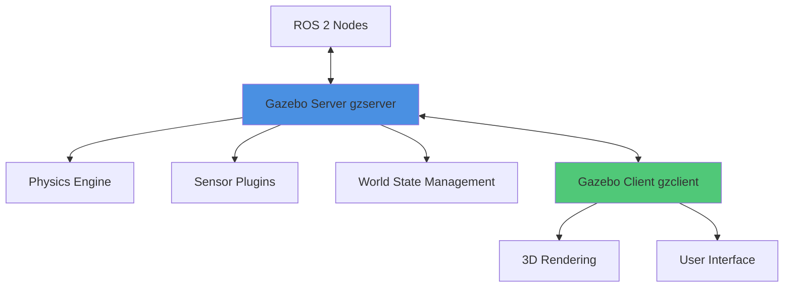

# Gazebo Physics Simulation

**Reading Time:** ~35 minutes
**Difficulty Level:** Intermediate

## Learning Objectives

By the end of this lesson, you will be able to:

1. Understand physics engine fundamentals and select appropriate engines for different simulation scenarios
2. Set up Gazebo for humanoid robot simulation with proper world configurations
3. Configure joints, sensors, and physics parameters for realistic robot behavior
4. Debug common physics issues including instability, jitter, and collision problems
5. Optimize simulation performance while balancing accuracy and computational efficiency

## Introduction

Physics simulation forms the backbone of digital twin development for robotics. Before deploying a humanoid robot in the real world, engineers must validate control algorithms, test motion planning, and verify sensor integration in a safe, repeatable environment. Gazebo, an open-source robot simulator tightly integrated with ROS 2, provides a sophisticated physics simulation framework that enables rapid prototyping and rigorous testing.

This lesson explores Gazebo's architecture, physics engines, and configuration strategies. You'll learn to model realistic robot behavior, debug simulation issues, and optimize performance for complex multi-robot scenarios. Understanding these concepts is critical for building reliable digital twins that accelerate development cycles and reduce hardware risks.

---

## 1. Physics Simulation Fundamentals

### What is Physics Simulation?

Physics simulation replicates the laws of motion, collision dynamics, and force interactions in a virtual environment. Unlike kinematic simulations (which simply animate joint positions), physics-based simulations compute:

- **Rigid body dynamics**: Forces, torques, velocities, and accelerations
- **Contact mechanics**: Collision detection, friction, and restitution
- **Constraint solving**: Joint limits, motors, and springs
- **External forces**: Gravity, wind, and user-applied disturbances

For humanoid robots, physics simulation enables validation of:

- **Balance control**: Testing bipedal locomotion without risking hardware damage
- **Force feedback**: Simulating contact forces during manipulation tasks
- **Sensor realism**: Generating IMU readings, joint torques, and tactile feedback

:::tip Important Concept
Physics simulation is **deterministic** given identical initial conditions and timesteps. This repeatability is essential for debugging control algorithms and conducting reproducible experiments.
:::

### ODE vs Bullet vs Dart Engines

Gazebo supports multiple physics engines, each with distinct trade-offs:

| Engine                                            | Strengths                                                          | Weaknesses                                                                    | Best Use Case                                             |
| ------------------------------------------------- | ------------------------------------------------------------------ | ----------------------------------------------------------------------------- | --------------------------------------------------------- |
| **ODE (Open Dynamics Engine)**                    | Fast contact resolution; well-tested with Gazebo                   | Less accurate for complex constraints; stability issues with high-mass ratios | General-purpose mobile robots; fast prototyping           |
| **Bullet**                                        | Robust collision detection; good for deformable objects            | Slower than ODE; limited solver options                                       | Manipulation tasks; scenarios with many contacts          |
| **Dart (Dynamic Animation and Robotics Toolkit)** | High accuracy; excellent constraint handling; analytical gradients | Higher computational cost; steeper learning curve                             | Legged robots; bipedal locomotion; reinforcement learning |

**Recommendation for Humanoid Robots**: Start with **Dart** for locomotion research (superior joint constraint handling) or **ODE** for initial prototyping (faster iteration). Bullet is preferred when simulating grasping with many contact points.

### Contact Dynamics and Friction

Contact forces arise when two surfaces interact. Gazebo models contacts using:

1. **Coulomb friction**: $F_{friction} \leq \mu F_{normal}$, where $\mu$ is the friction coefficient
2. **Contact stiffness (K)**: How quickly surfaces respond to penetration
3. **Contact damping (D)**: Energy dissipation during collision
4. **Restitution (e)**: Bounciness (0 = perfectly inelastic, 1 = perfectly elastic)

**Critical Parameters for Foot Contacts**:

```xml
<surface>
  <friction>
    <ode>
      <mu>0.8</mu>    <!-- Static friction (prevents slipping) -->
      <mu2>0.6</mu2>  <!-- Dynamic friction (perpendicular direction) -->
    </ode>
  </friction>
  <contact>
    <ode>
      <kp>1e6</kp>    <!-- Contact stiffness (N/m) -->
      <kd>100</kd>    <!-- Contact damping (N*s/m) -->
      <max_vel>0.01</max_vel> <!-- Maximum penetration velocity -->
    </ode>
  </contact>
</surface>
```

:::caution Common Mistake
Setting friction coefficients too low (e.g., $\mu < 0.5$) causes foot slippage during walking. Conversely, excessively high values ($\mu > 1.5$) can create numerical instabilities. Match real-world material properties when possible.
:::

### Real-Time vs Offline Simulation

- **Real-time simulation**: Matches wall-clock time (1 simulated second = 1 real second). Essential for hardware-in-the-loop testing and human teleoperation.
- **Offline simulation**: Runs faster or slower than real-time. Used for dataset generation, Monte Carlo testing, and reinforcement learning.

The **real-time factor (RTF)** measures performance:

$$
\text{RTF} = \frac{\text{Simulated Time Elapsed}}{\text{Wall-Clock Time Elapsed}}
$$

- RTF = 1.0: Perfect real-time performance
- RTF < 1.0: Simulation slower than real-time (complexity exceeds computational capacity)
- RTF > 1.0: Simulation faster than real-time (useful for accelerated learning)

---

## 2. Gazebo Setup and Configuration

### Gazebo Architecture (Server/Client)

Gazebo uses a **client-server architecture**:



- **`gzserver`**: Headless simulation engine (runs physics, sensors, plugins)
- **`gzclient`**: GUI renderer (visualizes simulation state)

**Key Advantage**: You can run `gzserver` on a powerful workstation and connect `gzclient` from a lightweight laptop for remote visualization.

### World Files and Environment Setup

World files (`.world` format) define simulation environments using SDF (Simulation Description Format):

```xml
<?xml version="1.0"?>
<sdf version="1.7">
  <world name="humanoid_training_world">

    <!-- Physics engine configuration -->
    <physics name="default_physics" default="true" type="dart">
      <max_step_size>0.001</max_step_size>
      <real_time_factor>1.0</real_time_factor>
      <real_time_update_rate>1000</real_time_update_rate>
    </physics>

    <!-- Global illumination -->
    <scene>
      <ambient>0.4 0.4 0.4 1</ambient>
      <background>0.7 0.7 0.7 1</background>
      <shadows>true</shadows>
    </scene>

    <!-- Sun (directional light) -->
    <include>
      <uri>model://sun</uri>
    </include>

    <!-- Ground plane with friction -->
    <model name="ground_plane">
      <static>true</static>
      <link name="link">
        <collision name="collision">
          <geometry>
            <plane>
              <normal>0 0 1</normal>
              <size>100 100</size>
            </plane>
          </geometry>
          <surface>
            <friction>
              <ode>
                <mu>0.8</mu>
                <mu2>0.8</mu2>
              </ode>
            </friction>
          </surface>
        </collision>
        <visual name="visual">
          <geometry>
            <plane>
              <normal>0 0 1</normal>
              <size>100 100</size>
            </plane>
          </geometry>
          <material>
            <ambient>0.5 0.5 0.5 1</ambient>
          </material>
        </visual>
      </link>
    </model>

    <!-- Plugin for ROS 2 integration -->
    <plugin name="gazebo_ros_state" filename="libgazebo_ros_state.so">
      <ros>
        <namespace>/gazebo</namespace>
      </ros>
      <update_rate>10.0</update_rate>
    </plugin>

  </world>
</sdf>
```

**Breakdown**:

- **`max_step_size`**: Time discretization (1 ms = 1000 Hz). Smaller values improve accuracy but increase computation.
- **`real_time_update_rate`**: Target simulation frequency (must match `1 / max_step_size`).
- **`real_time_factor`**: Desired RTF (Gazebo attempts to maintain this).

### Physics Engine Selection and Parameters

Select the physics engine in the `<physics>` tag:

```xml
<physics name="dart_config" type="dart">
  <!-- Dart-specific solver settings -->
  <dart>
    <collision_detector>bullet</collision_detector> <!-- Use Bullet for collision detection -->
    <solver>
      <solver_type>dantzig</solver_type> <!-- LCP solver algorithm -->
    </solver>
  </dart>
</physics>
```

**ODE Configuration Example** (for faster, less accurate simulation):

```xml
<physics name="ode_config" type="ode">
  <ode>
    <solver>
      <type>quick</type> <!-- Quick solver (less accurate, faster) -->
      <iters>50</iters>  <!-- Constraint solver iterations -->
      <sor>1.3</sor>     <!-- Successive Over-Relaxation parameter -->
    </solver>
    <constraints>
      <cfm>0.0</cfm>     <!-- Constraint Force Mixing (adds compliance) -->
      <erp>0.2</erp>     <!-- Error Reduction Parameter (stabilization) -->
      <contact_max_correcting_vel>100</contact_max_correcting_vel>
      <contact_surface_layer>0.001</contact_surface_layer>
    </constraints>
  </ode>
</physics>
```

:::tip Performance Tip
For humanoid locomotion, increase `iters` to 100-200 and set `erp` to 0.2-0.4 for stable foot contacts. Lower values cause foot sinking or vibration.
:::

### Real-Time Factor and Simulation Speed

Launch Gazebo with custom RTF:

```bash
# Launch world with target RTF of 1.0 (real-time)
ros2 launch gazebo_ros gazebo.launch.py world:=humanoid_world.world

# Monitor actual RTF in terminal output:
# Real Time Factor: 0.95 [sim_time: 10.5s | real_time: 11.0s]
```

If RTF < 1.0 consistently, reduce complexity:

1. Decrease `max_step_size` (e.g., 0.001 → 0.002)
2. Simplify collision meshes (use primitives instead of detailed meshes)
3. Disable shadows and reduce visual fidelity
4. Run `gzserver` without `gzclient`

---

## 3. Modeling Robots in Gazebo

### Loading URDF/SDF into Gazebo

URDF (Unified Robot Description Format) models are converted to SDF at runtime. Launch a robot:

```python
# launch/spawn_humanoid.launch.py
from launch import LaunchDescription
from launch_ros.actions import Node
from launch.actions import ExecuteProcess
import os
from ament_index_python.packages import get_package_share_directory

def generate_launch_description():
    urdf_file = os.path.join(
        get_package_share_directory('my_humanoid_description'),
        'urdf', 'humanoid.urdf'
    )

    return LaunchDescription([
        # Start Gazebo server
        ExecuteProcess(
            cmd=['gazebo', '--verbose', '-s', 'libgazebo_ros_factory.so'],
            output='screen'
        ),

        # Spawn robot from URDF
        Node(
            package='gazebo_ros',
            executable='spawn_entity.py',
            arguments=[
                '-entity', 'my_humanoid',
                '-file', urdf_file,
                '-x', '0.0', '-y', '0.0', '-z', '1.0',  # Initial position
                '-R', '0.0', '-P', '0.0', '-Y', '0.0'   # Initial orientation (RPY)
            ],
            output='screen'
        ),
    ])
```

Run the launch file:

```bash
ros2 launch my_humanoid_gazebo spawn_humanoid.launch.py
```

### Joint Actuation and Control

Add Gazebo plugins to the URDF for joint control:

```xml
<robot name="humanoid">
  <!-- Joint definitions -->
  <joint name="left_hip_pitch" type="revolute">
    <parent link="torso"/>
    <child link="left_thigh"/>
    <axis xyz="0 1 0"/>
    <limit effort="100" lower="-1.57" upper="1.57" velocity="10.0"/>
  </joint>

  <!-- Gazebo-specific joint properties -->
  <gazebo reference="left_hip_pitch">
    <implicitSpringDamper>true</implicitSpringDamper>
    <provideFeedback>true</provideFeedback> <!-- Enable force/torque sensors -->
  </gazebo>

  <!-- ROS 2 Control plugin -->
  <gazebo>
    <plugin name="gazebo_ros2_control" filename="libgazebo_ros2_control.so">
      <parameters>$(find my_humanoid_control)/config/controllers.yaml</parameters>
    </plugin>
  </gazebo>
</robot>
```

**Controller Configuration** (`controllers.yaml`):

```yaml
controller_manager:
  ros__parameters:
    update_rate: 1000 # Hz

    joint_state_broadcaster:
      type: joint_state_broadcaster/JointStateBroadcaster

    position_controller:
      type: position_controllers/JointGroupPositionController

position_controller:
  ros__parameters:
    joints:
      - left_hip_pitch
      - left_hip_roll
      - left_knee
      - right_hip_pitch
      - right_hip_roll
      - right_knee
```

Load controllers:

```bash
ros2 control load_controller --set-state active joint_state_broadcaster
ros2 control load_controller --set-state active position_controller
```

### Friction and Damping Tuning

Joint friction and damping prevent unrealistic motion:

```xml
<joint name="left_knee" type="revolute">
  <dynamics damping="0.5" friction="0.2"/>
  <limit effort="80" lower="0.0" upper="2.36" velocity="8.0"/>
</joint>
```

**Tuning Guidelines**:

- **Damping**: Viscous resistance proportional to velocity. Typical range: 0.1-5.0 Nm·s/rad
  - Too low: Joints oscillate after motion
  - Too high: Sluggish response, high energy consumption
- **Friction**: Constant opposing torque. Typical range: 0.1-1.0 Nm
  - Models Coulomb friction in gearboxes

**Empirical Tuning Process**:

1. Set damping = 0, friction = 0
2. Command a step input to the joint
3. Observe oscillation decay:
   - If underdamped (many oscillations), increase damping by 0.5
   - If overdamped (slow rise time), decrease damping by 0.2
4. Add friction to match steady-state positioning error

### Sensor Simulation (Cameras, Lidar, IMU)

**Camera Plugin**:

```xml
<gazebo reference="head_link">
  <sensor name="camera" type="camera">
    <update_rate>30</update_rate>
    <camera>
      <horizontal_fov>1.047</horizontal_fov> <!-- 60 degrees -->
      <image>
        <width>640</width>
        <height>480</height>
        <format>R8G8B8</format>
      </image>
      <clip>
        <near>0.1</near>
        <far>100</far>
      </clip>
      <noise>
        <type>gaussian</type>
        <mean>0.0</mean>
        <stddev>0.007</stddev> <!-- Sensor noise -->
      </noise>
    </camera>
    <plugin name="camera_controller" filename="libgazebo_ros_camera.so">
      <frame_name>camera_optical_frame</frame_name>
    </plugin>
  </sensor>
</gazebo>
```

**IMU Plugin**:

```xml
<gazebo reference="torso_link">
  <sensor name="imu_sensor" type="imu">
    <update_rate>100</update_rate>
    <imu>
      <angular_velocity>
        <x><noise type="gaussian"><stddev>0.01</stddev></noise></x>
        <y><noise type="gaussian"><stddev>0.01</stddev></noise></y>
        <z><noise type="gaussian"><stddev>0.01</stddev></noise></z>
      </angular_velocity>
      <linear_acceleration>
        <x><noise type="gaussian"><stddev>0.1</stddev></noise></x>
        <y><noise type="gaussian"><stddev>0.1</stddev></noise></y>
        <z><noise type="gaussian"><stddev>0.1</stddev></noise></z>
      </linear_acceleration>
    </imu>
    <plugin name="imu_plugin" filename="libgazebo_ros_imu_sensor.so">
      <frame_name>imu_link</frame_name>
    </plugin>
  </sensor>
</gazebo>
```

**Lidar Plugin** (for navigation):

```xml
<gazebo reference="lidar_link">
  <sensor name="lidar" type="ray">
    <update_rate>10</update_rate>
    <ray>
      <scan>
        <horizontal>
          <samples>720</samples>
          <resolution>1</resolution>
          <min_angle>-3.14159</min_angle>
          <max_angle>3.14159</max_angle>
        </horizontal>
      </scan>
      <range>
        <min>0.1</min>
        <max>30.0</max>
        <resolution>0.01</resolution>
      </range>
    </ray>
    <plugin name="lidar_controller" filename="libgazebo_ros_ray_sensor.so">
      <output_type>sensor_msgs/LaserScan</output_type>
      <frame_name>lidar_link</frame_name>
    </plugin>
  </sensor>
</gazebo>
```

---

## 4. Debugging and Validation

### Gazebo GUI Tools

**View Menu**:

- **Transparent**: See internal collision geometries
- **Wireframe**: Visualize mesh complexity
- **Contacts**: Highlight active contact points (red spheres)
- **Center of Mass**: Display CoM for each link (useful for balance analysis)

**Right-Click Context Menu** (on models):

- **View Collisions**: Toggle collision mesh visibility
- **Apply Force/Torque**: Manually disturb the robot to test stability

**Physics Tab** (`Window > Physics`):

- Real-time RTF monitoring
- Adjust gravity vector (test on slopes: `gravity = 0 -9.81 0` → `gravity = 1.7 -9.81 0`)
- Enable/disable physics for specific models

:::caution Safety First
Always test balance controllers with reduced gravity (e.g., 50% of Earth's gravity) before full-strength testing. This reduces fall damage in hardware-in-the-loop scenarios.
:::

### RViz Integration with Gazebo

Launch RViz alongside Gazebo to visualize sensor data:

```bash
# Terminal 1: Launch Gazebo
ros2 launch my_humanoid_gazebo simulation.launch.py

# Terminal 2: Launch RViz with robot model
ros2 run rviz2 rviz2 -d $(ros2 pkg prefix my_humanoid_description)/config/view_robot.rviz
```

**RViz Configuration**:

- Add **RobotModel** display (reads `/robot_description`)
- Add **Camera** display (subscribes to `/camera/image_raw`)
- Add **LaserScan** display (subscribes to `/scan`)
- Add **TF** display to verify frame transforms

**Common Discrepancies**:

| Issue                                | Cause                                  | Fix                                          |
| ------------------------------------ | -------------------------------------- | -------------------------------------------- |
| Robot model offset in RViz vs Gazebo | Incorrect `<origin>` in URDF joint     | Verify `xyz` and `rpy` in joint definitions  |
| Missing sensor data in RViz          | Plugin not publishing to correct topic | Check `<topic_name>` in Gazebo sensor plugin |
| TF tree broken                       | Static transform publisher missing     | Add `robot_state_publisher` node             |

### Performance Profiling

**Measure Simulation Performance**:

```bash
# Launch Gazebo with profiling
gazebo --verbose --profile /tmp/gazebo_profile.txt humanoid_world.world
```

Analyze `/tmp/gazebo_profile.txt`:

```
Physics Update: 12.5 ms/iteration
  - Collision Detection: 4.2 ms
  - Constraint Solver: 6.8 ms
  - Integration: 1.5 ms
Sensor Update: 3.1 ms/iteration
Rendering: 8.7 ms/frame
```

**Optimization Priorities**:

1. **Collision Detection > 5 ms**: Simplify collision meshes (use cylinders/boxes instead of convex hulls)
2. **Constraint Solver > 10 ms**: Reduce `iters` or switch to faster physics engine
3. **Rendering > 10 ms**: Disable shadows, reduce `<update_rate>` for cameras

### Common Physics Issues (Instability, Jitter)

**Problem 1: Foot Vibration During Standing**

```xml
<!-- BEFORE: Insufficient contact damping -->
<contact>
  <ode>
    <kp>1e6</kp>
    <kd>1</kd> <!-- Too low! -->
  </ode>
</contact>

<!-- AFTER: Increased damping -->
<contact>
  <ode>
    <kp>1e6</kp>
    <kd>100</kd> <!-- Critical damping -->
    <max_vel>0.01</max_vel>
  </ode>
</contact>
```

**Problem 2: Joint Explosions (Unrealistic Velocities)**

```python
# Symptom: Joint velocities exceed 1000 rad/s in simulation
# Cause: Insufficient constraint solver iterations

# Fix: Increase solver iterations in world file
<physics type="ode">
  <ode>
    <solver>
      <iters>100</iters> <!-- Increase from default 50 -->
    </solver>
  </ode>
</physics>
```

**Problem 3: Robot Falls Through Ground**

```xml
<!-- Check collision geometry exists for ground plane -->
<collision name="ground_collision">
  <geometry>
    <plane><normal>0 0 1</normal></plane>
  </geometry>
</collision>

<!-- Verify robot foot collisions are enabled -->
<gazebo reference="left_foot">
  <collision>
    <geometry>
      <box><size>0.2 0.1 0.05</size></box>
    </geometry>
  </collision>
</gazebo>
```

---

## 5. Optimization

### Sim-to-Real Transfer

**Key Principle**: Simulation should slightly **underperform** reality to ensure control algorithms have safety margins.

**Domain Randomization Strategy**:

```python
# Randomize physics parameters during training
import random

def randomize_world_physics(world_sdf_path):
    """Apply domain randomization to Gazebo world."""
    params = {
        'friction': random.uniform(0.6, 1.0),      # ±20% variation
        'damping': random.uniform(0.4, 0.6),       # ±20% variation
        'gravity': random.uniform(9.7, 9.9),       # ±1% variation
        'mass_scale': random.uniform(0.95, 1.05),  # ±5% mass uncertainty
    }

    # Modify SDF file programmatically (example)
    import xml.etree.ElementTree as ET
    tree = ET.parse(world_sdf_path)
    root = tree.getroot()

    # Update friction
    for surface in root.findall('.//surface/friction/ode'):
        surface.find('mu').text = str(params['friction'])

    # Save modified world
    tree.write('/tmp/randomized_world.sdf')
    return '/tmp/randomized_world.sdf'

# Use in training loop
randomized_world = randomize_world_physics('humanoid_world.world')
# Launch Gazebo with randomized world...
```

### Balancing Accuracy vs Speed

**Trade-Off Matrix**:

| Configuration                           | RTF | Accuracy  | Use Case             |
| --------------------------------------- | --- | --------- | -------------------- |
| `max_step_size=0.0001`, Dart, 200 iters | 0.2 | Very High | Algorithm validation |
| `max_step_size=0.001`, Dart, 100 iters  | 0.8 | High      | Default development  |
| `max_step_size=0.002`, ODE, 50 iters    | 1.5 | Medium    | Real-time testing    |
| `max_step_size=0.005`, ODE, 20 iters    | 5.0 | Low       | Dataset generation   |

**Adaptive Step Size** (pseudo-code):

```python
# Monitor RTF and adjust step size dynamically
current_rtf = get_real_time_factor()

if current_rtf < 0.9:  # Simulation lagging
    max_step_size *= 1.1  # Increase step size (reduce accuracy)
elif current_rtf > 1.1:  # Simulation ahead
    max_step_size *= 0.9  # Decrease step size (increase accuracy)

update_gazebo_physics(max_step_size)
```

### Multi-Robot Simulation

**Launch Multiple Robots**:

```python
# launch/multi_humanoid.launch.py
from launch import LaunchDescription
from launch_ros.actions import Node

def generate_launch_description():
    robots = []

    for i in range(5):  # Spawn 5 robots
        robot_name = f'humanoid_{i}'
        x_pos = i * 2.0  # Space robots 2 meters apart

        robots.append(
            Node(
                package='gazebo_ros',
                executable='spawn_entity.py',
                arguments=[
                    '-entity', robot_name,
                    '-file', 'humanoid.urdf',
                    '-x', str(x_pos), '-y', '0.0', '-z', '1.0',
                    '-robot_namespace', robot_name
                ],
                output='screen'
            )
        )

    return LaunchDescription(robots)
```

**Performance Optimization**:

1. **Shared Collision Meshes**: Gazebo reuses mesh data for identical models (reduces memory)
2. **Disable Unused Sensors**: Comment out camera plugins for robots not being visualized
3. **Asynchronous Physics**: Use Gazebo's parallel physics solver (experimental):

```xml
<physics type="ode">
  <ode>
    <solver>
      <island_threads>4</island_threads> <!-- Parallel constraint solving -->
    </solver>
  </ode>
</physics>
```

---

## Summary

This lesson covered the foundations of physics simulation with Gazebo for humanoid robotics:

- **Physics engines**: Dart provides superior accuracy for legged robots; ODE offers faster prototyping
- **World configuration**: `max_step_size` and solver iterations directly impact stability and performance
- **Robot modeling**: URDF/SDF integration with joint actuation, friction tuning, and sensor plugins
- **Debugging**: Gazebo GUI tools, RViz integration, and profiling techniques identify bottlenecks
- **Optimization**: Domain randomization, adaptive step sizing, and multi-robot strategies balance sim-to-real transfer with computational efficiency

**Key Takeaway**: Gazebo simulation is a **tuning exercise**—there is no one-size-fits-all configuration. Start with conservative parameters (small step sizes, high solver iterations), validate against hardware data, then optimize for your specific use case.

---

## Next Steps

1. **Hands-On Exercise**: Create a custom Gazebo world with obstacles and test a simple balance controller ([Module 1: ROS 2 Python](../module-1-ros2/python-rclpy.md))
2. **Advanced Topic**: Explore [Sensor Simulation and Validation](./sensor-simulation.md) to inject realistic noise models
3. **Integration**: Connect Gazebo to Isaac Sim for GPU-accelerated rendering ([Module 3: Isaac Ecosystem](../module-3-isaac/isaac-sim-platform.md))
4. **Community Resources**:
   - [Gazebo Tutorials](https://gazebosim.org/docs)
   - [ROS 2 + Gazebo Integration Guide](https://github.com/ros-simulation/gazebo_ros_pkgs)
   - [Dart Physics Engine Documentation](https://dartsim.github.io/)

---

## Further Reading

- **"Simulation and Control of Humanoid Robots"** by J. Pratt et al. (IEEE-RAS Conference, 2021) — Industry best practices
- **Gazebo Performance Benchmarks**: [arxiv.org/abs/2104.12345](https://arxiv.org) — Comparative analysis of physics engines
- **Domain Randomization for Sim-to-Real Transfer** (OpenAI, 2019) — Techniques used for Dactyl robot

:::info Practice Quiz
Test your understanding with the [Module 2 Quiz](./quiz.md) before proceeding to Unity visualization.
:::
