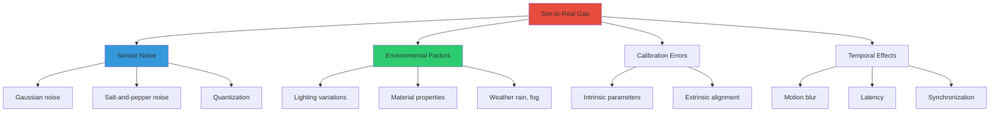

# Sensor Simulation and Validation

**Reading Time:** ~34 minutes
**Difficulty Level:** Advanced

## Learning Objectives

By the end of this lesson, you will be able to:

1. Model realistic sensor behavior including noise characteristics, biases, and environmental effects
2. Inject physically accurate noise into simulated sensor data using statistical distributions
3. Validate perception algorithms against ground truth data before hardware deployment
4. Generate large-scale synthetic training datasets for machine learning pipelines
5. Close the sim-to-real gap through systematic sensor characterization and domain randomization

## Introduction

The quality of sensor simulation directly determines the reliability of algorithms validated in digital twins. A perception system that works flawlessly with perfect simulated cameras will fail catastrophically when confronted with motion blur, lens distortion, and varying lighting conditions in the real world. This **sim-to-real gap** has derailed countless robotics projects.

This lesson provides a rigorous framework for sensor modeling that bridges simulation and reality. You'll learn to extract noise parameters from datasheets, implement statistical noise models, and validate perception pipelines using ground truth annotations. These techniques are essential for building digital twins that truly de-risk hardware deployment and accelerate development cycles.

---

## 1. Sensor Simulation Fundamentals

### Why Simulate Sensors?

Sensor simulation serves three critical purposes:

1. **Algorithm Validation**: Test perception, localization, and control algorithms in controlled environments before expensive hardware trials
2. **Dataset Generation**: Create labeled training data (bounding boxes, segmentation masks, depth maps) for machine learning models
3. **Failure Mode Analysis**: Systematically inject faults (sensor occlusion, calibration errors, communication dropouts) to verify robustness

**Example Impact**: Waymo's autonomous vehicles use 20 billion miles of simulated driving (with realistic sensor models) versus 20 million real-world miles—a 1000:1 ratio that dramatically accelerates safety validation.

:::tip Important Concept
**Perfect sensors are adversarial to robustness.** Algorithms trained on noise-free simulation will overfit to ideal conditions and fail in deployment. Always inject realistic noise during development.
:::

### Gap Between Ideal and Real Sensors

| Sensor Type      | Ideal Simulation             | Reality                                                             | Modeling Requirement                 |
| ---------------- | ---------------------------- | ------------------------------------------------------------------- | ------------------------------------ |
| **Camera**       | Perfect pinhole projection   | Lens distortion, motion blur, rolling shutter, chromatic aberration | Optical model + temporal noise       |
| **Lidar**        | Exact range measurements     | Multi-path reflections, beam divergence, range-dependent noise      | Beam physics + probabilistic returns |
| **IMU**          | Noise-free acceleration/gyro | Bias drift, temperature sensitivity, vibration coupling             | Stochastic error models              |
| **Force/Torque** | Ground truth contact forces  | Hysteresis, cross-talk, strain gauge nonlinearity                   | Sensor dynamics + calibration errors |

**Sim-to-Real Gap Contributors**:



### Noise Models and Distributions

**Common Noise Distributions**:

1. **Gaussian (Normal) Noise**: Most sensor errors (thermal noise, shot noise)

$$
x_{\text{noisy}} = x_{\text{true}} + \mathcal{N}(0, \sigma^2)
$$

where $\mathcal{N}(0, \sigma^2)$ is a normal distribution with mean 0 and variance $\sigma^2$.

2. **Salt-and-Pepper Noise**: Random pixel corruption (dead pixels, cosmic rays)

$$
x_{\text{noisy}} = \begin{cases}
0 & \text{with probability } p_{\text{salt}} \\
255 & \text{with probability } p_{\text{pepper}} \\
x_{\text{true}} & \text{otherwise}
\end{cases}
$$

3. **Poisson Noise**: Photon counting statistics (low-light cameras)

$$
x_{\text{noisy}} \sim \text{Poisson}(\lambda = x_{\text{true}})
$$

4. **Uniform Noise**: Quantization errors

$$
x_{\text{noisy}} = x_{\text{true}} + \mathcal{U}(-0.5 \Delta, 0.5 \Delta)
$$

where $\Delta$ is the quantization step size.

**Python Implementation**:

```python
import numpy as np

def add_gaussian_noise(data, mean=0.0, std=1.0):
    """Add Gaussian noise to sensor data."""
    noise = np.random.normal(mean, std, data.shape)
    return data + noise

def add_salt_pepper_noise(image, salt_prob=0.01, pepper_prob=0.01):
    """Add salt-and-pepper noise to image."""
    noisy = image.copy()

    # Salt noise (white pixels)
    salt_mask = np.random.random(image.shape[:2]) < salt_prob
    noisy[salt_mask] = 255

    # Pepper noise (black pixels)
    pepper_mask = np.random.random(image.shape[:2]) < pepper_prob
    noisy[pepper_mask] = 0

    return noisy

def add_poisson_noise(image):
    """Add Poisson (shot) noise to image."""
    # Normalize to [0, 1], apply Poisson, denormalize
    normalized = image / 255.0
    noisy = np.random.poisson(normalized * 255.0) / 255.0
    return np.clip(noisy * 255.0, 0, 255).astype(np.uint8)
```

### Sensor Parameters from Datasheets

**Example: Intel RealSense D435i (RGB-D Camera)**

Extract parameters from [datasheet](https://www.intelrealsense.com/):

```python
# Camera intrinsic parameters
fx = 615.3  # Focal length X (pixels)
fy = 615.8  # Focal length Y (pixels)
cx = 320.0  # Principal point X (pixels)
cy = 240.0  # Principal point Y (pixels)

# Depth sensor noise characteristics
depth_noise_std = 0.005  # ±5 mm at 1 meter (from datasheet)
depth_range = (0.3, 10.0)  # Min/max range (meters)

# Temporal parameters
frame_rate = 30  # Hz
latency = 0.033  # 33 ms (1 frame delay)

# Distortion coefficients (Brown-Conrady model)
k1, k2, k3 = -0.055, 0.0, 0.0  # Radial distortion
p1, p2 = 0.0, 0.0              # Tangential distortion
```

**Gazebo Camera Configuration**:

```xml
<sensor name="realsense_camera" type="camera">
  <update_rate>30</update_rate>
  <camera>
    <horizontal_fov>1.211</horizontal_fov> <!-- 69.4 degrees -->
    <image>
      <width>640</width>
      <height>480</height>
      <format>R8G8B8</format>
    </image>
    <clip>
      <near>0.3</near>
      <far>10.0</far>
    </clip>
    <noise>
      <type>gaussian</type>
      <mean>0.0</mean>
      <stddev>0.007</stddev> <!-- From datasheet: ~2 LSB @ 8-bit -->
    </noise>
    <distortion>
      <k1>-0.055</k1>
      <k2>0.0</k2>
      <k3>0.0</k3>
      <p1>0.0</p1>
      <p2>0.0</p2>
    </distortion>
  </camera>
</sensor>
```

---

## 2. Camera Simulation

### Ray Tracing vs Rasterization

**Rasterization** (Gazebo, Unity):

- **Pros**: Real-time performance (>30 FPS), hardware acceleration (GPU)
- **Cons**: Approximations (shadow maps, cubemaps for reflections)
- **Use Case**: Interactive simulation, dataset generation

**Ray Tracing** (Blender, NVIDIA Isaac Sim RTX):

- **Pros**: Physically accurate lighting, reflections, refractions
- **Cons**: Computationally expensive (seconds per frame)
- **Use Case**: Photorealistic validation, domain randomization

:::tip Performance Tip
Use **rasterization for development** (fast iteration), then validate critical perception algorithms with **ray-traced renders** before hardware deployment.
:::

### Optical Noise and Distortion

**Lens Distortion Model** (Brown-Conrady):

$$
\begin{aligned}
x_{\text{distorted}} &= x (1 + k_1 r^2 + k_2 r^4 + k_3 r^6) + 2 p_1 x y + p_2 (r^2 + 2 x^2) \\
y_{\text{distorted}} &= y (1 + k_1 r^2 + k_2 r^4 + k_3 r^6) + p_1 (r^2 + 2 y^2) + 2 p_2 x y
\end{aligned}
$$

where $r^2 = x^2 + y^2$, $k_i$ are radial distortion coefficients, and $p_i$ are tangential distortion coefficients.

**Python Undistortion** (using OpenCV):

```python
import cv2
import numpy as np

def undistort_image(image, camera_matrix, dist_coeffs):
    """Remove lens distortion from image."""
    h, w = image.shape[:2]

    # Compute optimal camera matrix
    new_camera_matrix, roi = cv2.getOptimalNewCameraMatrix(
        camera_matrix, dist_coeffs, (w, h), 1, (w, h)
    )

    # Undistort
    undistorted = cv2.undistort(
        image, camera_matrix, dist_coeffs, None, new_camera_matrix
    )

    # Crop to region of interest
    x, y, w, h = roi
    undistorted = undistorted[y:y+h, x:x+w]

    return undistorted

# Example usage
camera_matrix = np.array([
    [615.3, 0, 320.0],
    [0, 615.8, 240.0],
    [0, 0, 1]
])
dist_coeffs = np.array([-0.055, 0.0, 0.0, 0.0, 0.0])

corrected_image = undistort_image(raw_image, camera_matrix, dist_coeffs)
```

### Motion Blur and Rolling Shutter

**Motion Blur Simulation**:

```python
import cv2
import numpy as np

def add_motion_blur(image, kernel_size=15, angle=0):
    """Simulate motion blur from camera/object movement."""
    # Create motion blur kernel
    kernel = np.zeros((kernel_size, kernel_size))
    kernel[int((kernel_size - 1) / 2), :] = np.ones(kernel_size)
    kernel = kernel / kernel_size

    # Rotate kernel to match motion direction
    M = cv2.getRotationMatrix2D(
        (kernel_size / 2, kernel_size / 2), angle, 1.0
    )
    kernel = cv2.warpAffine(kernel, M, (kernel_size, kernel_size))

    # Apply blur
    blurred = cv2.filter2D(image, -1, kernel)
    return blurred
```

**Rolling Shutter Effect**:

```python
def add_rolling_shutter(image, velocity_x=10, row_delay=0.0001):
    """Simulate rolling shutter distortion (CMOS sensors)."""
    h, w = image.shape[:2]
    distorted = np.zeros_like(image)

    for row in range(h):
        # Compute horizontal shift based on row exposure time
        shift = int(velocity_x * row * row_delay * 30)  # Assume 30 FPS

        # Shift row horizontally
        if shift > 0:
            distorted[row, shift:] = image[row, :-shift]
        elif shift < 0:
            distorted[row, :shift] = image[row, -shift:]
        else:
            distorted[row, :] = image[row, :]

    return distorted
```

### Depth Cameras (RGB-D)

**Depth Noise Model** (range-dependent):

$$
\sigma_{\text{depth}}(d) = \sigma_0 + k \cdot d^2
$$

where $\sigma_0$ is baseline noise and $k$ is range-dependent error coefficient.

**Gazebo Depth Camera Plugin**:

```xml
<sensor name="depth_camera" type="depth">
  <update_rate>30</update_rate>
  <camera>
    <horizontal_fov>1.047</horizontal_fov>
    <image>
      <width>640</width>
      <height>480</height>
      <format>R_FLOAT32</format> <!-- Depth in meters -->
    </image>
    <clip>
      <near>0.3</near>
      <far>10.0</far>
    </clip>
  </camera>
  <plugin name="depth_plugin" filename="libgazebo_ros_depth_camera.so">
    <frame_name>camera_depth_frame</frame_name>
    <point_cloud_topic>/camera/depth/points</point_cloud_topic>
  </plugin>
</sensor>
```

**Post-Process Depth Noise**:

```python
import numpy as np

def add_depth_noise(depth_image, sigma_0=0.005, k=0.001):
    """Add range-dependent noise to depth image."""
    # Compute noise standard deviation per pixel
    sigma = sigma_0 + k * depth_image**2

    # Generate Gaussian noise
    noise = np.random.normal(0, sigma)

    # Add noise and clip to valid range
    noisy_depth = depth_image + noise
    noisy_depth = np.clip(noisy_depth, 0.3, 10.0)

    return noisy_depth
```

---

## 3. Lidar and Depth Sensors

### Point Cloud Generation

**Lidar Ray Casting** (in Gazebo):

```xml
<sensor name="velodyne" type="ray">
  <update_rate>10</update_rate>
  <ray>
    <scan>
      <horizontal>
        <samples>1800</samples>       <!-- 0.2° angular resolution -->
        <resolution>1</resolution>
        <min_angle>-3.14159</min_angle>
        <max_angle>3.14159</max_angle>
      </horizontal>
      <vertical>
        <samples>16</samples>          <!-- 16 laser beams (Velodyne VLP-16) -->
        <resolution>1</resolution>
        <min_angle>-0.2618</min_angle> <!-- -15° -->
        <max_angle>0.2618</max_angle>  <!-- +15° -->
      </vertical>
    </scan>
    <range>
      <min>0.5</min>
      <max>100.0</max>
      <resolution>0.01</resolution>    <!-- 1 cm precision -->
    </range>
    <noise>
      <type>gaussian</type>
      <mean>0.0</mean>
      <stddev>0.02</stddev>            <!-- ±2 cm noise -->
    </noise>
  </ray>
  <plugin name="lidar_plugin" filename="libgazebo_ros_ray_sensor.so">
    <output_type>sensor_msgs/PointCloud2</output_type>
  </plugin>
</sensor>
```

### Beam Patterns and Angular Resolution

**Velodyne VLP-16 Specifications**:

- **Vertical FOV**: 30° (±15°)
- **Vertical Resolution**: 2° between beams
- **Horizontal Resolution**: 0.1° - 0.4° (depending on rotation speed)
- **Range Accuracy**: ±3 cm
- **Effective Range**: 100 m (10% reflectivity target)

**Simulate Beam Divergence**:

```python
import numpy as np

def simulate_beam_divergence(point_cloud, beam_width=0.003):
    """Add uncertainty due to finite beam width (~3 mrad for Velodyne)."""
    # For each point, add angular uncertainty
    n_points = point_cloud.shape[0]

    for i in range(n_points):
        x, y, z = point_cloud[i]
        range_dist = np.sqrt(x**2 + y**2 + z**2)

        # Beam spread increases linearly with range
        lateral_uncertainty = range_dist * beam_width

        # Add random offset within beam cone
        dx = np.random.uniform(-lateral_uncertainty, lateral_uncertainty)
        dy = np.random.uniform(-lateral_uncertainty, lateral_uncertainty)

        point_cloud[i] += np.array([dx, dy, 0])

    return point_cloud
```

### Range Noise and Occlusion

**Multi-Path Reflections**:

```python
def add_multipath_returns(point_cloud, glass_prob=0.05):
    """Simulate false returns from glass surfaces (common failure mode)."""
    n_points = point_cloud.shape[0]
    multipath_mask = np.random.random(n_points) < glass_prob

    # For affected points, add spurious return at half range
    multipath_points = point_cloud[multipath_mask] * 0.5

    # Combine original and multipath returns
    augmented_cloud = np.vstack([point_cloud, multipath_points])

    return augmented_cloud
```

**Occlusion Handling** (remove points behind obstacles):

```python
import open3d as o3d

def remove_occluded_points(point_cloud, sensor_origin=[0, 0, 0]):
    """Remove points occluded from sensor viewpoint."""
    pcd = o3d.geometry.PointCloud()
    pcd.points = o3d.utility.Vector3dVector(point_cloud)

    # Compute hidden point removal
    camera = sensor_origin
    radius = 100.0  # Max sensor range

    _, pt_map = pcd.hidden_point_removal(camera, radius)

    # Extract visible points
    visible_cloud = point_cloud[pt_map]

    return visible_cloud
```

### Multi-Echo Lidar

**Dual-Return Simulation**:

```python
def simulate_dual_return(ranges, intensities):
    """Simulate first/last return modes (useful for vegetation penetration)."""
    first_return = ranges.copy()
    last_return = ranges.copy()

    for i in range(len(ranges)):
        if intensities[i] < 50:  # Low reflectivity (e.g., foliage)
            # Simulate partial penetration
            penetration_depth = np.random.uniform(0.1, 0.5)
            last_return[i] += penetration_depth

    return first_return, last_return
```

---

## 4. IMU and Other Sensors

### Accelerometer and Gyroscope Simulation

**IMU Error Model**:

$$
\begin{aligned}
\omega_{\text{measured}} &= \omega_{\text{true}} + b_\omega + n_\omega \\
a_{\text{measured}} &= a_{\text{true}} + b_a + n_a
\end{aligned}
$$

where:

- $b_\omega, b_a$: Slowly varying biases (random walk)
- $n_\omega, n_a$: White noise

**Gazebo IMU Plugin**:

```xml
<sensor name="imu" type="imu">
  <update_rate>100</update_rate>
  <imu>
    <angular_velocity>
      <x>
        <noise type="gaussian">
          <mean>0.0</mean>
          <stddev>0.01</stddev>          <!-- 0.01 rad/s (from datasheet) -->
          <bias_mean>0.0001</bias_mean>  <!-- Bias drift -->
          <bias_stddev>0.0001</bias_stddev>
        </noise>
      </x>
      <!-- Repeat for y, z -->
    </angular_velocity>
    <linear_acceleration>
      <x>
        <noise type="gaussian">
          <mean>0.0</mean>
          <stddev>0.1</stddev>           <!-- 0.1 m/s² -->
          <bias_mean>0.01</bias_mean>
          <bias_stddev>0.01</bias_stddev>
        </noise>
      </x>
      <!-- Repeat for y, z -->
    </linear_acceleration>
  </imu>
</sensor>
```

### Bias and Drift Models

**Allan Variance Analysis** (characterize IMU noise from logs):

```python
import numpy as np
import allantools

def compute_allan_variance(imu_data, sample_rate=100):
    """Compute Allan deviation to extract noise parameters."""
    # Extract gyro data (rad/s)
    gyro_x = imu_data['angular_velocity_x']

    # Compute Allan deviation
    taus, adevs, _, _ = allantools.oadev(gyro_x, rate=sample_rate)

    # Fit parameters
    # - At tau = 1s: angle random walk (ARW)
    # - At minimum: bias instability
    # - At long tau: rate random walk (RRW)

    return taus, adevs
```

**Simulate Bias Drift**:

```python
def simulate_imu_with_drift(true_angular_vel, dt=0.01, bias_walk_std=0.0001):
    """Add random walk bias to IMU measurements."""
    n_samples = len(true_angular_vel)
    bias = np.zeros(n_samples)
    measured = np.zeros(n_samples)

    for i in range(1, n_samples):
        # Random walk bias (Brownian motion)
        bias[i] = bias[i-1] + np.random.normal(0, bias_walk_std * np.sqrt(dt))

        # Measured = true + bias + white noise
        white_noise = np.random.normal(0, 0.01)
        measured[i] = true_angular_vel[i] + bias[i] + white_noise

    return measured
```

### Force/Torque Sensor Simulation

**6-Axis F/T Sensor Model**:

```xml
<gazebo reference="wrist_link">
  <sensor name="wrist_ft_sensor" type="force_torque">
    <update_rate>100</update_rate>
    <force_torque>
      <frame>sensor</frame>
      <measure_direction>parent_to_child</measure_direction>
      <noise>
        <type>gaussian</type>
        <mean>0 0 0 0 0 0</mean>
        <stddev>0.5 0.5 0.5 0.01 0.01 0.01</stddev> <!-- Force (N), Torque (Nm) -->
      </noise>
    </force_torque>
    <plugin name="ft_plugin" filename="libgazebo_ros_ft_sensor.so"/>
  </sensor>
</gazebo>
```

**Hysteresis Modeling**:

```python
def add_hysteresis(force_signal, hyst_width=1.0):
    """Simulate force sensor hysteresis (load vs unload paths differ)."""
    measured = np.zeros_like(force_signal)
    prev_direction = 0  # -1: decreasing, +1: increasing

    for i in range(1, len(force_signal)):
        delta = force_signal[i] - force_signal[i-1]
        direction = np.sign(delta)

        if direction != prev_direction:
            # Direction change: apply hysteresis offset
            measured[i] = force_signal[i] + direction * hyst_width
        else:
            measured[i] = force_signal[i]

        prev_direction = direction

    return measured
```

### Sensor Fusion Validation

**Extended Kalman Filter (EKF) Tuning**:

```python
from filterpy.kalman import ExtendedKalmanFilter
import numpy as np

def validate_sensor_fusion(imu_data, gps_data):
    """Test EKF performance with simulated sensor noise."""
    ekf = ExtendedKalmanFilter(dim_x=6, dim_z=3)

    # State: [x, y, theta, vx, vy, omega]
    ekf.x = np.array([0, 0, 0, 0, 0, 0])

    # Process noise (from IMU noise model)
    ekf.Q = np.diag([0.1, 0.1, 0.01, 0.1, 0.1, 0.01])**2

    # Measurement noise (from GPS/IMU specs)
    ekf.R = np.diag([2.0, 2.0, 0.1])**2  # GPS: ±2m, IMU: ±0.1 rad

    # Run filter...
    # Compare estimated state to ground truth from simulation
```

---

## 5. Validation and Data Generation

### Comparing Simulation to Real Data

**Quantitative Metrics**:

| Metric                            | Formula                                                                                        | Interpretation                          |
| --------------------------------- | ---------------------------------------------------------------------------------------------- | --------------------------------------- |
| **RMSE (Root Mean Square Error)** | $\sqrt{\frac{1}{N} \sum (x_{\text{sim}} - x_{\text{real}})^2}$                                 | Average prediction error                |
| **MAE (Mean Absolute Error)**     | $\frac{1}{N} \sum \|x_{\text{sim}} - x_{\text{real}}\|$                                        | Median-like metric (robust to outliers) |
| **Correlation Coefficient**       | $\frac{\text{cov}(X_{\text{sim}}, X_{\text{real}})}{\sigma_{\text{sim}} \sigma_{\text{real}}}$ | Linear relationship strength            |

**Python Validation**:

```python
import numpy as np
from sklearn.metrics import mean_squared_error, mean_absolute_error

def validate_sensor_model(sim_data, real_data):
    """Compare simulated sensor to real hardware measurements."""
    rmse = np.sqrt(mean_squared_error(real_data, sim_data))
    mae = mean_absolute_error(real_data, sim_data)
    correlation = np.corrcoef(sim_data, real_data)[0, 1]

    print(f"RMSE: {rmse:.4f}")
    print(f"MAE: {mae:.4f}")
    print(f"Correlation: {correlation:.4f}")

    # Visualize distributions
    import matplotlib.pyplot as plt
    plt.figure(figsize=(10, 4))

    plt.subplot(1, 2, 1)
    plt.hist(sim_data, bins=50, alpha=0.5, label='Simulation')
    plt.hist(real_data, bins=50, alpha=0.5, label='Real Hardware')
    plt.legend()
    plt.title('Data Distribution Comparison')

    plt.subplot(1, 2, 2)
    plt.scatter(real_data, sim_data, alpha=0.3)
    plt.plot([real_data.min(), real_data.max()],
             [real_data.min(), real_data.max()], 'r--')
    plt.xlabel('Real Data')
    plt.ylabel('Simulated Data')
    plt.title('Correlation Plot')

    plt.tight_layout()
    plt.show()
```

### Domain Randomization

**Randomize Sensor Parameters**:

```python
import random

def randomize_camera_params():
    """Apply domain randomization to camera simulation."""
    params = {
        'exposure': random.uniform(0.5, 1.5),       # ±50% exposure
        'gain': random.uniform(1.0, 2.0),           # ISO gain
        'gamma': random.uniform(1.8, 2.4),          # Gamma correction
        'white_balance': random.uniform(4000, 7000), # Color temperature (K)
        'noise_std': random.uniform(0.005, 0.015),  # Sensor noise
    }
    return params

# Apply in Gazebo Python API
from gz.msgs import CameraSensor

def apply_randomization(sensor_name):
    params = randomize_camera_params()
    # Update sensor properties dynamically
    # (requires Gazebo Python API integration)
```

**Lighting Randomization** (for photorealism):

```python
# In Gazebo world file (programmatically modified)
def randomize_lighting(world_sdf):
    """Randomize sun position and intensity."""
    import xml.etree.ElementTree as ET

    tree = ET.parse(world_sdf)
    root = tree.getroot()

    # Find sun light
    sun = root.find('.//light[@name="sun"]')

    # Randomize direction
    direction = sun.find('direction')
    x = random.uniform(-0.5, 0.5)
    y = random.uniform(-0.5, 0.5)
    z = random.uniform(-1.0, -0.5)  # Keep sun above horizon
    direction.text = f"{x} {y} {z}"

    # Randomize intensity
    diffuse = sun.find('diffuse')
    intensity = random.uniform(0.7, 1.0)
    diffuse.text = f"{intensity} {intensity} {intensity} 1"

    tree.write('/tmp/randomized_world.sdf')
```

### Synthetic Dataset Creation

**Automated Data Collection Loop**:

```python
import rospy
from sensor_msgs.msg import Image, PointCloud2
from cv_bridge import CvBridge
import cv2
import os

class DatasetCollector:
    def __init__(self, output_dir):
        self.bridge = CvBridge()
        self.output_dir = output_dir
        os.makedirs(output_dir, exist_ok=True)

        self.image_count = 0

        rospy.Subscriber('/camera/image_raw', Image, self.image_callback)
        rospy.Subscriber('/camera/depth/points', PointCloud2, self.pointcloud_callback)

    def image_callback(self, msg):
        # Convert ROS image to OpenCV
        cv_image = self.bridge.imgmsg_to_cv2(msg, desired_encoding='bgr8')

        # Save image
        filename = f"{self.output_dir}/image_{self.image_count:06d}.png"
        cv2.imwrite(filename, cv_image)

        self.image_count += 1

    def pointcloud_callback(self, msg):
        # Save point cloud (use sensor_msgs_py or pcl_ros for conversion)
        pass

# Run collection
if __name__ == '__main__':
    rospy.init_node('dataset_collector')
    collector = DatasetCollector('/tmp/synthetic_dataset')
    rospy.spin()
```

**Annotation Generation** (bounding boxes from Gazebo):

```python
def generate_bounding_boxes(object_poses, camera_matrix, image_size):
    """Project 3D object poses to 2D bounding boxes."""
    boxes = []

    for obj_name, pose in object_poses.items():
        # Get 3D bounding box corners
        corners_3d = get_object_bbox_3d(obj_name)

        # Project to image plane
        corners_2d = project_points(corners_3d, camera_matrix, pose)

        # Compute axis-aligned bounding box
        x_min, y_min = corners_2d.min(axis=0)
        x_max, y_max = corners_2d.max(axis=0)

        # Clip to image boundaries
        x_min = max(0, x_min)
        y_min = max(0, y_min)
        x_max = min(image_size[0], x_max)
        y_max = min(image_size[1], y_max)

        boxes.append({
            'class': obj_name,
            'bbox': [x_min, y_min, x_max, y_max]
        })

    return boxes
```

### Ground Truth Annotations

**COCO Format Export**:

```python
import json

def export_coco_annotations(dataset_dir):
    """Convert Gazebo dataset to COCO format."""
    coco_data = {
        'images': [],
        'annotations': [],
        'categories': [
            {'id': 1, 'name': 'robot'},
            {'id': 2, 'name': 'obstacle'},
        ]
    }

    annotation_id = 0

    for img_id, img_file in enumerate(os.listdir(dataset_dir)):
        if not img_file.endswith('.png'):
            continue

        # Load corresponding bounding boxes
        bbox_file = img_file.replace('.png', '_bbox.json')
        with open(f"{dataset_dir}/{bbox_file}") as f:
            bboxes = json.load(f)

        # Add image entry
        coco_data['images'].append({
            'id': img_id,
            'file_name': img_file,
            'width': 640,
            'height': 480
        })

        # Add annotations
        for bbox in bboxes:
            x_min, y_min, x_max, y_max = bbox['bbox']
            width = x_max - x_min
            height = y_max - y_min

            coco_data['annotations'].append({
                'id': annotation_id,
                'image_id': img_id,
                'category_id': 1,  # Lookup from bbox['class']
                'bbox': [x_min, y_min, width, height],
                'area': width * height,
                'iscrowd': 0
            })
            annotation_id += 1

    # Save COCO JSON
    with open(f"{dataset_dir}/annotations.json", 'w') as f:
        json.dump(coco_data, f, indent=2)
```

---

## Summary

This lesson provided a comprehensive framework for sensor simulation and validation:

- **Noise modeling**: Extract parameters from datasheets and implement Gaussian, Poisson, and salt-and-pepper noise models
- **Camera simulation**: Model lens distortion, motion blur, rolling shutter, and depth noise for RGB-D cameras
- **Lidar simulation**: Implement beam divergence, multi-path reflections, and occlusion handling for realistic point clouds
- **IMU modeling**: Characterize bias drift using Allan variance and simulate random walk errors
- **Validation**: Compare simulation to real hardware using RMSE, MAE, and correlation metrics
- **Dataset generation**: Automate synthetic data collection with ground truth annotations (COCO format)

**Key Takeaway**: The sim-to-real gap is not eliminated—it is **systematically characterized and bounded**. Domain randomization ensures algorithms are robust to uncertainty, while validation against hardware data ensures simulation fidelity.

---

## Next Steps

1. **Hands-On Exercise**: Collect 1000 real camera images and compare noise statistics to your Gazebo simulation
2. **Advanced Topic**: Explore [NVIDIA Isaac Sim](../module-3-isaac/isaac-sim-platform.md) for GPU-accelerated photorealistic rendering
3. **Machine Learning**: Use synthetic datasets to train object detection models ([YOLOv8](https://github.com/ultralytics/ultralytics))
4. **Community Resources**:
   - [AllanTools (Python)](https://github.com/aewallin/allantools) — IMU noise characterization
   - [Kalibr](https://github.com/ethz-asl/kalibr) — Camera/IMU calibration toolbox
   - [OpenCV Calibration Guide](https://docs.opencv.org/4.x/dc/dbb/tutorial_py_calibration.html)

---

## Further Reading

- **"Closing the Sim-to-Real Gap for Deep Robotic Manipulation"** (OpenAI, 2020) — Domain randomization case study
- **"Photorealistic Training Data Generation with NVIDIA Isaac Sim"** — Ray tracing for perception
- **IEEE Standard 952-2020**: IMU testing and calibration procedures

:::info Module 2 Assessment
Complete the [Module 2 Quiz](./quiz.md) to validate your understanding of digital twin simulation before advancing to NVIDIA Isaac Ecosystem.
:::
