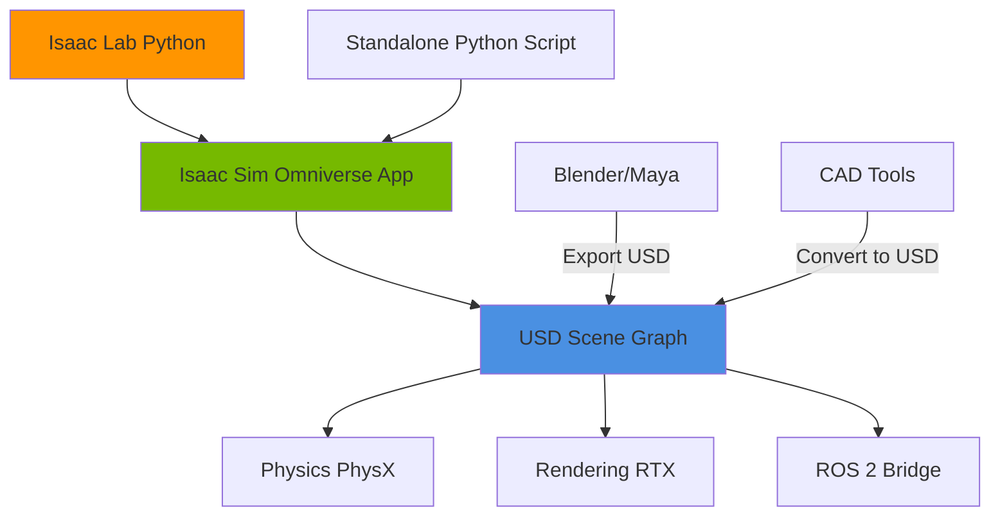

# Isaac Sim Platform

**Reading Time:** ~36 minutes
**Difficulty Level:** Advanced

## Learning Objectives

By the end of this lesson, you will be able to:

1. Navigate the Isaac Sim interface and understand its advantages over traditional simulators
2. Build sophisticated robot simulations using USD (Universal Scene Description) and Omniverse
3. Generate high-quality synthetic training data with domain randomization
4. Optimize GPU-accelerated simulation for reinforcement learning and perception tasks
5. Deploy trained models from Isaac Sim to real robots with minimal sim-to-real gap

## Introduction

NVIDIA Isaac Sim represents a paradigm shift in robotics simulation, leveraging GPU acceleration and photorealistic rendering to close the gap between virtual validation and physical deployment. Built on NVIDIA Omniverse, Isaac Sim provides:

- **RTX ray tracing**: Physically accurate lighting and shadows for perception training
- **PhysX 5 GPU acceleration**: Real-time physics for thousands of objects simultaneously
- **Synthetic data generation**: Perfect ground truth labels (depth, segmentation, bounding boxes)
- **ROS 2 integration**: Seamless connection to existing robotics stacks

This lesson explores Isaac Sim's architecture, scripting workflows, and deployment strategies. You'll learn to build simulations that generate training data at scale, validate perception pipelines, and accelerate reinforcement learning—capabilities critical for modern humanoid robotics development.

---

## 1. Isaac Ecosystem Overview

### Isaac Sim vs Gazebo

| Aspect | Isaac Sim | Gazebo |
|--------|-----------|--------|
| **Rendering** | RTX ray tracing (GPU) | OpenGL rasterization (CPU/GPU) |
| **Physics** | PhysX 5 (GPU-accelerated) | ODE/Bullet/Dart (CPU) |
| **Scalability** | Thousands of robots simultaneously | 10-20 robots max |
| **Synthetic Data** | Native annotation (depth, segmentation, bbox) | Plugin-based (limited) |
| **Asset Format** | USD (Universal Scene Description) | SDF/URDF |
| **Learning Focus** | RL, computer vision, perception | Controls, traditional robotics |
| **Platform** | NVIDIA GPUs (RTX 2000+) | CPU + optional GPU rendering |

**When to Use Isaac Sim**:

- Large-scale dataset generation (100K+ images)
- Reinforcement learning (parallel environment training)
- Photorealistic perception testing (lighting, materials, reflections)
- Warehouse/factory simulations (many robots, complex scenes)

**When to Use Gazebo**:

- Rapid prototyping with existing ROS 2 packages
- CPU-only workflows
- Simple environments (outdoor navigation, single robot)

:::tip Important Concept
Isaac Sim is a **machine learning accelerator**, not a replacement for Gazebo. Use Isaac Sim for data-hungry tasks (perception, RL), then deploy algorithms validated in Gazebo for traditional control workflows.
:::

### Omniverse Platform

**NVIDIA Omniverse** is a collaborative platform for 3D content creation, built on **USD (Universal Scene Description)**—Pixar's open-source scene graph format.



**Key Advantages**:

1. **Collaborative**: Multiple users can edit the same scene in real-time (like Google Docs for 3D)
2. **Non-destructive**: USD uses layers (like Photoshop), preserving original assets while applying modifications
3. **Interoperable**: Import from Blender, Maya, Unreal Engine, Unity via USD converters

### Isaac Lab Framework

**Isaac Lab** (formerly Isaac Gym) is a Python framework for RL built on Isaac Sim:

```python
# Example: Spawning 1000 parallel robot environments
from omni.isaac.lab.envs import ManagerBasedRLEnv
from omni.isaac.lab.utils import configclass

@configclass
class HumanoidEnvCfg:
    num_envs = 1000  # Parallel instances (GPU-accelerated)
    episode_length = 500
    robot_asset = "omniverse://localhost/Humanoid/humanoid.usd"

env = ManagerBasedRLEnv(cfg=HumanoidEnvCfg())

for _ in range(1000000):  # 1M training steps
    obs = env.get_observations()
    actions = policy(obs)
    env.step(actions)
```

**Benefits**:

- **GPU parallelism**: Train 1000 robots in the time it takes to simulate one in Gazebo
- **End-to-end**: Perception → policy → control in a unified framework
- **Hardware transfer**: Trained policies deploy to real robots via ROS 2

### Industrial Applications

**Case Studies**:

1. **Amazon Robotics**: Uses Isaac Sim to generate 10M+ warehouse images for bin-picking vision models
2. **BMW Group**: Virtual factory simulations with 100+ robots for production line optimization
3. **Agility Robotics (Digit)**: Bipedal locomotion RL training in diverse terrains

**Market Impact**: Companies using Isaac Sim report **50-80% reduction in development time** for perception-heavy applications.

---

## 2. Getting Started

### Installation and Setup

**System Requirements**:

- **GPU**: NVIDIA RTX 2000 series or newer (RTX 4090 recommended for large scenes)
- **VRAM**: 8 GB minimum (16-24 GB for RL training)
- **OS**: Ubuntu 20.04/22.04 or Windows 10/11
- **Drivers**: NVIDIA 525+ (check with `nvidia-smi`)

**Installation via Omniverse Launcher**:

```bash
# Download Omniverse Launcher
wget https://install.launcher.omniverse.nvidia.com/installers/omniverse-launcher-linux.AppImage

# Run installer
chmod +x omniverse-launcher-linux.AppImage
./omniverse-launcher-linux.AppImage

# In Launcher:
# 1. Install Nucleus (local asset server)
# 2. Install Isaac Sim (2023.1.0 or later)
# 3. Install Isaac Lab (optional, for RL)
```

**Verify Installation**:

```bash
# Launch Isaac Sim
~/.local/share/ov/pkg/isaac_sim-2023.1.0/isaac-sim.sh

# Or headless mode (for remote servers)
~/.local/share/ov/pkg/isaac_sim-2023.1.0/isaac-sim.headless.sh
```

### Navigating the GUI

**Main Interface Components**:

```
┌─────────────────────────────────────────────────────┐
│ Viewport (3D scene)         │  Content Browser      │
│                              │  (Assets, USD files)  │
│                              │                       │
├─────────────────────────────────────────────────────┤
│ Stage (USD hierarchy)        │  Property (Object     │
│                              │  attributes, physics) │
│                              │                       │
└─────────────────────────────────────────────────────┘
│ Timeline (Animation, playback controls)             │
└─────────────────────────────────────────────────────┘
```

**Viewport Controls**:

- **Orbit**: Alt + Left Mouse Button
- **Pan**: Alt + Middle Mouse Button
- **Zoom**: Alt + Right Mouse Button or Scroll Wheel
- **Focus**: F (frame selected object)

**Essential Menus**:

- `Create > Physics > Rigid Body`: Add physics properties
- `Create > Light > Dome Light`: Add environment lighting (HDRI)
- `Isaac Utils > Sensors`: Add cameras, lidar, IMU

### Creating Worlds and Robots

**Create a Simple Environment**:

```python
# Python script (run inside Isaac Sim Script Editor: Window > Script Editor)
from pxr import Usd, UsdGeom, UsdPhysics
import omni.isaac.core.utils.prims as prim_utils

# Get current stage
stage = omni.usd.get_context().get_stage()

# Create ground plane
ground = prim_utils.create_prim(
    "/World/Ground",
    "Cube",
    position=(0, 0, -0.5),
    scale=(100, 100, 1)
)

# Add physics collider
UsdPhysics.CollisionAPI.Apply(ground.GetPrim())

# Create dome light (HDRI environment)
dome_light = UsdLux.DomeLight.Define(stage, "/World/DomeLight")
dome_light.CreateIntensityAttr(1000)
dome_light.CreateTextureFileAttr("omniverse://localhost/NVIDIA/Assets/Skies/Indoor/ZetoCG_com_WarehouseInterior2b.hdr")
```

**Import Robot from URDF**:

```python
from omni.isaac.core.utils.extensions import enable_extension
enable_extension("omni.importer.urdf")

import omni.kit.commands
from pxr import UsdPhysics

# Import URDF
omni.kit.commands.execute(
    "URDFParseAndImportFile",
    urdf_path="/path/to/humanoid.urdf",
    import_config=omni.importer.urdf.ImportConfig(
        fix_base=False,  # Floating base for humanoids
        distance_scale=1.0,
        density=1000.0  # kg/m^3 (if URDF missing mass)
    ),
    dest_path="/World/Humanoid"
)

# Verify articulation root
prim = stage.GetPrimAtPath("/World/Humanoid")
UsdPhysics.ArticulationRootAPI.Apply(prim)
```

### Asset Libraries

**NVIDIA Asset Library** (accessed via Content Browser):

- `omniverse://localhost/NVIDIA/Assets/Isaac/2023.1.0/`
  - `Robots/`: Pre-built humanoids (Digit, Cassie), manipulators (Franka, UR10)
  - `Environments/`: Warehouses, offices, outdoor terrains
  - `Props/`: Crates, shelves, clutter objects

**Add Asset to Scene**:

```python
# Drag-and-drop from Content Browser, or:
from omni.isaac.core.prims import XFormPrim

robot = XFormPrim(
    prim_path="/World/Digit",
    usd_path="omniverse://localhost/NVIDIA/Assets/Isaac/2023.1.0/Isaac/Robots/Agility/Digit/digit.usd",
    position=(0, 0, 1.0)
)
```

---

## 3. Robot Simulation and Physics

### Physics Engine Selection

Isaac Sim uses **NVIDIA PhysX 5** (no alternatives like Gazebo's ODE/Dart). Configure per scene:

```python
from pxr import UsdPhysics, PhysxSchema

# Get physics scene
physics_scene = UsdPhysics.Scene.Define(stage, "/World/PhysicsScene")

# Set simulation parameters
physics_scene.CreateGravityDirectionAttr((0, 0, -1))
physics_scene.CreateGravityMagnitudeAttr(9.81)

# PhysX-specific settings
physx_scene = PhysxSchema.PhysxSceneAPI.Apply(physics_scene.GetPrim())
physx_scene.CreateEnableCCDAttr(True)  # Continuous Collision Detection
physx_scene.CreateEnableStabilizationAttr(True)
physx_scene.CreateEnableGPUDynamicsAttr(True)  # GPU acceleration
physx_scene.CreateBroadphaseTypeAttr("MBP")  # Multi-Box Pruning (fastest)
physx_scene.CreateSolverTypeAttr("TGS")  # Temporal Gauss-Seidel (stable)
```

**Critical Parameters**:

- **Time Step**: Default 1/60 s (60 Hz). Reduce to 1/120 s for high-speed contacts
- **Substeps**: Number of physics iterations per rendering frame (increase for stability)

```python
# Set via Python
from omni.physx import get_physx_interface
physx = get_physx_interface()
physx.update_simulation_parameters(
    dt=1/120,  # 120 Hz physics
    substeps=2  # 2 solver iterations per step
)
```

### Joint Actuation

**Configure Joint Drives**:

```python
from pxr import UsdPhysics

# Get joint prim (e.g., left hip)
joint_prim = stage.GetPrimAtPath("/World/Humanoid/left_hip_joint")

# Create drive API
drive = UsdPhysics.DriveAPI.Apply(joint_prim, "angular")
drive.CreateTypeAttr("force")  # Force-controlled (vs position/velocity)
drive.CreateMaxForceAttr(100.0)  # N·m
drive.CreateStiffnessAttr(1000.0)  # N·m/rad (PD controller P gain)
drive.CreateDampingAttr(50.0)  # N·m·s/rad (PD controller D gain)

# Set target angle (radians)
drive.CreateTargetPositionAttr(0.5)  # 28.6 degrees
```

**Programmatic Control Loop**:

```python
import omni.isaac.core.utils.numpy.rotations as rot_utils
from omni.isaac.core.articulations import Articulation

# Wrap robot as Articulation
robot = Articulation("/World/Humanoid")
robot.initialize()

# Control loop
for step in range(1000):
    # Read joint states
    joint_positions = robot.get_joint_positions()
    joint_velocities = robot.get_joint_velocities()

    # Compute control (e.g., PD controller)
    target_positions = compute_walking_trajectory(step)
    torques = pd_controller(joint_positions, target_positions, joint_velocities)

    # Apply torques
    robot.apply_action(torques)

    # Step simulation
    from omni.isaac.core import World
    World.instance().step(render=True)
```

### Sensor Simulation

**Add Camera**:

```python
from omni.isaac.sensor import Camera

# Create RGB camera
camera = Camera(
    prim_path="/World/Humanoid/head/camera",
    resolution=(1280, 720),
    frequency=30,  # Hz
    position=(0, 0, 1.5),
    orientation=rot_utils.euler_angles_to_quats([0, 0, 0])
)

camera.initialize()

# Capture frame
rgba = camera.get_rgba()  # Shape: (720, 1280, 4)
depth = camera.get_depth()  # Shape: (720, 1280)
```

**Lidar Sensor**:

```python
from omni.isaac.range_sensor import LidarRtx

# Create RTX lidar (GPU-accelerated ray tracing)
lidar = LidarRtx(
    prim_path="/World/Humanoid/lidar",
    config="Example_Rotary",  # Preset: Velodyne VLP-16 equivalent
    translation=(0, 0, 1.0)
)

# Read point cloud
point_cloud = lidar.get_point_cloud()  # Shape: (N, 3) XYZ coordinates
```

### Synthetic Data Annotation

**Semantic Segmentation**:

```python
from omni.isaac.synthetic_utils import SyntheticDataHelper

# Initialize annotator
sd_helper = SyntheticDataHelper()
sd_helper.initialize(backend="numpy")

# Assign semantic labels to objects
from omni.isaac.core.utils.semantics import add_update_semantics
add_update_semantics(
    prim=stage.GetPrimAtPath("/World/Humanoid"),
    semantic_label="robot",
    type_label="class"
)

add_update_semantics(
    prim=stage.GetPrimAtPath("/World/Obstacles/Box"),
    semantic_label="obstacle",
    type_label="class"
)

# Capture semantic segmentation
seg_data = sd_helper.get_groundtruth(["semantic_segmentation"], camera)
seg_image = seg_data["semantic_segmentation"]["data"]  # Per-pixel class IDs
```

**Bounding Boxes (2D/3D)**:

```python
# Get 2D bounding boxes
bbox_data = sd_helper.get_groundtruth(["bounding_box_2d_tight"], camera)
bboxes = bbox_data["bounding_box_2d_tight"]["data"]

# Format: [{"semanticId": 1, "x_min": 120, "y_min": 200, "x_max": 450, "y_max": 600}, ...]
```

---

## 4. Python Scripting and Automation

### Isaac Sim Python API

**Script Execution Modes**:

1. **Script Editor** (`Window > Script Editor`): Interactive REPL
2. **Standalone Python**: Run Isaac Sim as a library

```bash
# Standalone script
~/.local/share/ov/pkg/isaac_sim-2023.1.0/python.sh my_script.py
```

**Example Standalone Script**:

```python
# my_script.py
from omni.isaac.kit import SimulationApp

# Initialize Isaac Sim (headless mode)
simulation_app = SimulationApp({"headless": True})

from omni.isaac.core import World
from omni.isaac.core.objects import DynamicCuboid
import numpy as np

# Create world
world = World(stage_units_in_meters=1.0)

# Add objects
cube = DynamicCuboid(
    prim_path="/World/Cube",
    position=np.array([0, 0, 1.0]),
    scale=np.array([0.2, 0.2, 0.2]),
    color=np.array([1.0, 0, 0])  # Red
)

world.scene.add(cube)

# Reset world (physics ready)
world.reset()

# Run simulation
for i in range(100):
    world.step(render=False)  # Headless (no rendering)

    if i % 10 == 0:
        pos, _ = cube.get_world_pose()
        print(f"Step {i}: Cube position = {pos}")

simulation_app.close()
```

### Automating Data Collection

**Generate 1000 Images with Randomization**:

```python
from omni.isaac.core import World
from omni.isaac.sensor import Camera
from omni.isaac.core.utils.stage import open_stage
import numpy as np
import os

# Initialize
simulation_app = SimulationApp({"headless": False})
world = World()

# Load scene
open_stage("omniverse://localhost/Projects/warehouse.usd")

# Add camera
camera = Camera(
    prim_path="/World/Camera",
    resolution=(1920, 1080),
    position=(5, 0, 2),
)
camera.initialize()
world.reset()

# Output directory
os.makedirs("/data/synthetic_images", exist_ok=True)

# Data collection loop
for i in range(1000):
    # Randomize lighting
    dome_light = stage.GetPrimAtPath("/World/DomeLight")
    intensity = np.random.uniform(500, 2000)
    dome_light.GetAttribute("inputs:intensity").Set(intensity)

    # Randomize camera position
    x = np.random.uniform(-10, 10)
    y = np.random.uniform(-10, 10)
    camera.set_world_pose(position=[x, y, 2])

    # Step simulation
    world.step(render=True)

    # Capture and save image
    rgba = camera.get_rgba()
    from PIL import Image
    img = Image.fromarray((rgba[:, :, :3] * 255).astype(np.uint8))
    img.save(f"/data/synthetic_images/image_{i:06d}.png")

    print(f"Saved image {i+1}/1000")

simulation_app.close()
```

### Custom Sensors and Plugins

**Create Tactile Sensor** (contact force detection):

```python
from omni.isaac.sensor import ContactSensor

# Add to robot foot
contact_sensor = ContactSensor(
    prim_path="/World/Humanoid/left_foot/contact_sensor",
    radius=0.05,  # 5 cm sensor area
    translation=(0, 0, -0.05)
)

contact_sensor.initialize()

# Read contact data
for _ in range(100):
    world.step()

    if contact_sensor.is_valid():
        force = contact_sensor.get_contact_force()
        print(f"Contact force: {force} N")
```

### Task Generation

**Randomized Object Placement**:

```python
from omni.isaac.core.objects import DynamicCuboid
import numpy as np

def spawn_random_obstacles(num_obstacles=50):
    for i in range(num_obstacles):
        # Random position
        x = np.random.uniform(-10, 10)
        y = np.random.uniform(-10, 10)
        z = 0.5

        # Random size
        scale = np.random.uniform(0.2, 1.0)

        # Create obstacle
        obstacle = DynamicCuboid(
            prim_path=f"/World/Obstacles/Cube_{i}",
            position=np.array([x, y, z]),
            scale=np.array([scale, scale, scale]),
            color=np.random.random(3)
        )

        world.scene.add(obstacle)

spawn_random_obstacles(100)
world.reset()
```

---

## 5. Domain Randomization and ML

### Randomization for Robustness

**Material Randomization**:

```python
from omni.isaac.core.materials import PreviewSurface

def randomize_materials():
    # Get all mesh prims
    from pxr import UsdGeom
    for prim in stage.Traverse():
        if prim.IsA(UsdGeom.Mesh):
            # Create random material
            material = PreviewSurface(prim_path=f"{prim.GetPath()}/Material")

            # Random color
            material.set_color(np.random.random(3))

            # Random roughness (0 = mirror, 1 = matte)
            material.set_roughness(np.random.uniform(0.2, 0.9))

            # Random metallic (0 = dielectric, 1 = metal)
            material.set_metallic(np.random.uniform(0, 0.5))

            # Bind to mesh
            from omni.isaac.core.utils.prims import apply_material
            apply_material(prim.GetPath(), material.prim_path)

randomize_materials()
```

**Physics Randomization**:

```python
def randomize_physics():
    # Randomize gravity
    physics_scene = stage.GetPrimAtPath("/World/PhysicsScene")
    gravity = np.random.uniform(9.5, 10.0)
    physics_scene.GetAttribute("physics:gravityMagnitude").Set(gravity)

    # Randomize ground friction
    ground = stage.GetPrimAtPath("/World/Ground")
    from pxr import UsdPhysics
    material = UsdPhysics.MaterialAPI.Apply(ground)
    friction = np.random.uniform(0.6, 1.0)
    material.CreateStaticFrictionAttr(friction)
    material.CreateDynamicFrictionAttr(friction * 0.8)

randomize_physics()
```

### Preparing Data for Neural Networks

**Export COCO Dataset**:

```python
import json
from omni.isaac.synthetic_utils import SyntheticDataHelper

sd_helper = SyntheticDataHelper()
sd_helper.initialize()

coco_data = {
    "images": [],
    "annotations": [],
    "categories": [{"id": 1, "name": "robot"}, {"id": 2, "name": "obstacle"}]
}

annotation_id = 0

for img_id in range(1000):
    world.step()

    # Capture image
    rgba = camera.get_rgba()
    save_image(rgba, f"/data/images/img_{img_id}.png")

    # Get bounding boxes
    bbox_data = sd_helper.get_groundtruth(["bounding_box_2d_tight"], camera)

    # Add to COCO
    coco_data["images"].append({
        "id": img_id,
        "file_name": f"img_{img_id}.png",
        "width": 1920,
        "height": 1080
    })

    for bbox in bbox_data["bounding_box_2d_tight"]["data"]:
        coco_data["annotations"].append({
            "id": annotation_id,
            "image_id": img_id,
            "category_id": bbox["semanticId"],
            "bbox": [bbox["x_min"], bbox["y_min"],
                     bbox["x_max"] - bbox["x_min"],
                     bbox["y_max"] - bbox["y_min"]],
            "area": (bbox["x_max"] - bbox["x_min"]) * (bbox["y_max"] - bbox["y_min"]),
            "iscrowd": 0
        })
        annotation_id += 1

# Save COCO JSON
with open("/data/annotations.json", "w") as f:
    json.dump(coco_data, f, indent=2)
```

### Transfer to Real Robots

**ROS 2 Bridge**:

```python
# Enable ROS 2 extension
from omni.isaac.core.utils.extensions import enable_extension
enable_extension("omni.isaac.ros2_bridge")

# Create joint state publisher
import omni.graph.core as og

# Add ROS 2 Joint State Publisher node
(graph, nodes, _, _) = og.Controller.edit(
    {"graph_path": "/World/ROS2", "evaluator_name": "execution"},
    {
        og.Controller.Keys.CREATE_NODES: [
            ("OnPlaybackTick", "omni.graph.action.OnPlaybackTick"),
            ("JointState", "omni.isaac.ros2_bridge.ROS2PublishJointState"),
        ],
        og.Controller.Keys.CONNECT: [
            ("OnPlaybackTick.outputs:tick", "JointState.inputs:execIn"),
        ],
        og.Controller.Keys.SET_VALUES: [
            ("JointState.inputs:targetPrim", "/World/Humanoid"),
            ("JointState.inputs:topicName", "/joint_states"),
        ],
    },
)
```

**Deployment Workflow**:

1. **Train in Isaac Sim**: Use RL (Isaac Lab) or supervised learning on synthetic data
2. **Export Policy**: Save neural network weights (PyTorch/ONNX)
3. **ROS 2 Node**: Load policy in ROS 2 node running on robot hardware

```python
# ROS 2 node (on real robot)
import torch
import rclpy
from sensor_msgs.msg import JointState
from std_msgs.msg import Float64MultiArray

class PolicyNode(Node):
    def __init__(self):
        super().__init__('policy_node')
        self.policy = torch.jit.load('/models/humanoid_policy.pt')

        self.subscription = self.create_subscription(
            JointState, '/joint_states', self.state_callback, 10
        )
        self.publisher = self.create_publisher(
            Float64MultiArray, '/joint_commands', 10
        )

    def state_callback(self, msg):
        # Convert joint states to observation tensor
        obs = torch.tensor(msg.position + msg.velocity)

        # Run policy
        with torch.no_grad():
            action = self.policy(obs)

        # Publish commands
        cmd = Float64MultiArray(data=action.tolist())
        self.publisher.publish(cmd)
```

### Performance Benchmarking

**Measure Throughput**:

```python
import time

world = World()
world.reset()

# Benchmark physics step rate
start = time.time()
steps = 1000

for _ in range(steps):
    world.step(render=False)

elapsed = time.time() - start
fps = steps / elapsed

print(f"Physics FPS: {fps:.2f}")
print(f"Real-time factor: {fps / 60:.2f}x")  # Assuming 60 Hz target

# Expected: 500-2000 FPS (headless, GPU, simple scene)
```

---

## Summary

This lesson introduced NVIDIA Isaac Sim as a GPU-accelerated simulation platform for robotics:

- **Ecosystem**: Isaac Sim provides photorealistic rendering (RTX), massively parallel physics (PhysX GPU), and native synthetic data generation—advantages over CPU-based simulators
- **Omniverse and USD**: Collaborative scene editing and interoperability with industry tools (Blender, CAD)
- **Simulation workflows**: Python API enables automated data collection, domain randomization, and RL training
- **Deployment**: ROS 2 bridge transfers trained models to real robots with minimal code changes

**Key Takeaway**: Isaac Sim is purpose-built for **data-driven robotics**—use it to generate training datasets, validate perception systems, and accelerate reinforcement learning. Pair it with Gazebo for traditional control workflows and Unity for human-facing visualization.

---

## Next Steps

1. **Hands-On Exercise**: Generate 1000 images of a humanoid robot in Isaac Sim with randomized lighting and camera poses
2. **Advanced Topic**: Explore [Isaac ROS and Visual SLAM](./isaac-ros-vslam.md) for GPU-accelerated perception pipelines
3. **Reinforcement Learning**: Train a bipedal walking policy using Isaac Lab (requires GPU with 16+ GB VRAM)
4. **Community Resources**:
   - [Isaac Sim Documentation](https://docs.omniverse.nvidia.com/isaacsim/)
   - [Isaac Lab GitHub](https://github.com/isaac-sim/IsaacLab)
   - [Omniverse Forum](https://forums.developer.nvidia.com/c/omniverse/)

---

## Further Reading

- **"Learning Dexterous In-Hand Manipulation"** (OpenAI, 2019) — RL case study using GPU simulation
- **"Isaac Sim Synthetic Data Generation"** (NVIDIA, 2023) — Best practices for perception datasets
- **USD Specification**: [Pixar USD Documentation](https://graphics.pixar.com/usd/docs/index.html)

:::info Practice Quiz
Test your understanding with the [Module 3 Quiz](./quiz.md) before proceeding to Isaac ROS perception pipelines.
:::
