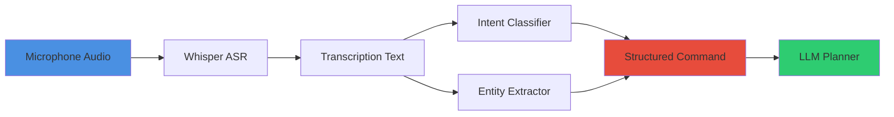

# Capstone Project: Voice-Controlled Humanoid Assistant

**Reading Time:** ~38 minutes
**Difficulty Level:** Advanced

## Learning Objectives

By the end of this capstone project, you will be able to:

1. Design and implement an end-to-end voice-language-action (VLA) system integrating all course concepts
2. Combine speech recognition, LLM planning, and robot control into a cohesive application
3. Validate system performance through comprehensive testing (unit, integration, end-to-end)
4. Deploy a production-ready voice control interface on real or simulated humanoid robots
5. Iterate on system design based on user feedback and performance metrics

## Introduction

This capstone project synthesizes all concepts from Modules 1-4 into a complete voice-controlled humanoid assistant. You will build a system where users issue natural language commands ("Bring me a drink from the kitchen"), and the robot:

1. **Transcribes speech** using Whisper ASR
2. **Extracts intent and entities** using NLU
3. **Plans task execution** using LLM reasoning
4. **Validates safety** through precondition checking
5. **Executes actions** via ROS 2 navigation and manipulation
6. **Provides feedback** through audio/visual confirmation

**Project Scope**: A humanoid robot operating in a simulated indoor environment (Gazebo + Isaac Sim) with voice control for navigation and object manipulation tasks.

**Timeline**: 4-6 weeks (adjust based on experience level)

---

## 1. Capstone Overview

### Project Scope and Goals

**Mission Statement**: Enable non-expert users to command a humanoid robot using natural voice instructions for common household tasks.

**Functional Requirements**:

1. **Voice Interface**:
   - Recognize voice commands in real-time (latency < 3 seconds)
   - Handle 10 common household tasks (navigate, pick, place, open, close, etc.)
   - Support 2-3 languages (English + optional)

2. **Task Execution**:
   - Navigate to named locations (kitchen, bedroom, table)
   - Pick and place objects (mugs, books, boxes)
   - Open/close containers (doors, drawers, refrigerators)
   - Provide status updates ("I'm navigating to the kitchen...")

3. **Safety and Robustness**:
   - Validate all commands before execution
   - Detect and recover from failures (object not found, path blocked)
   - Emergency stop via voice ("Stop immediately")

**Non-Functional Requirements**:

- **Latency**: Command → action initiation < 5 seconds
- **Accuracy**: Intent classification > 90% accuracy on test set
- **Reliability**: 80% task success rate on 50-task test suite
- **Privacy**: All speech processing on-device (no cloud APIs for deployment)

### Expected Outcomes

**Deliverables**:

1. **ROS 2 Package**: Complete voice control stack with documented launch files
2. **Test Suite**: Unit tests (pytest), integration tests, end-to-end scenarios
3. **User Guide**: Installation instructions, example commands, troubleshooting
4. **Demo Video**: 3-5 minute video showcasing 5 common tasks
5. **Performance Report**: Metrics (latency, accuracy, success rate) with analysis

**Success Criteria**:

| Metric | Target | Measurement |
|--------|--------|-------------|
| **Command Recognition** | > 95% WER < 5% | 100-command test set with Whisper |
| **Intent Accuracy** | > 90% | 200 utterances, manually labeled |
| **Task Success Rate** | > 80% | 50 tasks (10 types × 5 trials each) |
| **End-to-End Latency** | < 5 seconds | Speech end → robot motion start |
| **Safety Compliance** | 100% | Zero invalid actions executed |

### Evaluation Criteria

**Grading Rubric** (100 points):

1. **Functionality (40 pts)**:
   - Voice recognition integration (10 pts)
   - Intent/entity extraction (10 pts)
   - LLM task planning (10 pts)
   - ROS 2 execution (10 pts)

2. **Code Quality (20 pts)**:
   - Documentation and comments (5 pts)
   - Test coverage > 70% (10 pts)
   - Code organization (ROS 2 best practices) (5 pts)

3. **Performance (20 pts)**:
   - Meets latency targets (5 pts)
   - Achieves accuracy targets (10 pts)
   - Demonstrates robustness (5 pts)

4. **Demo and Presentation (20 pts)**:
   - Video quality and clarity (10 pts)
   - Written report completeness (10 pts)

### Timeline Suggestions

**Week 1-2: Setup and Infrastructure**
- Day 1-3: Environment setup (ROS 2, Gazebo, Isaac Sim)
- Day 4-7: Speech recognition integration (Whisper + ROS 2 node)
- Day 8-14: Intent classification system (training/tuning)

**Week 3-4: Core Functionality**
- Day 15-21: LLM planning integration (prompt engineering, API setup)
- Day 22-28: Action execution (Nav2 + manipulation primitives)

**Week 5: Integration and Testing**
- Day 29-31: End-to-end integration
- Day 32-35: Test suite development and execution

**Week 6: Refinement and Delivery**
- Day 36-38: Bug fixes, performance tuning
- Day 39-40: Demo video recording
- Day 41-42: Final report writing

---

## 2. Part 1: Voice Recognition and Parsing

### Building the Speech-to-Intent Pipeline

**Architecture**:



**ROS 2 Node Structure**:

```python
# voice_interface/voice_command_node.py
import rclpy
from rclpy.node import Node
from std_msgs.msg import String
from voice_interface_msgs.msg import VoiceCommand  # Custom message

import speech_recognition as sr
from faster_whisper import WhisperModel

class VoiceCommandNode(Node):
    def __init__(self):
        super().__init__('voice_command_node')

        # Publishers
        self.command_pub = self.create_publisher(
            VoiceCommand, '/voice/command', 10
        )
        self.status_pub = self.create_publisher(
            String, '/voice/status', 10
        )

        # Whisper model
        self.declare_parameter('whisper_model', 'base')
        model_size = self.get_parameter('whisper_model').value

        self.whisper = WhisperModel(
            model_size,
            device="cuda",
            compute_type="int8"
        )

        # Intent classifier (placeholder - implement in Part 2)
        self.classifier = load_intent_classifier()

        # Start listening thread
        import threading
        self.listen_thread = threading.Thread(
            target=self.listen_loop,
            daemon=True
        )
        self.listen_thread.start()

        self.get_logger().info("Voice command node started")

    def listen_loop(self):
        """Continuous listening loop."""
        recognizer = sr.Recognizer()
        mic = sr.Microphone()

        with mic as source:
            recognizer.adjust_for_ambient_noise(source, duration=1)
            self.get_logger().info("Listening for commands...")

        while rclpy.ok():
            try:
                with mic as source:
                    audio = recognizer.listen(source, timeout=10)

                # Transcribe
                with open("/tmp/command.wav", "wb") as f:
                    f.write(audio.get_wav_data())

                segments, _ = self.whisper.transcribe("/tmp/command.wav")
                text = " ".join([s.text for s in segments]).strip()

                if text:
                    self.get_logger().info(f"Recognized: {text}")
                    self.process_command(text)

            except sr.WaitTimeoutError:
                continue
            except Exception as e:
                self.get_logger().error(f"Error: {e}")

    def process_command(self, text):
        """Extract intent and publish command."""
        # Classify intent
        intent, confidence = self.classifier.predict(text)

        # Extract entities
        entities = extract_entities(text)

        # Publish structured command
        cmd = VoiceCommand()
        cmd.text = text
        cmd.intent = intent
        cmd.confidence = confidence
        cmd.entities = str(entities)  # JSON string

        self.command_pub.publish(cmd)

        # Status update
        status = String(data=f"Processing: {intent}")
        self.status_pub.publish(status)

def main():
    rclpy.init()
    node = VoiceCommandNode()
    rclpy.spin(node)

if __name__ == '__main__':
    main()
```

**Custom Message Definition**:

```bash
# voice_interface_msgs/msg/VoiceCommand.msg
string text          # Original transcription
string intent        # Classified intent (NAVIGATE, PICK, etc.)
float32 confidence   # Classification confidence [0-1]
string entities      # JSON string of extracted entities
```

### Testing with Various Accents/Background Noise

**Noise Injection Test**:

```python
# tests/test_noise_robustness.py
import pytest
import numpy as np
import soundfile as sf

def add_noise(audio, snr_db=10):
    """Add white noise at specified SNR."""
    signal_power = np.mean(audio ** 2)
    noise_power = signal_power / (10 ** (snr_db / 10))

    noise = np.random.normal(0, np.sqrt(noise_power), audio.shape)
    return audio + noise

def test_whisper_noise_robustness():
    """Test recognition accuracy at various noise levels."""
    clean_audio, sr = sf.read("test_data/clean_command.wav")
    ground_truth = "Navigate to the kitchen"

    model = WhisperModel("base")

    results = []
    for snr in [20, 10, 5, 0, -5]:  # dB
        noisy_audio = add_noise(clean_audio, snr)

        # Save noisy audio
        sf.write(f"/tmp/noisy_{snr}db.wav", noisy_audio, sr)

        # Transcribe
        segments, _ = model.transcribe(f"/tmp/noisy_{snr}db.wav")
        text = " ".join([s.text for s in segments])

        # Compute WER
        wer = compute_wer(ground_truth, text)
        results.append((snr, wer))

    # Assert acceptable performance
    for snr, wer in results:
        if snr >= 10:
            assert wer < 0.1, f"High WER ({wer:.2%}) at {snr} dB SNR"

def compute_wer(reference, hypothesis):
    """Compute Word Error Rate."""
    import jiwer
    return jiwer.wer(reference, hypothesis)
```

**Accent Diversity Test** (collect recordings from multiple speakers):

```python
def test_accent_robustness():
    """Test on diverse accents."""
    test_cases = [
        ("test_data/american_accent.wav", "Go to the bedroom"),
        ("test_data/british_accent.wav", "Pick up the mug"),
        ("test_data/indian_accent.wav", "Open the door"),
    ]

    model = WhisperModel("base")

    for audio_file, ground_truth in test_cases:
        segments, _ = model.transcribe(audio_file)
        text = " ".join([s.text for s in segments])

        wer = compute_wer(ground_truth, text)
        assert wer < 0.15, f"High WER for {audio_file}: {wer:.2%}"
```

### Debugging Transcription Errors

**Error Analysis Tool**:

```python
def analyze_transcription_errors(test_dataset):
    """Identify common transcription error patterns."""
    model = WhisperModel("base")
    errors = []

    for audio_file, ground_truth in test_dataset:
        segments, _ = model.transcribe(audio_file)
        hypothesis = " ".join([s.text for s in segments])

        if hypothesis != ground_truth:
            errors.append({
                "file": audio_file,
                "expected": ground_truth,
                "actual": hypothesis,
                "error_type": categorize_error(ground_truth, hypothesis)
            })

    # Print summary
    from collections import Counter
    error_types = Counter([e["error_type"] for e in errors])

    print("Error Distribution:")
    for error_type, count in error_types.most_common():
        print(f"  {error_type}: {count}")

    return errors

def categorize_error(expected, actual):
    """Classify error type."""
    if len(actual) < len(expected) * 0.5:
        return "TRUNCATION"
    elif any(word not in expected for word in actual.split()):
        return "HALLUCINATION"
    elif expected.lower() != actual.lower():
        return "CASE_ERROR"
    else:
        return "SUBSTITUTION"
```

---

## 3. Part 2: Planning and Validation

### Implementing Task Planning

**LLM Planner Node**:

```python
# task_planner/llm_planner_node.py
import rclpy
from rclpy.node import Node
from voice_interface_msgs.msg import VoiceCommand
from task_planner_msgs.msg import TaskPlan  # Custom message

import json
from ollama import Client  # Local LLM client

class LLMPlannerNode(Node):
    def __init__(self):
        super().__init__('llm_planner_node')

        # Subscriber
        self.command_sub = self.create_subscription(
            VoiceCommand,
            '/voice/command',
            self.command_callback,
            10
        )

        # Publisher
        self.plan_pub = self.create_publisher(
            TaskPlan,
            '/task/plan',
            10
        )

        # LLM client (Ollama local)
        self.llm = Client()

        # Action library
        self.actions = {
            "navigate": ["location"],
            "pick": ["object"],
            "place": ["object", "location"],
            "open": ["container"],
            "close": ["container"]
        }

        self.get_logger().info("LLM planner node started")

    def command_callback(self, msg):
        """Generate task plan from voice command."""
        self.get_logger().info(f"Planning for: {msg.text}")

        # Generate plan
        plan = self.generate_plan(msg.text, msg.intent, msg.entities)

        # Validate plan
        if self.validate_plan(plan):
            # Publish
            task_plan = TaskPlan()
            task_plan.command = msg.text
            task_plan.actions = json.dumps(plan)

            self.plan_pub.publish(task_plan)
            self.get_logger().info(f"Plan published: {plan}")
        else:
            self.get_logger().error("Plan validation failed")

    def generate_plan(self, text, intent, entities):
        """Use LLM to generate action sequence."""
        prompt = f"""
You are a robot task planner.

Available actions:
{json.dumps(self.actions, indent=2)}

Command: "{text}"
Intent: {intent}
Entities: {entities}

Generate a plan as a JSON array of actions.

Example:
Command: "Go to the kitchen and pick up the mug"
Plan:
[
  {{"action": "navigate", "parameters": {{"location": "kitchen"}}}},
  {{"action": "pick", "parameters": {{"object": "mug"}}}}
]

Now generate the plan:
"""

        response = self.llm.chat(
            model="llama3",
            messages=[{"role": "user", "content": prompt}]
        )

        # Parse JSON from response
        plan_text = response['message']['content']
        plan = json.loads(plan_text)

        return plan

    def validate_plan(self, plan):
        """Validate plan against action library."""
        for step in plan:
            action = step.get("action")

            # Check action exists
            if action not in self.actions:
                self.get_logger().error(f"Invalid action: {action}")
                return False

            # Check required parameters
            params = step.get("parameters", {})
            required_params = self.actions[action]

            for param in required_params:
                if param not in params:
                    self.get_logger().error(
                        f"Missing parameter '{param}' for action '{action}'"
                    )
                    return False

        return True
```

### Validating Execution Safety

**Safety Validator Node**:

```python
# safety/safety_validator_node.py
import rclpy
from rclpy.node import Node
from task_planner_msgs.msg import TaskPlan
from std_msgs.msg import Bool

import json

class SafetyValidatorNode(Node):
    def __init__(self):
        super().__init__('safety_validator_node')

        # Subscriber
        self.plan_sub = self.create_subscription(
            TaskPlan,
            '/task/plan',
            self.validate_callback,
            10
        )

        # Publisher
        self.validated_pub = self.create_publisher(
            TaskPlan,
            '/task/validated_plan',
            10
        )

        # Safety rules
        self.forbidden_keywords = ["break", "destroy", "throw"]
        self.max_plan_length = 20  # Prevent infinite loops

        self.get_logger().info("Safety validator started")

    def validate_callback(self, msg):
        """Validate plan safety."""
        plan = json.loads(msg.actions)

        # Check 1: Plan length
        if len(plan) > self.max_plan_length:
            self.get_logger().error(
                f"Plan too long ({len(plan)} steps > {self.max_plan_length})"
            )
            return

        # Check 2: Forbidden keywords
        for step in plan:
            for keyword in self.forbidden_keywords:
                if keyword in str(step).lower():
                    self.get_logger().error(
                        f"Forbidden keyword '{keyword}' in plan"
                    )
                    return

        # Check 3: Physical feasibility (placeholder)
        if not self.check_physics(plan):
            return

        # All checks passed
        self.get_logger().info("Plan validated")
        self.validated_pub.publish(msg)

    def check_physics(self, plan):
        """Validate physical feasibility (simplified)."""
        # TODO: Query Gazebo/Isaac Sim for collision checking
        return True
```

### Handling Failures and Recovery

**Execution Monitor**:

```python
# execution/execution_monitor_node.py
import rclpy
from rclpy.node import Node
from task_planner_msgs.msg import TaskPlan
from std_msgs.msg import String

import json

class ExecutionMonitorNode(Node):
    def __init__(self):
        super().__init__('execution_monitor_node')

        # Subscriber
        self.plan_sub = self.create_subscription(
            TaskPlan,
            '/task/validated_plan',
            self.execute_callback,
            10
        )

        # Status subscriber (from robot)
        self.status_sub = self.create_subscription(
            String,
            '/robot/status',
            self.status_callback,
            10
        )

        # Command publisher
        self.cmd_pub = self.create_publisher(
            String,
            '/robot/command',
            10
        )

        self.current_plan = []
        self.current_step = 0

        self.get_logger().info("Execution monitor started")

    def execute_callback(self, msg):
        """Begin plan execution."""
        self.current_plan = json.loads(msg.actions)
        self.current_step = 0

        self.get_logger().info(f"Executing plan: {self.current_plan}")
        self.execute_next_step()

    def execute_next_step(self):
        """Execute next action in plan."""
        if self.current_step >= len(self.current_plan):
            self.get_logger().info("Plan completed successfully")
            return

        step = self.current_plan[self.current_step]
        action = step["action"]
        params = step["parameters"]

        # Format command
        cmd = f"{action}({', '.join([f'{k}={v}' for k, v in params.items()])})"

        self.get_logger().info(f"Step {self.current_step + 1}: {cmd}")

        # Publish command
        cmd_msg = String(data=cmd)
        self.cmd_pub.publish(cmd_msg)

    def status_callback(self, msg):
        """Handle robot status updates."""
        status = msg.data

        if status == "ACTION_COMPLETE":
            self.current_step += 1
            self.execute_next_step()

        elif status.startswith("ERROR"):
            self.get_logger().error(f"Execution failed: {status}")
            self.handle_failure(status)

    def handle_failure(self, error_msg):
        """Implement recovery strategy."""
        self.get_logger().warn("Attempting recovery...")

        # Simple retry
        if "OBJECT_NOT_FOUND" in error_msg:
            self.get_logger().info("Retrying object detection...")
            # Re-execute current step
            self.execute_next_step()

        elif "PATH_BLOCKED" in error_msg:
            self.get_logger().info("Requesting re-planning...")
            # TODO: Trigger LLM replanning with updated constraints

        else:
            self.get_logger().error("Unrecoverable error. Aborting plan.")
```

---

## 4. Part 3: Integration and Testing

### Connecting to ROS 2 Robot Control

**Navigation Interface**:

```python
# robot_control/navigation_client.py
import rclpy
from rclpy.node import Node
from rclpy.action import ActionClient
from nav2_msgs.action import NavigateToPose
from geometry_msgs.msg import PoseStamped

class NavigationClient(Node):
    def __init__(self):
        super().__init__('navigation_client')

        self.nav_client = ActionClient(
            self, NavigateToPose, 'navigate_to_pose'
        )

        # Semantic location map
        self.locations = {
            "kitchen": (5.0, 2.0, 0.0),
            "bedroom": (-3.0, 4.0, 1.57),
            "table": (1.0, 0.5, 0.0)
        }

    def navigate_to(self, location_name):
        """Navigate to named location."""
        if location_name not in self.locations:
            self.get_logger().error(f"Unknown location: {location_name}")
            return False

        x, y, theta = self.locations[location_name]

        # Create goal
        goal_msg = NavigateToPose.Goal()
        goal_msg.pose = PoseStamped()
        goal_msg.pose.header.frame_id = "map"
        goal_msg.pose.pose.position.x = x
        goal_msg.pose.pose.position.y = y

        # Convert theta to quaternion
        from tf_transformations import quaternion_from_euler
        quat = quaternion_from_euler(0, 0, theta)
        goal_msg.pose.pose.orientation.z = quat[2]
        goal_msg.pose.pose.orientation.w = quat[3]

        # Send goal
        self.nav_client.wait_for_server()
        future = self.nav_client.send_goal_async(goal_msg)

        rclpy.spin_until_future_complete(self, future)
        goal_handle = future.result()

        if not goal_handle.accepted:
            self.get_logger().error("Navigation goal rejected")
            return False

        # Wait for result
        result_future = goal_handle.get_result_async()
        rclpy.spin_until_future_complete(self, result_future)

        return result_future.result().status == 4  # SUCCEEDED
```

### End-to-End System Testing

**Integration Test Suite**:

```python
# tests/test_integration.py
import pytest
import rclpy
from std_msgs.msg import String
from voice_interface_msgs.msg import VoiceCommand

class TestEndToEnd:
    @pytest.fixture(autouse=True)
    def setup(self):
        rclpy.init()
        yield
        rclpy.shutdown()

    def test_navigate_command(self):
        """Test full pipeline: voice → plan → execution."""
        # Simulate voice command
        cmd = VoiceCommand()
        cmd.text = "Go to the kitchen"
        cmd.intent = "NAVIGATE"
        cmd.entities = '{"location": "kitchen"}'

        # TODO: Publish command and monitor execution
        # Assert: Robot reaches kitchen location

    def test_pick_and_place(self):
        """Test object manipulation pipeline."""
        cmd = VoiceCommand()
        cmd.text = "Pick up the mug and place it on the table"
        cmd.intent = "PICK_AND_PLACE"
        cmd.entities = '{"object": "mug", "destination": "table"}'

        # TODO: Execute and verify object moved

    def test_error_recovery(self):
        """Test recovery from object not found."""
        cmd = VoiceCommand()
        cmd.text = "Pick up the invisible object"
        cmd.intent = "PICK"
        cmd.entities = '{"object": "invisible_object"}'

        # TODO: Verify graceful failure handling
```

**Performance Metrics Collection**:

```python
# tests/collect_metrics.py
import time
import csv

class MetricsCollector:
    def __init__(self):
        self.metrics = []

    def measure_latency(self, command):
        """Measure end-to-end latency."""
        start_time = time.time()

        # Execute command
        execute_voice_command(command)

        # Wait for robot motion start
        wait_for_robot_motion()

        end_time = time.time()
        latency = end_time - start_time

        self.metrics.append({
            "command": command,
            "latency_s": latency
        })

        return latency

    def save_metrics(self, filename="metrics.csv"):
        """Save metrics to CSV."""
        with open(filename, "w", newline="") as f:
            writer = csv.DictWriter(f, fieldnames=["command", "latency_s"])
            writer.writeheader()
            writer.writerows(self.metrics)

# Usage
collector = MetricsCollector()

for cmd in test_commands:
    latency = collector.measure_latency(cmd)
    print(f"{cmd}: {latency:.2f}s")

collector.save_metrics()
```

### Performance Metrics

**Automated Test Runner**:

```bash
#!/bin/bash
# run_performance_tests.sh

echo "Running performance test suite..."

# Start ROS 2 nodes
ros2 launch voice_assistant full_system.launch.py &
LAUNCH_PID=$!

sleep 10  # Wait for initialization

# Run metrics collection
python3 tests/collect_metrics.py

# Analyze results
python3 tests/analyze_metrics.py metrics.csv

# Cleanup
kill $LAUNCH_PID
```

**Metrics Analysis**:

```python
# tests/analyze_metrics.py
import pandas as pd
import matplotlib.pyplot as plt

def analyze_metrics(csv_file):
    """Analyze performance metrics."""
    df = pd.read_csv(csv_file)

    # Compute statistics
    mean_latency = df['latency_s'].mean()
    p95_latency = df['latency_s'].quantile(0.95)
    max_latency = df['latency_s'].max()

    print(f"Mean latency: {mean_latency:.2f}s")
    print(f"P95 latency: {p95_latency:.2f}s")
    print(f"Max latency: {max_latency:.2f}s")

    # Plot distribution
    plt.figure(figsize=(10, 6))
    plt.hist(df['latency_s'], bins=20, edgecolor='black')
    plt.xlabel('Latency (seconds)')
    plt.ylabel('Frequency')
    plt.title('End-to-End Latency Distribution')
    plt.axvline(5.0, color='r', linestyle='--', label='Target (5s)')
    plt.legend()
    plt.savefig('latency_distribution.png')

    # Check targets
    if mean_latency > 5.0:
        print("WARNING: Mean latency exceeds target")

    return df

if __name__ == '__main__':
    import sys
    analyze_metrics(sys.argv[1])
```

---

## 5. Deployment and Iteration

### Deployment to Jetson Hardware

**Docker Deployment**:

```dockerfile
# Dockerfile.jetson
FROM nvcr.io/nvidia/l4t-pytorch:r35.2.1-pth2.0-py3

# Install ROS 2 Humble
RUN apt-get update && apt-get install -y \
    ros-humble-desktop \
    ros-humble-nav2-bringup \
    python3-pip

# Install Python dependencies
COPY requirements.txt /tmp/
RUN pip3 install -r /tmp/requirements.txt

# Copy workspace
COPY voice_assistant_ws /workspace/voice_assistant_ws

# Build workspace
WORKDIR /workspace/voice_assistant_ws
RUN . /opt/ros/humble/setup.sh && colcon build

# Entry point
COPY entrypoint.sh /entrypoint.sh
RUN chmod +x /entrypoint.sh

ENTRYPOINT ["/entrypoint.sh"]
```

```bash
# entrypoint.sh
#!/bin/bash
source /opt/ros/humble/setup.bash
source /workspace/voice_assistant_ws/install/setup.bash

# Launch system
ros2 launch voice_assistant full_system.launch.py
```

**Build and Deploy**:

```bash
# Build Docker image on Jetson
docker build -t voice_assistant:jetson -f Dockerfile.jetson .

# Run container
docker run --runtime=nvidia --gpus all \
  --device=/dev/snd:/dev/snd \
  --network=host \
  -it voice_assistant:jetson
```

### Gathering User Feedback

**User Study Protocol**:

```python
# evaluation/user_study.py
import csv
from datetime import datetime

class UserStudy:
    def __init__(self):
        self.responses = []

    def conduct_trial(self, participant_id, task):
        """Run single trial with user."""
        print(f"\nParticipant {participant_id}")
        print(f"Task: {task}")

        # Record command
        command = input("Speak command (transcribed): ")

        # Measure execution
        start_time = datetime.now()
        success = execute_task(command)
        end_time = datetime.now()

        duration = (end_time - start_time).total_seconds()

        # Collect feedback
        print("\nRating (1-5):")
        ease_of_use = int(input("  Ease of use: "))
        accuracy = int(input("  Command accuracy: "))
        speed = int(input("  Response speed: "))

        self.responses.append({
            "participant_id": participant_id,
            "task": task,
            "command": command,
            "success": success,
            "duration_s": duration,
            "ease_of_use": ease_of_use,
            "accuracy": accuracy,
            "speed": speed
        })

    def save_results(self, filename="user_study.csv"):
        """Save study results."""
        with open(filename, "w", newline="") as f:
            writer = csv.DictWriter(
                f,
                fieldnames=self.responses[0].keys()
            )
            writer.writeheader()
            writer.writerows(self.responses)

# Run study
study = UserStudy()

tasks = [
    "Navigate to the kitchen",
    "Pick up the red mug",
    "Open the refrigerator"
]

for participant in range(1, 6):  # 5 participants
    for task in tasks:
        study.conduct_trial(participant, task)

study.save_results()
```

### Performance Monitoring

**Runtime Monitoring Dashboard** (using ROS 2 diagnostics):

```python
# monitoring/diagnostics_node.py
import rclpy
from rclpy.node import Node
from diagnostic_msgs.msg import DiagnosticArray, DiagnosticStatus

class DiagnosticsNode(Node):
    def __init__(self):
        super().__init__('diagnostics_node')

        self.diag_pub = self.create_publisher(
            DiagnosticArray,
            '/diagnostics',
            10
        )

        # Monitor metrics
        self.create_timer(1.0, self.publish_diagnostics)

        self.command_count = 0
        self.success_count = 0

    def publish_diagnostics(self):
        """Publish system health metrics."""
        diag_array = DiagnosticArray()

        # Command success rate
        success_rate = (
            self.success_count / self.command_count
            if self.command_count > 0 else 0.0
        )

        status = DiagnosticStatus()
        status.name = "Voice Assistant"
        status.hardware_id = "voice_system"

        if success_rate > 0.8:
            status.level = DiagnosticStatus.OK
            status.message = "System operating normally"
        elif success_rate > 0.5:
            status.level = DiagnosticStatus.WARN
            status.message = "Degraded performance"
        else:
            status.level = DiagnosticStatus.ERROR
            status.message = "Critical: Low success rate"

        # Add values
        from diagnostic_msgs.msg import KeyValue
        status.values.append(
            KeyValue(key="success_rate", value=f"{success_rate:.2%}")
        )
        status.values.append(
            KeyValue(key="total_commands", value=str(self.command_count))
        )

        diag_array.status.append(status)
        self.diag_pub.publish(diag_array)
```

### Future Improvements

**Enhancement Roadmap**:

1. **Multi-Modal Interaction** (Weeks 7-8):
   - Add gesture recognition (camera-based hand tracking)
   - Combine voice + pointing ("Pick up that object")

2. **Contextual Memory** (Weeks 9-10):
   - Track conversation history
   - Remember object locations ("Where did I leave my keys?")

3. **Advanced Planning** (Weeks 11-12):
   - Multi-step task composition ("Prepare breakfast")
   - Temporal reasoning ("Remind me in 10 minutes")

4. **Personalization** (Weeks 13-14):
   - User profiles (voice recognition)
   - Preference learning ("I prefer my coffee strong")

**Research Directions**:

- End-to-end VLA training (bypass LLM, train vision → action directly)
- Sim-to-real transfer for voice control (domain adaptation)
- Privacy-preserving on-device ASR (federated learning)

---

## Summary

This capstone project integrated all course concepts into a complete voice-controlled humanoid assistant:

- **Part 1**: Speech recognition pipeline (Whisper + ROS 2) with noise robustness testing
- **Part 2**: LLM-based task planning with safety validation and error recovery
- **Part 3**: End-to-end integration testing with performance metrics collection
- **Deployment**: Jetson hardware deployment, user studies, and runtime monitoring

**Key Takeaway**: Building production robotics systems requires **systematic integration**, rigorous testing, and continuous iteration based on real-world feedback. Voice control democratizes robot interaction but demands careful attention to safety, latency, and user experience.

---

## Submission Guidelines

**Deliverables Checklist**:

- [ ] ROS 2 workspace (`voice_assistant_ws/`) with all packages
- [ ] Launch files (`full_system.launch.py`, `simulation.launch.py`)
- [ ] Test suite (`tests/`) with >70% coverage
- [ ] Demo video (3-5 minutes, MP4 format)
- [ ] Performance report (PDF, 5-10 pages)
- [ ] User guide (Markdown, installation + usage)

**Submission Format**:

```
capstone_submission/
├── voice_assistant_ws/
│   ├── src/
│   │   ├── voice_interface/
│   │   ├── task_planner/
│   │   ├── safety/
│   │   └── robot_control/
│   └── README.md
├── tests/
│   ├── test_integration.py
│   └── test_performance.py
├── docs/
│   ├── USER_GUIDE.md
│   ├── PERFORMANCE_REPORT.pdf
│   └── demo_video.mp4
└── requirements.txt
```

**Grading Timeline**:

- Week 6, Day 42: Submission deadline
- Week 7: Peer review (optional)
- Week 8: Final grades released

---

## Resources and Support

**Recommended Tools**:

- **ROS 2 Humble**: [https://docs.ros.org/en/humble/](https://docs.ros.org/en/humble/)
- **Whisper**: [https://github.com/openai/whisper](https://github.com/openai/whisper)
- **Ollama**: [https://ollama.com/](https://ollama.com/)
- **Gazebo**: [https://gazebosim.org/](https://gazebosim.org/)

**Community Forums**:

- ROS Discourse: [https://discourse.ros.org/](https://discourse.ros.org/)
- Course Discord: [Link in syllabus]

**Office Hours**:

- Tuesdays 3-5 PM (Voice/NLU questions)
- Thursdays 3-5 PM (ROS 2/Deployment questions)

:::tip Final Tips
1. **Start early**: Environment setup can take 2-3 days
2. **Test incrementally**: Don't wait until Week 6 for integration
3. **Document as you go**: Write README sections after completing each part
4. **Ask for help**: Use office hours and forums—you're not alone!
5. **Have fun**: This is the culmination of everything you've learned!
:::

**Good luck with your capstone project!** 🤖🎓
